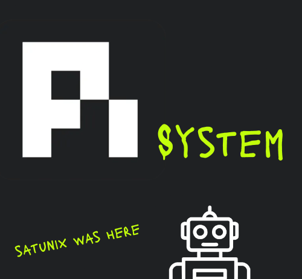

# pi-system

<p align="center">
  
</p>

<p align="center">
  <a href="https://github.com/SATUNIX/pi-system/actions/workflows/ci.yml"></a>
  <a href="CHANGELOG.md"></a>
  <a href="LICENSE"></a>
  <a href="package.json"></a>
  <a href="package.json"></a>
</p>

**pi-system** is a capability layer for the [pi coding agent](https://github.com/earendil-works/pi):
a permission gate for tool calls, governed delegation to sub-agents, verification, durable memory,
bounded recovery, a status bar, and an installer that ties them together as **profiles**. It is
one pi package, installed once.

> **Beta.** This is `0.2.4-beta.0`, the first public beta. It is tested, but it is not a stable
> release: expect rough edges, read [Beta status](docs/beta.md) for what is and is not covered, and
> report problems in the issue tracker. The tool firewall is a guard rail, not a sandbox
> ([Security model](docs/security.md)).

## Install

Requirements: Node.js 22.19 or newer, git, and pi.

```sh
npm install -g @earendil-works/pi-coding-agent
pi install git:github.com/SATUNIX/pi-system@v0.2.4-beta.0
pi
```

The first time pi starts with the kit it applies the `balanced` profile and asks you to `/reload`.
Sign in to a model provider with `/login` if pi reports no models. Details, other channels and
troubleshooting: [Getting started](docs/getting-started.md), [Installation](docs/INSTALL.md).

Upgrading from a private-GitLab install? See [Migration](docs/migration.md); your customisations
are kept and the retired source is never contacted.

## Use

| Want to | Do |
|---|---|
| See what the kit offers | `/kit` |
| Switch profile | `/profile` (picker) or `/profile lite` |
| Choose how hard the agent works and how much it delegates | `/effort` or `/effort thorough` ([Effort](docs/effort.md)) |
| See what pi, the kit and packages can update to | `/update` ([Updates](docs/updates.md)) |
| Review or revoke remembered approvals | `/firewall list`, `/firewall revoke <id>` ([Security](docs/security.md)) |
| Change the status bar | `/footer light`, `/footer default`, `/footer heavy` ([Status bar](docs/status-bar-and-costs.md)) |
| Open the local web console | `/console` ([Web console](docs/web-console.md)) |

## Profiles

A profile chooses which extensions, skills and prompts load, and the firewall mode. Switching is
transactional: it verifies the result and rolls back on any failure. Lists and counts are
generated in the [capability matrix](docs/capability-matrix.md).

| Profile | For |
|---|---|
| `quick` | Fast edits with the safety guards and checkpoints, no ceremony. |
| `balanced` | Everyday work with verification and context helpers (the default). |
| `long-horizon` | Multi-hour work: goals, task graph, branches, delegation. |
| `autonomous` | Long-running sessions, including unattended runs ([Autonomous runs](docs/autonomy.md)). |
| `self-improving` | Research use: adds memory services, dual review and skill mining (experimental). |
| `pentest` | Authorised security engagements: strict firewall policy, scope and rules of engagement. |
| `lite` | Small local models and short contexts. |

## Autonomous runs

For work that should continue without you at the keyboard, the autonomous runner executes a task
inside a hardened container, with an explicit boundary you approve first. It needs a container
engine and is optional. See [Autonomous runs](docs/autonomy.md).

## Repository layout

The workspace layout is for development; users install the kit as one pi package.

| Package | What it is |
|---|---|
| [`packages/core/`](packages/core) | Installer, verification gate, registry, release tooling, schemas, policies. |
| [`packages/extensions/`](packages/extensions) | First-party extensions (`src/`) and vendored ones (`third_party/`). |
| [`packages/kit/`](packages/kit) | Skills, prompts, profiles, themes, agent definitions, workflows. |
| [`packages/web-ui/`](packages/web-ui) | The local web console (token-authenticated, loopback by default). |
| [`packages/autonomy/`](packages/autonomy) | The autonomous run engine and its container boundary (private, not published). |
| [`packages/container/`](packages/container) | Container image, compose files and MCP servers for the pentest deployment. |

## Develop

```sh
npm ci --ignore-scripts
npm run verify          # schema, type-check, self-containment lint, policy and docs drift
npm run test:security   # firewall, delegation, secret-guard and web-console security suites
npm run check:all       # everything CI runs
```

`AGENTS.md` is what the shipped agent reads about using the kit; `CLAUDE.md` is for people and
agents developing this repository. Start the documentation at [`docs/index.md`](docs/index.md) and
see [`CONTRIBUTING.md`](CONTRIBUTING.md) to add an extension. Security reports: [`SECURITY.md`](SECURITY.md).

Licence: MIT, © SATUNIX. Vendored third-party code is credited in
[`THIRD_PARTY_NOTICES.md`](THIRD_PARTY_NOTICES.md).
