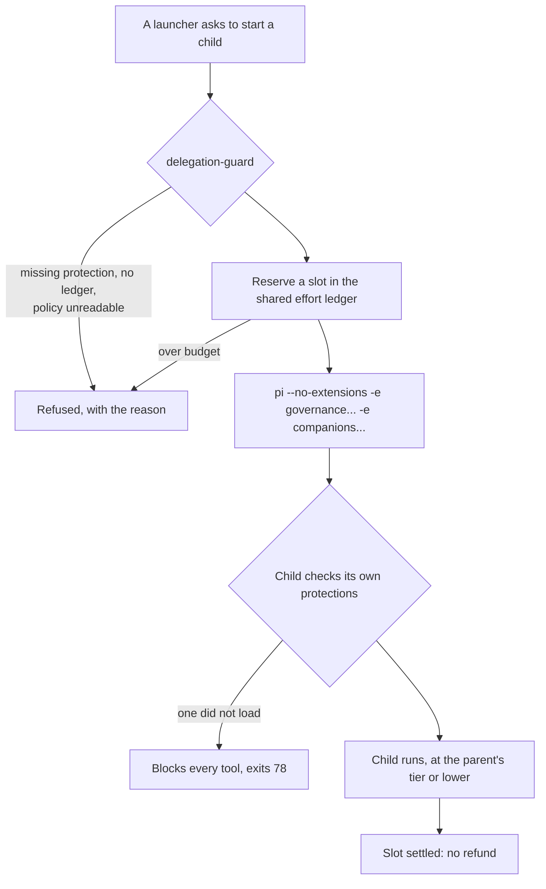

# Agent Orchestration

Autonomous "agent team" delegation: a planning agent, N implementation agents, and a
review/validation agent, coordinated by the main agent you talk to, **auto-invoked when a task is
non-trivial**. Works in both the lite and full installs.

> This is a set of **kit extensions** (pi-package resources). It does not modify pi core. Subagents
> are separate `pi` processes with their own isolated context windows.

## Pieces

| Extension | Role |
| --- | --- |
| `subagent` (vendored) | The one delegation engine: single / parallel / chain delegation to role agents in isolated `pi` subprocesses (tool restriction, per-role model, skill preloading), plus [workflows](workflows.md). Every other launcher goes through the same launch contract. |
| `delegation-guard` | The launch contract: decides which extensions a child loads, reserves its budget, and verifies inside the child that its protections loaded. See [Child governance](#child-governance). |
| `effort` | The [effort tier](effort.md) and the shared delegation ledger every launch reserves against. |
| `orchestrator` | The autonomy: scores task complexity and, when non-trivial, steers the main agent into the plan → implement → validate flow (via a context-sieve message). |
| `goal-core` | Persists the mission goal to `.pi/GOAL.yaml` (survives compaction). |
| `task-graph` | Shared DAG task board (`.pi/task-graph.json`): planner emits units, implementers claim the next unblocked one. *(full)* |
| `verifier-board` | Definition-of-done gate (`.pi/verdicts.json`): the mission isn't done until verdicts pass and at least one trusted source (`verify`/`review`/`validator:<id>`) passes. *(full)* |
| `branch-lab` | Git worktree leases so parallel implementers don't clobber each other. *(full)* |

## Roles

Resolved in this order, later sources overriding earlier ones by name:

1. **kit**: `packages/kit/agents/*.md` (`scout`, `planner`, `implementer`, `reviewer`,
   `delegator`). Always available and trusted, including inside headless children.
2. **user**: `~/.pi/agent/agents/*.md`. Copy a kit role here to customise it.
3. **project**: `.pi/agents/*.md`, only with `agentScope: "project" | "both"`. It needs
   interactive approval, or an exact digest in `PI_KIT_TRUSTED_PROJECT_ROLES`.

Older kits copied the roles into each project's `.pi/agents`. Those copies are now ignored
by default. A one-time notice lists only the copies whose content differs from the current
built-in roles; byte-identical copies are not flagged.

Role frontmatter: `name`, `description`, `tools` (comma list), `model` (`provider/id`),
`thinking` (`off` … `max`), `skills` (SKILL.md bodies preloaded into the role's system
prompt), `extensions` (extra kit extensions for the isolated child), `max_runtime`
(`30m`), `effort` (ask for a lower [effort tier](effort.md) for this role) and `scout: true`
(count against the scout limit).

## Subagent model policy

A role's `model:` is used when set. Otherwise the child gets the parent session's active
model. Set `PI_KIT_SUBAGENT_INHERIT_MODEL=1` to force the parent model for every role.

## Child governance

A child is a separate `pi` process started with `--no-extensions` plus an allowlist that
`delegation-guard` builds. Every launch path uses it: the `subagent` tool, `/workflow`, the
completion reviewer in `verify-gate`, the specialists and validators in `conductor`, the second-model
reviewer in `dual-review` (`/review` and the `dual_review` tool), and recovery. A test scans the
extension sources and fails when a launcher of `pi` children does not ask the guard
(`tests/delegation-guard-smoke.mjs`). There is one engine, so there is one set of rules:

- **Governance first.** The child loads `delegation-guard`, then `protected-paths`, `secret-guard`
  and `tool-firewall` (each if the parent has it), then any other extension whose manifest says
  `childGovernance: true` (`effort`, `pentest-governance-domain`), then the companions
  `finish-reason-retry` and `todo`. The firewall is always ahead of anything that could act.
- **Fail closed.** If a required protection cannot be located or did not load in the child, the
  child is not started, or (if it started) blocks every tool call and exits with code 78
  (`EX_CONFIG`) so the parent sees a visible failure. A child is never started with weaker
  protection than its parent, at any depth: grandchildren go through the same contract.
- **Fatal, not retried.** A denied or misconfigured launch is not treated as a transient failure.
- **Budgeted.** Every launch reserves a slot in the [effort ledger](effort.md#how-delegation-is-budgeted);
  a child's tier is its parent's or lower.
- **Roles that need more.** A role whose tools include `subagent` also gets `subagent`, and a
  role or step can add `extensions:`, by **name**: a kit extension's registry name, never a path,
  so a role, workflow or settings file cannot load arbitrary code into a governed child (a name
  that is not one is skipped). Ambient launchers (a pentest specialist that needs the operator's
  MCP servers) keep the operator's extensions but are always given `delegation-guard` explicitly
  and the guard's environment, so the child-side check runs even if the child's settings would not
  have loaded it.

`PI_KIT_SUBAGENT_EXTENSIONS=a,b` replaces the **companion** list (governance cannot be removed).
`PI_KIT_SUBAGENT_ISOLATE=0` no longer disables isolation. The task reaches the child over stdin
(print mode merges it into the prompt), not as one argument, so large chained tasks cannot hit the
128 KiB argument limit.

## How autonomy works

pi is model-driven — there is no hidden background spawn; a subagent runs only when the main agent
calls the `subagent` tool. So "automatic" means: the `orchestrator` scores each request and, above a
threshold, injects a high-priority directive telling the main agent to delegate. Tune it:

- `PI_KIT_ORCH_THRESHOLD` — complexity score needed to auto-delegate (default `3`; raise for lite /
  small models).
- `/orchestrate on|off|auto|status` — force always-delegate, never, or automatic for the session.
- `PI_KIT_ORCH_DISABLE=1` — turn the layer off entirely.

## Subagent reliability, observability and recovery

A subagent is a long-lived child process; the parent must never be wedged by one. The guards:

- **Idle watchdog** — `PI_KIT_SUBAGENT_IDLE_TIMEOUT_MS` (default 15 min, 0 disables). Keys on
  child *output*, so a long silent tool call can still look stalled.
- **Wall-clock ceiling** — `PI_KIT_SUBAGENT_MAX_RUNTIME_MS` (default 30 min, 0 disables). The
  backstop for a child that keeps dripping output and would otherwise defeat the idle watchdog.
  Reports `stopReason: "wall-clock"`.
- **Live heartbeat** — `PI_KIT_SUBAGENT_HEARTBEAT_MS` (default 5 s, 0 disables). Emits elapsed /
  idle / bytes to the parent (and the TUI footer) while the child is silent.
- **Cancel and background.** Esc (a cancelled tool call) stops the children, so there's no
  hidden token spend and a chain can't be silently truncated. For long work you don't need
  this turn, pass `background: true` (single or parallel mode). The call returns
  immediately, and the result is delivered to the agent (a session message) and to you (a
  notification) when it finishes. `PI_KIT_SUBAGENT_DETACH_SIGNAL=1` restores the old
  detach-on-cancel behaviour. Live children are stopped when the session ends.
- **Bounded headless approvals** — a tool-firewall `ask` inside a headless child is answered for
  at most `PI_KIT_SUBAGENT_APPROVAL_TIMEOUT_MS` (default 2 min) before failing closed, rather than
  the 15-minute root default.
- **Live TUI footer** — the tool sets a persistent `subagent` status line (agent, step, turn,
  elapsed, last tool + target, run id) for the duration and clears it on finish.

The main agent can inspect and stop runs with `subagent_status` / `subagent_stop` (and the
`/subagents` / `/subagent-stop` commands); every run also writes `.pi/subagent/<id>.log` and
`.pi/subagent/runs.jsonl`. Run ids carry a random suffix (parallel runs of one role no longer
collide), the registry is compacted to the last 500 runs, and a run whose process died is shown
as `orphaned` instead of `running` forever.

### Autonomous stall escalation

`progress-guard` watches the main session for repetition, oscillation, and reads-without-a-write.
When one signature keeps recurring it injects a review/delegate checkpoint on its own — in either
mode, no `/reflect` and no mode switch — and writes `.pi/recovery/escalation.json` for
`recovery-orchestrator`. The reads-since-edit signal defaults to `PI_KIT_GUARD_STALL` (10) and is
suppressed entirely in a session with no write-capable tool active. See
`packages/extensions/src/progress-guard/README.md`.

## Lite vs full

- **Lite ("Plan→Do→Check"):** `planner → implementer → reviewer` chain, in-place, higher threshold.
  Ships `subagent`, `orchestrator`, `goal-core` + the role agents. No external deps.
- **Full ("Agent Team"):** adds `scout`, parallel implementers in `branch-lab` worktrees, the
  `task-graph` DAG and the `verifier-board` gate.

## Manual entry points

- `/orchestrate-plan <task>`: scout + planner produce a plan (no changes). Sent as a message.
- `/orchestrate-implement-review <task>`: planner → implementer → reviewer, looping until it
  passes.
- `/workflow run feature goal=…` / `bugfix` / `research`: the same flows as saved, resumable
  [workflows](workflows.md).
- Or just ask in plain language: "plan this with a subagent, then implement and review it."

## Verification lifecycle

Conversation does not require a verifier board. The gate is armed by an active
implementation/delegation workflow, or successful `write`/`edit` results in a
project that declares `scripts.verify` with `PI_KIT_VERIFY_ON_TURN=1`. Plan-only commands and ordinary report
edits without that project contract do not create failing npm verdicts.

With `PI_KIT_VERIFY_ON_TURN=1`, verify-gate runs after edits when the assistant
finishes its tool sequence, awaiting the check before subsequent hooks inspect
the board. Load verify-gate before orchestrator for this ordering (as in the lite
surface and live harness). Automatic checks skip projects without a verify script.
The check command is bounded to two minutes and one MiB of captured output.

Explicit `/verify` (operator) and `verify_completion` (agent) are a general
completion check, not only a test run. They run the check command if one exists,
then an isolated read-only reviewer that judges the goal, todos, task graph, and
recent requests against the repository. The reviewer records `review` on the
board and writes `.pi/verify-report.md`. If neither a check nor a review can
run, `/verify` still records FAIL. See `packages/extensions/src/verify-gate/README.md`.

The orchestrator sends at most one labeled custom diagnostic per user request at
the final `turn_end`, while Pi can consume it in the current loop. It does not
inject a user message at `agent_end`, which could otherwise remain queued until
the next user request. The diagnostic requests actual check results or an honest
blocker report; it never authorizes fabricating PASS verdicts or executing operator
slash commands as shell commands. A failed board remains failed after the bounded
correction.

Automatic delegation also checks that `subagent` is in the active tool set.
Unavailable tools do not produce delegation directives or phantom completion
requirements; explicit delegation commands report the missing tool to the operator.

Automatic edit detection covers successful built-in `write` and `edit` tools.
Shell-only changes and external tools still need explicit project checks or an
explicit workflow. This completion guidance is not an authorization boundary or
proof that model-authored evidence is correct.

## Root orchestration with Conductor

`conductor` is the layer-4 orchestration layer above this task-level `orchestrator`. It owns durable,
multi-phase engagements, dynamically synthesises least-privilege specialists rather than relying only
on static `.pi/agents/*.md` roles, and routes claimed findings/results through causally independent
validation. See [Subagents and orchestration](architecture/subagents-and-orchestration.md) and the
`engagement-conductor` and `dynamic-agent-synthesis` skills under
[Orchestration & recovery](skills-catalogue.md#orchestration-recovery), and the
`independent-finding-validation` skill under
[Evidence & reporting](skills-catalogue.md#evidence-reporting) in the skills catalogue.
