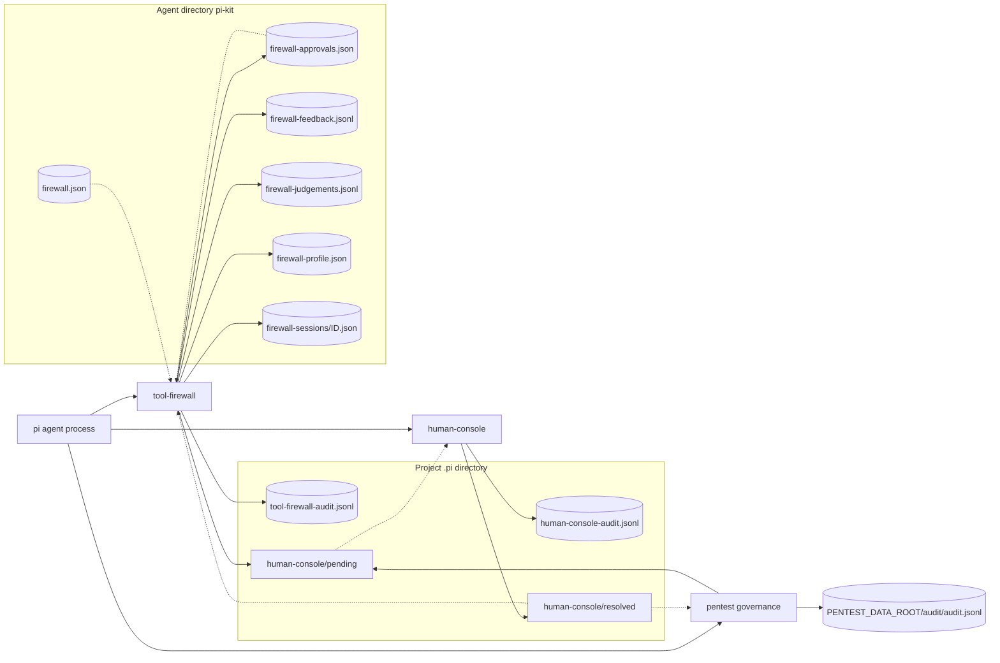
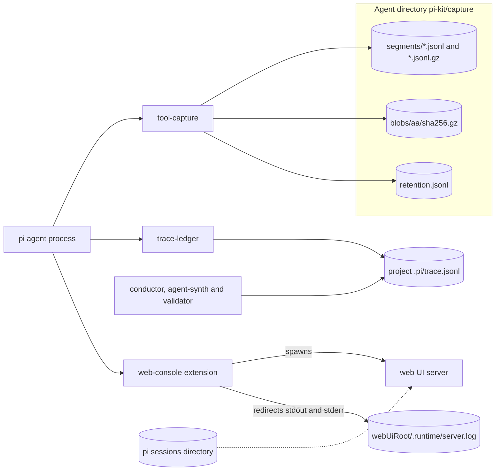
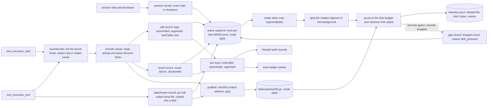
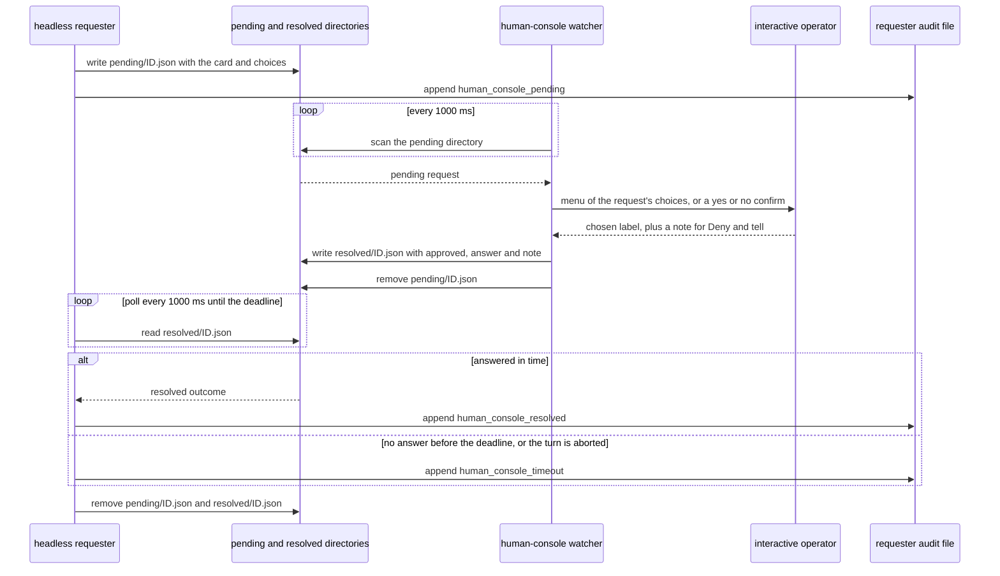
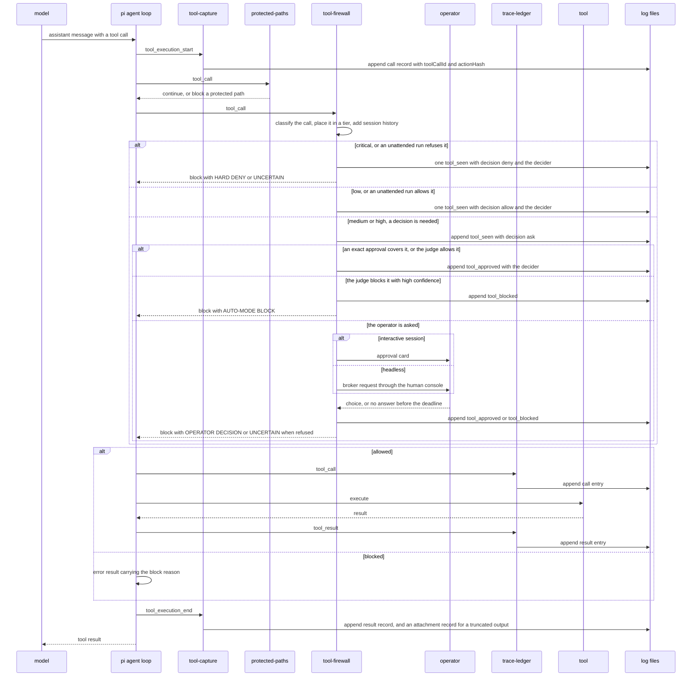

# Human console, approvals and logging

This page covers how a headless session gets an answer from a person, and where the kit records what happened. It describes the human console (a filesystem rendezvous between a headless requester and an interactive operator session), the approvals the tool firewall remembers, every log and state file the extensions write, how `tool-capture` stores and prunes tool input and output, and how the join keys tie the logs together. The four diagrams show where state lives (split into two maps), how capture stores and prunes data, the broker round trip, and one tool call end to end.

The human console is not a UI. A headless requester drops an approval or question request into a `pending` directory and an interactive operator session writes the answer into a `resolved` directory. The `ask_human` tool, the tool firewall and pentest governance all use this broker, so a headless subagent can ask a question or request an approval that a person sitting in another session answers.

## Retention and join keys

Every subsystem writes its own log, most of it JSONL, and the retention rules differ. `tool-capture` self-prunes against a disk budget and rotates its segments. `firewall-judgements.jsonl` is rotated at 4 MiB with a single `.1` backup. The firewall audit, the human-console audit, the trace ledger and the pentest hash chain are append-only with no automatic rotation, so an operator manages them and they grow until someone trims them. `firewall-feedback.jsonl` is append-only too, apart from `/auto forget`, which rewrites it. The per-session `firewall-sessions/<id>.json` files and the approvals file are rewritten atomically on every save.

Firewall decision records carry a `toolCallId` and an `actionHash`. Capture `call` records carry their own `actionHash` and `argsHash`, the trace ledger uses its own `argsHash` and `toolCallId`, and the learning-state `FeedbackRecord` carries a `hash` and a `sig` but no `toolCallId`. The keys let an operator correlate the logs; there is no single universal join key.

## Components and where state lives

The firewall and the capture and trace extensions write into different trees. The firewall audit, the human-console files and the trace ledger sit in the project's `.pi/` directory, the firewall's learning state, approvals and the capture store sit under the agent directory's `pi-kit/`, and pentest governance writes under `PENTEST_DATA_ROOT`. Two console surfaces exist: the human-console file broker described here, and the optional **web UI** (`/console`, extension `web-console`). The web-console extension spawns `packages/web-ui/server/server.js` and appends that server's stdout and stderr to `<webUiRoot>/.runtime/server.log`. The server reads pi session JSONL from the sessions directory (`PI_CODING_AGENT_SESSION_DIR`, default `<agentDir>/sessions`) and never reads or writes the human-console `pending` and `resolved` directories.

Every profile except `lite` loads `human-console` and `tool-capture`; `trace-ledger` is in all of them.

The first map covers the firewall, the broker and the pentest audit. Solid arrows are writes and dotted arrows are reads.

The second map covers capture, the trace ledger and the web UI.

The table lists every log and state file these subsystems touch with its writer, the record kinds it holds, and its rotation or retention behaviour.

The `.pi/trace.jsonl` `call` and `result` record kinds describe only trace-ledger's records. Conductor, its synthesiser and its validator also append their own result-style entries to the same shared file, with an FNV 8-hex `argsHash` (trace-ledger uses sha256). That is why trace-ledger's header warns that this file must never be truncated.

| File | Writer | Record kinds | Rotation / retention |
| --- | --- | --- | --- |
| `.pi/tool-firewall-audit.jsonl` (override `PI_KIT_FIREWALL_AUDIT_LOG`) | tool-firewall `audit` | `tool_seen`, `tool_approved`, `tool_blocked`, `tool_escalated`, `human_console_pending`, `human_console_resolved`, `human_console_timeout`, `auto_mode_check_start`, `auto_mode_approved`, `auto_mode_blocked`, `auto_mode_judge_unavailable`, `approvals_malformed`, `approval_store_error`, `ssh_config_changed`, `policy_rule_warnings`, `policy_load_error` | append-only; no built-in rotation, operator-managed |
| `.pi/human-console/pending/` and `resolved/` (override root with `PI_KIT_HUMAN_CONSOLE_DIR`) | requester writes `pending/<id>.json`; the console watcher writes `resolved/<id>.json` | one JSON request or answer per file | the requester removes both files when it finishes; a malformed pending file is renamed `<file>.invalid` and at most 50 of those are kept |
| `.pi/human-console-audit.jsonl` (always cwd-relative) | human-console `audit` | `ask_human_pending`, `ask_human_resolved`, `ask_human_timeout`, `human_console_invalid_pending_json`, `human_console_invalid_pending_id`, `human_console_invalid_pending_kind` | append-only; no built-in rotation, operator-managed |
| `.pi/trace.jsonl` | trace-ledger (and conductor's own transition entries) | trace-ledger's `call` and `result` entries; conductor, agent-synth and validator append their own result-style entries with an FNV 8-hex `argsHash` | append-only; no built-in rotation; `/trace` shows a bounded tail; shared file, never truncate |
| `<agentDir>/pi-kit/firewall.json` (override `PI_KIT_FIREWALL_CONFIG`) | the profile installer, `/auto` and `/firewall revoke host:<name>` | `mode`, `policy`, `source`, `judgeModel`, `learn`, `knownHosts`, `untrustedHosts` | latest-only, rewritten atomically |
| `<agentDir>/pi-kit/firewall-approvals.json` (override `PI_KIT_FIREWALL_APPROVALS`) | tool-firewall `approvals.ts` (`addApproval`, `revokeApprovals`) | session approvals (given by the operator, bound to one action, workspace, working directory and root session, 24 hours), persistent approvals (learned exact actions, 30 days) and revocation `floors` | one versioned file (`schemaVersion` 1), rewritten atomically under a short lock; expired entries are dropped on write and at most 200 are kept; a file with unreadable entries is also copied to `<file>.rejected-<hash>` |
| `<agentDir>/pi-kit/firewall-feedback.jsonl` (override `PI_KIT_FIREWALL_FEEDBACK`) | tool-firewall `appendFeedback` | operator decision precedents | append-only; `/auto forget` rewrites it to drop matches |
| `<agentDir>/pi-kit/firewall-judgements.jsonl` (override `PI_KIT_FIREWALL_JUDGEMENTS`) | tool-firewall `appendJudgement` | judge verdicts | rotates at 4 MiB, keeps one old copy as `.1` |
| `<agentDir>/pi-kit/firewall-profile.json` (override `PI_KIT_FIREWALL_LEARNED_PROFILE`) | tool-firewall profile distiller | stats, principles, cautions | latest-only, rewritten in the background |
| `<agentDir>/pi-kit/firewall-sessions/` (override `PI_KIT_FIREWALL_SESSIONS_DIR`) | tool-firewall trajectory | one `<id>.json` per session (recent actions, credential reads, downloads, judge cache, counters) | rewritten atomically on every save; files older than 14 days are swept |
| `<agentDir>/pi-kit/capture/` (override `PI_KIT_CAPTURE_DIR`) | tool-capture store | `call`, `result`, `attachment`, `session`, `gap` records plus blobs and `retention.jsonl` | rotates at `PI_KIT_CAPTURE_SEGMENT_BYTES`, gzips rotated segments, prunes to budget |
| `<PENTEST_DATA_ROOT>/audit/audit.jsonl` (default `.pi/pentest`) | pentest governance `audit` | `session_start`, `tool_allowed`, `tool_blocked`, `approval_requested`, `tool_approved`, `human_console_pending`, `human_console_resolved`, `human_console_timeout`, `policy_metadata_load_error` | hash-chained and append-only; no built-in rotation, operator-managed |
| `<webUiRoot>/.runtime/server.log` (`PI_KIT_WEBUI_ROOT` locates the root) | the web UI server process spawned by web-console `startServer` | plain text lines: the server's stdout and stderr | append-only; no built-in rotation, grows unbounded |

## Approvals, refusal labels and unattended mode

What the operator allows is remembered in one file, `<agent dir>/pi-kit/firewall-approvals.json`. An approval is never broader than the choice that created it: it is bound to one exact action (tool plus action hash) in one workspace and working directory, under the policy it was given in. A session approval also belongs to the root session, which its subagents share, and expires after 24 hours. A persistent approval is an exact action the operator approved repeatedly (three approvals in two sessions within 30 days, with no denial since) and expires after 30 days. The file is treated as untrusted input. A file of another `schemaVersion`, invalid JSON, or an entry of an unknown shape is ignored, never treated as an allow, and reported. The decision reads the file on every call, so `/firewall revoke` takes effect on the next tool call. A `firewall-sessions/<root>.grants.json` file left by an older kit is not read, so it cannot authorise anything.

Every refusal carries exactly one label, in the text the agent reads and in the audit record's `outcome`:

| Label in the refusal text | Audit `outcome` | Meaning |
| --- | --- | --- |
| `[HARD DENY]` (also `[HARD DENY: unattended run]` and `[HARD DENY: outside the unattended zone]`) | `hard_deny` | policy says never, or the action needs authority outside the unattended zone; no approval and no judge overrides it |
| `[UNCERTAIN: no operator decision]` (also `[UNCERTAIN: no operator in this unattended run]`) | `uncertain` | the automatic layers could not settle it, or nobody could be asked before the deadline; it fails closed with a message the agent can relay |
| `[OPERATOR DECISION: denied]` | `operator_decision` | a person declined it; an allow is recorded as `operator_decision` too |
| `[AUTO-MODE BLOCK: judge, high confidence]` | `judge_block` | the auto-mode judge blocked it with high confidence; the block is final and carries the reason |

Unattended mode (`packages/extensions/src/tool-firewall/unattended.ts`) is decided once, when the firewall loads, from the supervisor's environment (`PI_KIT_UNATTENDED=1`, a known `PI_KIT_UNATTENDED_BOUNDARY` and a read-only `PI_KIT_UNATTENDED_CONTRACT` file). Nothing inside a session can switch it on, and a changed or unreadable contract switches it off for the rest of the process. Inside the zone there are no approval prompts and no judge calls. Critical and hard-denied classes, and anything that needs authority outside the zone (a host that is not in the contract's egress list, a git remote that is not listed, publishing, cloud and cluster APIs), are still refused. Audit records for these runs carry `mode: "unattended"`, the boundary and a short contract digest.

## Tool-capture pipeline and join keys

Capture opens one segment per process and appends five kinds of record around a tool call: a `call` record on `tool_execution_start`, a `result` record and an optional `attachment` record on `tool_execution_end`, a `session` record on start and shutdown, and a `gap` record that says how many records were dropped once disk pressure eases. Values too large to inline are written to content-addressed gzip blobs and referenced from the record, and rotated segments are compressed in the background. Each record lists the secret kinds it contains; values are stored byte-exact unless `PI_KIT_CAPTURE_REDACT=1`, and `PI_KIT_CAPTURE=0` turns capture off. The join keys are `toolCallId` plus `actionHash` and `argsHash`, which connect a capture record to the firewall audit and the trace ledger.

## Broker round trip: headless requester to interactive operator

A headless requester (the firewall, or pentest governance) writes `<id>.json` into the pending directory and polls the resolved directory once a second until its deadline. The deadline is `PI_KIT_HUMAN_CONSOLE_TIMEOUT_MS` (15 minutes by default), or the end of the turn if it is aborted first. An interactive session's human-console watcher, which only runs in a session that has a UI, reads the pending directory every 1000 ms, shows the menu, writes `<id>.json` into the resolved directory and removes the pending file. If the operator answers after the request's deadline, the watcher only removes the pending file, so no orphan answer is left. The requester's audit gets `human_console_pending`, then `human_console_resolved` once it reads the answer, or `human_console_timeout` if nothing arrives by the deadline; pentest governance records the same three kinds in its hash-chained audit. The requester removes both files when it finishes.

The approval choices come from the firewall card: `Allow once`, `Deny`, and `Deny and tell the agent why…`. The session choice is offered in two forms: `Allow for this session (similar steps: judge checks them against this)` when the judge will check similar steps, and `Allow for this session (exact repeats only)` when only exact repeats are allowed. Under the pentest policy no session choice is offered. A request without `choices` (pentest governance's) is shown as a yes or no confirm. A question request instead shows the caller's `options` plus an `Other (type an answer)` entry. An operator's session allow is stored as a session approval and is also recorded with the `grant` source in the feedback log.

## A run end to end

This sequence shows one tool call from the model through the firewall's decision, the possible operator detour, capture and the trace ledger. pi emits `tool_execution_start` first (capture writes its `call` record), then runs the `tool_call` handlers in load order (the profiles list `protected-paths`, then `tool-firewall`, then later extensions such as trace-ledger), stopping at the first block. A blocked call therefore gets no trace-ledger entry and no `tool_result` event. For an immediate decision (`low` allows, `critical` denies, and every unattended outcome) the firewall appends exactly one `tool_seen` record that carries the decider. The deferred path appends `tool_seen` with `decision: ask` and then `tool_approved` or `tool_blocked`. The tool runs only after every handler has returned, and `tool_execution_end` fires for every call, blocked or not.

## Source files

- `packages/extensions/src/human-console/index.ts` — file-broker watcher; pending and resolved directories; `ask_human` tool; cwd-relative audit; the `.invalid` quarantine.
- `packages/extensions/src/tool-firewall/index.ts` — `auditPath`, `audit`, `brokerApproval`, `decide`, the labelled outcomes and `/firewall`; writes `.pi/tool-firewall-audit.jsonl`.
- `packages/extensions/src/tool-firewall/approvals.ts` — the approvals file: schema, validation, expiry, scope matching, revocation and floors.
- `packages/extensions/src/tool-firewall/unattended.ts` — the run contract, unattended state, egress and remote checks, hard and outside-the-zone denials.
- `packages/extensions/src/tool-firewall/card.ts` — approval choice constants and `sessionChoice` / `choicesFor`.
- `packages/extensions/src/tool-firewall/config.ts` — `kitStateDir`, `configPath`, `feedbackPath`, `sessionsDir`; env precedence.
- `packages/extensions/src/tool-firewall/profile.ts` — `judgementsPath`, `profilePath`; 4 MiB rotation and the distilled profile.
- `packages/extensions/src/tool-firewall/feedback.ts` — `firewall-feedback.jsonl` record shape, learning thresholds and `/auto forget` compaction.
- `packages/extensions/src/tool-firewall/trajectory.ts` — `firewall-sessions/<sessionId>.json`; 14-day sweep; root-session sharing.
- `packages/extensions/src/tool-capture/index.ts` — capture hooks, `captureDir`, `actionHash`, `argsHash`, secret scanning, blob and attachment handling.
- `packages/extensions/src/tool-capture/store.ts` — segments, blobs and `retention.jsonl`; rotation, gzip and budget pruning.
- `packages/extensions/src/trace-ledger/index.ts` — subscribes to pi's `tool_call` / `tool_result` events and appends `call` / `result` entries to the shared `.pi/trace.jsonl` (conductor also appends there); sha256 `argsHash`; bounded `/trace` tail.
- `packages/extensions/src/web-console/index.ts` — `/console` command; locates `packages/web-ui`, spawns the bundled server and appends its stdout and stderr to `<webUiRoot>/.runtime/server.log`.
- `packages/web-ui/server/config.js`, `packages/web-ui/server/sessions.js`, `packages/web-ui/server/tailer.js` — session directory (`PI_CODING_AGENT_SESSION_DIR`), discovery and tailing of pi session JSONL; none of them touch the human-console `pending` / `resolved` directories.
- `packages/extensions/src/pentest-governance-domain/index.ts` — `dataRoot`, the hash-chained `audit/audit.jsonl`, and its own `human_console_*` pending / resolved round trip.
- `packages/extensions/third_party/protected-paths/index.ts` — refuses agent writes to the human-console files, the approvals file and the firewall state.
