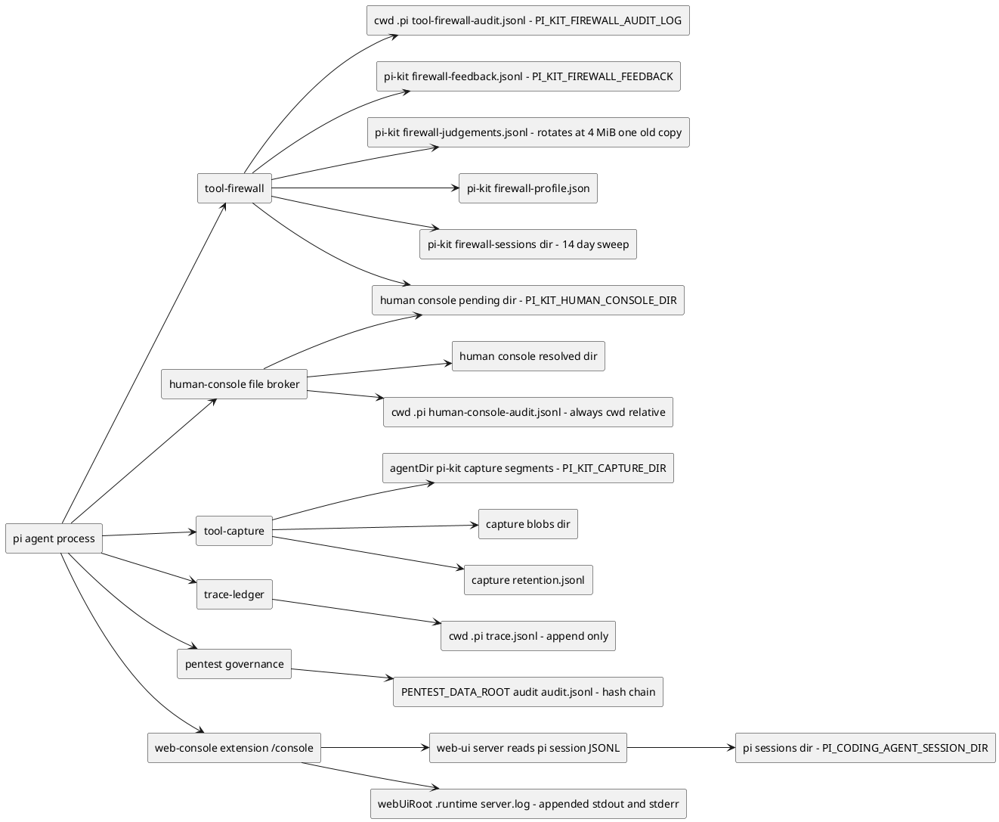
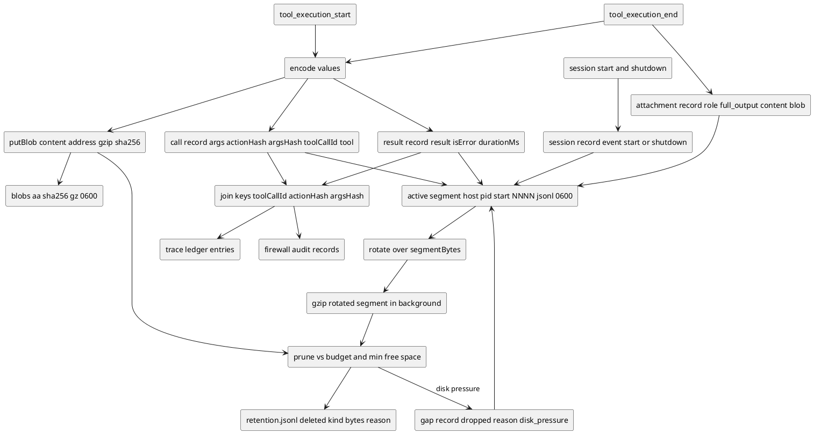
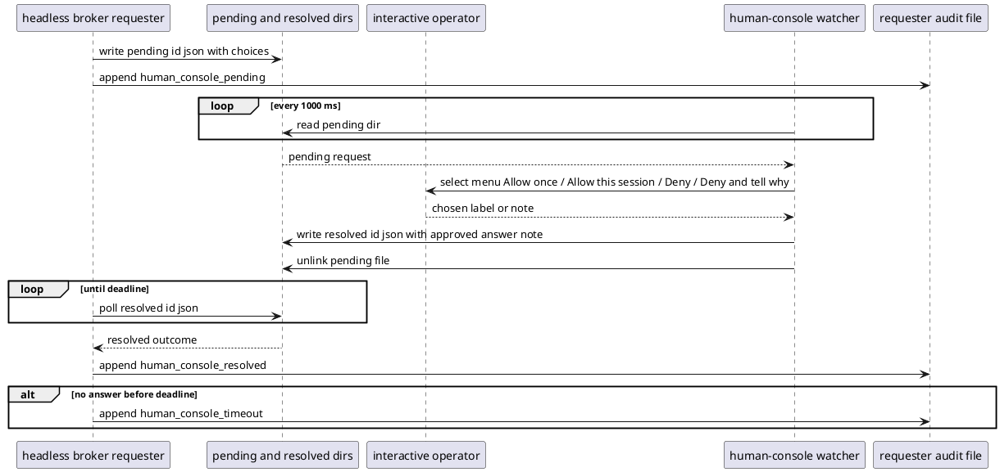
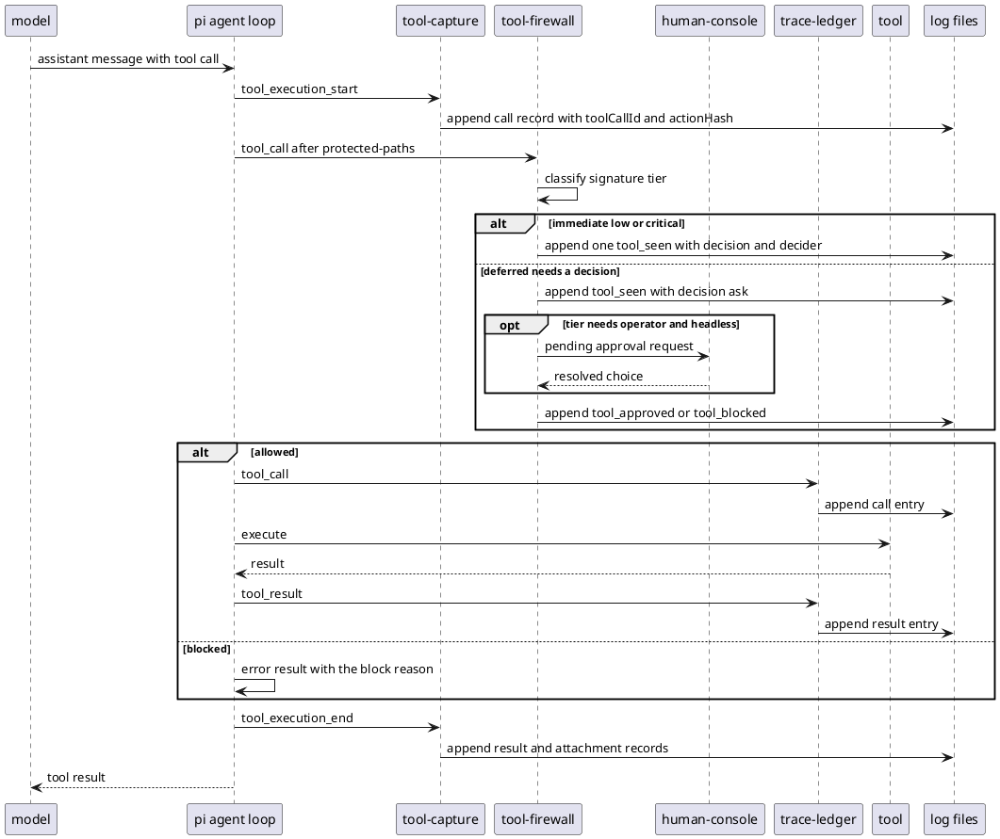

# Human console, approvals and logging

> Diagrams reflect commit 399b221 (branch overhaul/2026-09, 2026-09-23). If the code has changed since, regenerate them.

The human console is not a UI: it is a filesystem rendezvous where a headless requester drops an approval or question request into a `pending` directory and an interactive operator session writes the answer into a `resolved` directory. At least the `ask_human` tool, the tool-firewall and pentest governance's approval path use this broker, so a headless subagent can ask a question or request an approval that a human sitting in another session answers. Every subsystem also writes its own append-only log, most of it JSONL, but they have very different retention stories: `tool-capture` self-prunes against a disk budget and rotates its segments, and `firewall-judgements.jsonl` is the only log rotated with a single `.1` backup. The firewall audit, the human-console audit, the trace ledger, the feedback log and the pentest hash chain are all append-only with no automatic rotation, so they are operator-managed and grow until someone trims them; the `firewall-sessions/<id>.json` state files are instead rewritten atomically on every save. Firewall decision records carry a `toolCallId` and `actionHash`; capture `call` records carry their own `actionHash` and `argsHash`, the trace ledger uses its own `argsHash`, and the learning-state `FeedbackRecord` carries a `hash` and `sig` but no `toolCallId`, so the keys let an operator correlate the logs rather than forming one universal join key. This document maps where that state lives, how the broker round trip works, how capture stores and prunes data, and how the join keys tie the logs together.

## Components and where state lives

The firewall and the capture and trace extensions all write into different trees: the firewall and trace use the project's `.pi/` directory, the learning state and capture live under the agent directory's `pi-kit/`, and the pentest domain uses `PENTEST_DATA_ROOT`. Two distinct console surfaces exist: the human-console file broker above, and the optional **web UI** (`/console`, extension `web-console`), which spawns `packages/web-ui/server/server.js` and appends that server's stdout/stderr to `<webUiRoot>/.runtime/server.log`, while the server itself reads pi session JSONL from the sessions directory (`PI_CODING_AGENT_SESSION_DIR`, default `<agentDir>/sessions`) and never touches the human-console `pending`/`resolved` directories. The table lists every log and state file these subsystems touch with its writer, the record kinds it holds, and its rotation or retention behaviour.

The `.pi/trace.jsonl` `call` and `result` record kinds describe only trace-ledger's records. Conductor, its synthesizer and its validator also append their own result-style entries into the same shared file with an FNV 8-hex `argsHash` (unlike trace-ledger's sha256), which is why trace-ledger's header warns that this file must never be truncated.

| File | Writer | Record kinds | Rotation / retention |
| --- | --- | --- | --- |
| `.pi/tool-firewall-audit.jsonl` (override `PI_KIT_FIREWALL_AUDIT_LOG`) | tool-firewall `audit` | `tool_seen`, `tool_approved`, `tool_blocked`, `human_console_pending`, `human_console_resolved`, `human_console_timeout`, `auto_mode_*`, `policy_rule_warnings`, `policy_load_error` | append-only; no built-in rotation, operator-managed |
| `.pi/human-console-audit.jsonl` (always cwd-relative) | human-console `audit` | `ask_human_pending`, `ask_human_resolved`, `ask_human_timeout`, `human_console_invalid_pending_id` | append-only; no built-in rotation, operator-managed |
| `.pi/trace.jsonl` | trace-ledger (and conductor's own transition entries) | trace-ledger's `call` and `result` entries; conductor, agent-synth and validator append their own result-style entries with an FNV 8-hex `argsHash` | append-only; no built-in rotation; `/trace` shows a bounded tail; shared file, never truncate |
| `<agentDir>/pi-kit/firewall-feedback.jsonl` (override `PI_KIT_FIREWALL_FEEDBACK`) | tool-firewall `appendFeedback` | operator decision precedents | append-only; `/auto forget` rewrites it to drop matches |
| `<agentDir>/pi-kit/firewall-judgements.jsonl` (override `PI_KIT_FIREWALL_JUDGEMENTS`) | tool-firewall `appendJudgement` | judge verdicts | rotates at 4 MiB, keeps one old copy as `.1` |
| `<agentDir>/pi-kit/firewall-profile.json` (override `PI_KIT_FIREWALL_LEARNED_PROFILE`) | tool-firewall profile distiller | stats, principles, cautions | latest-only, rewritten in the background |
| `<agentDir>/pi-kit/firewall-sessions/` (override `PI_KIT_FIREWALL_SESSIONS_DIR`) | tool-firewall trajectory | per-session `<id>.json` and `<id>.grants.json` | files older than 14 days are swept |
| `<agentDir>/pi-kit/capture/` (override `PI_KIT_CAPTURE_DIR`) | tool-capture store | `call`, `result`, `attachment`, `session`, `gap` records plus blobs and `retention.jsonl` | rotates at `PI_KIT_CAPTURE_SEGMENT_BYTES`, gzips rotated segments, prunes to budget |
| `<PENTEST_DATA_ROOT>/audit/audit.jsonl` (default `.pi/pentest`) | pentest governance `audit` | `session_start`, `tool_allowed`, `tool_blocked`, `approval_requested`, `tool_approved`, `human_console_pending`, `human_console_resolved`, `human_console_timeout`, `policy_metadata_load_error` | append-only; no built-in rotation, operator-managed |
| `<webUiRoot>/.runtime/server.log` (override `PI_KIT_WEBUI_ROOT` locates the root) | the web UI server process spawned by web-console `startServer` | plain text lines: the server's stdout and stderr | append-only; no built-in rotation, grows unbounded |

## Tool-capture pipeline and join keys

Capture opens one segment per process and appends five kinds of record around a tool call: a `call` record on `tool_execution_start`, a `result` record and optional `attachment` record on `tool_execution_end`, a `session` record on start and shutdown, and a `gap` record when disk pressure forces records to be dropped. Values too large to inline are written to content-addressed gzip blobs and referenced from the record, and rotated segments are compressed in the background. The join keys are `toolCallId` plus `actionHash` and `argsHash`, which are what connect a capture record to the firewall audit and the trace ledger.

## Broker round trip: headless requester to interactive operator

A headless requester broker (the firewall, or pentest governance) writes `<id>.json` into the pending directory and polls the resolved directory until its deadline; an interactive session's human-console watcher reads the pending file every 1000 ms, shows the menu, writes `<id>.json` into the resolved directory and removes the pending file. The requester's audit gets the `human_console_pending` record and, once the broker reads the resolution, the `human_console_resolved` record; if nothing arrives by the deadline it writes `human_console_timeout` instead. Pentest governance's audit records the same three kinds (`human_console_pending`, `human_console_resolved`, `human_console_timeout`) alongside its own events.

The exact approval choices come from the firewall card. They are `Allow once`, `Deny`, and `Deny and tell the agent why…`; the session choice is offered in two forms, `Allow for this session (similar steps: judge checks them against this)` when the judge will check similar steps, and `Allow for this session (exact repeats only)` when only exact repeats are allowed. A question request instead shows the caller's `options` plus an `Other (type an answer)` entry. The operator's session allow may be remembered as a grant, which the firewall records with the `grant` source in the feedback log.

## A run end to end

This sequence shows one tool call from the model through the firewall's decision, the possible human-console detour, capture and the trace ledger. pi emits `tool_execution_start` first (capture writes its `call` record), then runs the `tool_call` handlers in load order: `protected-paths`, then `tool-firewall`, then later extensions such as trace-ledger, stopping at the first block, so a blocked call gets no trace-ledger entry and no `tool_result` event. For an immediate decision (`low` → allow, `critical` → deny) the firewall appends exactly one `tool_seen` record that carries the decider; the deferred path appends `tool_seen` (with `decision: ask`) and then `tool_approved` or `tool_blocked`. The tool runs only after every handler has returned, and `tool_execution_end` fires for every call, blocked or not.

## Key files

- `packages/extensions/src/human-console/index.ts` — file-broker watcher; pending and resolved directories; `ask_human` tool; cwd-relative audit.
- `packages/extensions/src/tool-firewall/card.ts` — approval choice constants and `sessionChoice` / `choicesFor`.
- `packages/extensions/src/tool-firewall/index.ts` — `auditPath`, `audit`, `brokerApproval` and `decide`; writes `.pi/tool-firewall-audit.jsonl`.
- `packages/extensions/src/tool-firewall/config.ts` — `kitStateDir`, `configPath`, `feedbackPath`, `sessionsDir`; env precedence.
- `packages/extensions/src/tool-firewall/profile.ts` — `judgementsPath`, `profilePath`; 4 MiB rotation and the distilled profile.
- `packages/extensions/src/tool-firewall/feedback.ts` — `firewall-feedback.jsonl` record shape and `/auto forget` compaction.
- `packages/extensions/src/tool-firewall/trajectory.ts` — `firewall-sessions/<sessionId>.json` and `.grants.json`; 14-day sweep.
- `packages/extensions/src/tool-capture/index.ts` — capture hooks, `captureDir`, `actionHash`, `argsHash`, blob and attachment handling.
- `packages/extensions/src/tool-capture/store.ts` — segments, blobs and `retention.jsonl`; rotation, gzip and budget pruning.
- `packages/extensions/src/trace-ledger/index.ts` — subscribes to pi's `tool_call` / `tool_result` events and appends `call` / `result` entries to the shared `.pi/trace.jsonl` (conductor also appends there); sha256 `argsHash`; bounded `/trace` tail.
- `packages/extensions/src/web-console/index.ts` — `/console` command; locates `packages/web-ui`, spawns the bundled server and appends its stdout/stderr to `<webUiRoot>/.runtime/server.log`.
- `packages/web-ui/server/config.js`, `packages/web-ui/server/sessions.js`, `packages/web-ui/server/tailer.js` — read-only discovery and tailing of pi session JSONL (`PI_CODING_AGENT_SESSION_DIR`); never touch the human-console `pending`/`resolved` directories.
- `packages/extensions/src/pentest-governance-domain/index.ts` — `dataRoot`, the hash-chained `audit/audit.jsonl`, and its own `human_console_*` pending/resolved round trip.
