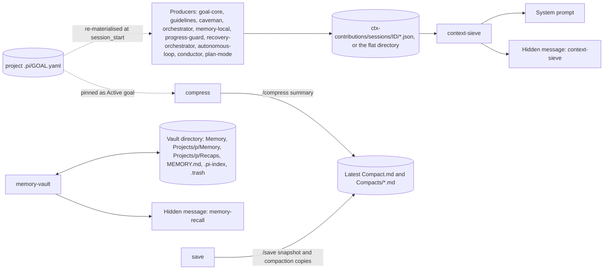
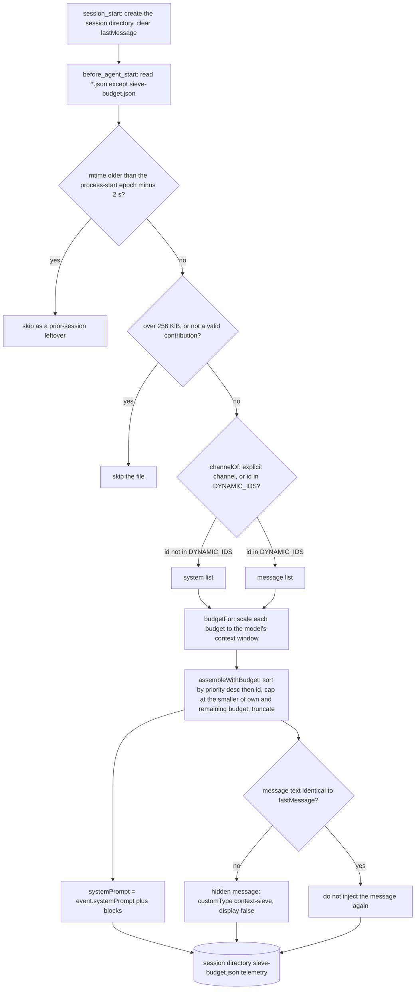
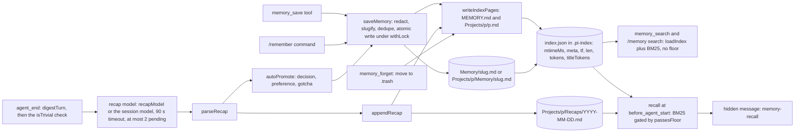
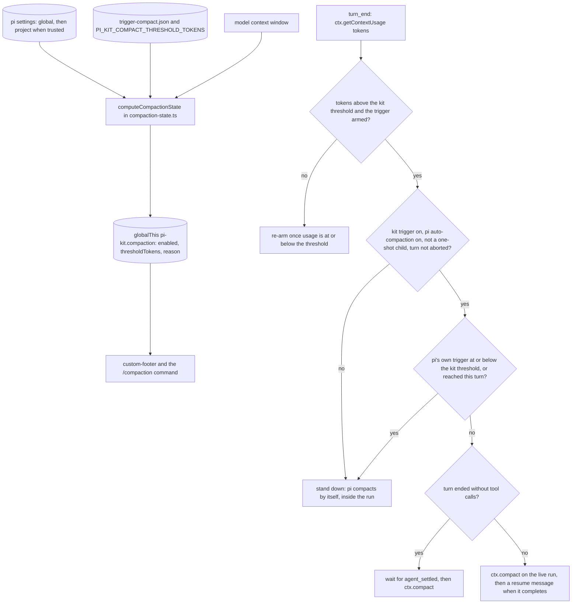
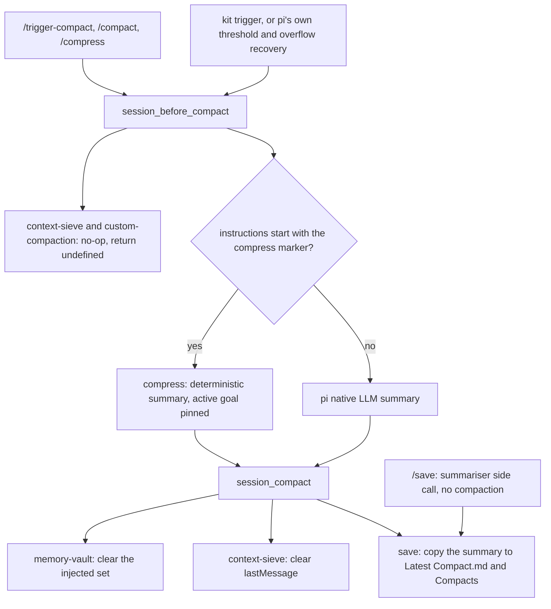
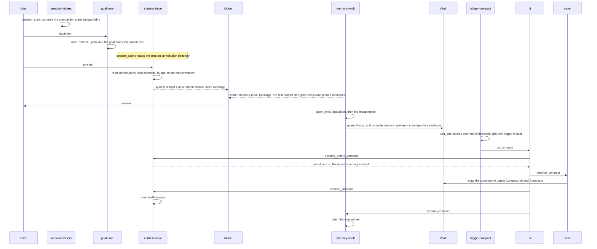

# Memory vault, compaction and context assembly

This page covers how the kit keeps context useful over a long session and across sessions. It maps the durable memory vault and its per-turn recaps, the assembly of contribution files into the system prompt and one hidden message, the compaction state that `session-helpers` computes and publishes, the triggers and summarisers that decide when and how a session is compacted, and one run that touches all of them. Each section names the hooks, files and environment variables involved. The six diagrams show the components and data flow, context assembly, the memory lifecycle, the compaction state and triggers, the summary path, and one run end to end.

pi separates durable memory (memory-vault, an Obsidian-compatible Markdown vault under `~/.pi/vault` by default) from in-session context assembly (context-sieve, the single reader of `.pi/ctx-contributions/sessions/<session-id>/*.json`; the flat `.pi/ctx-contributions/*.json` directory is the fallback when no session id is available). context-sieve merges those files into the system prompt or one hidden message. The `effort` extension may also return a system prompt, but only through its own marked block. Memory is managed by explicit tools (`memory_save`, `memory_search`, `memory_forget`, `/remember`, `/memory`) and automatically by per-turn recaps produced at `agent_end`.

Compaction is triggered by pi itself (at the context window minus `reserveTokens`, plus overflow recovery), by the kit's fixed-budget `trigger-compact` (default 100k tokens) when that would fire first, or manually (`/compress`, `/compact`, `/trigger-compact`). Summaries are produced natively by pi, deterministically by `/compress`, or, without compacting, by `save`'s check-in summariser. `goal-core` persists `.pi/GOAL.yaml` and re-materialises the goal contribution at every `session_start` while a goal is set, so the goal reaches the model through ordinary prompt assembly and survives compaction. context-sieve's `session_before_compact` is an explicit no-op that does not read `GOAL.yaml`; `/compress` reads `.pi/GOAL.yaml` itself and pins it above the conversation as `## Active goal`.

## Component and data flow

Producers write JSON contribution files into `<cwd>/.pi/ctx-contributions/` (session-scoped at `<cwd>/.pi/ctx-contributions/sessions/<session-id>/` when the host exposes a session id, with the flat directory as the fallback). context-sieve is the only component that reads them and decides what becomes part of the system prompt and what becomes one hidden message. memory-vault injects its own separate hidden message (`memory-recall`), and it and the compaction extensions write to disk independently of the assembly path.

Relevant environment variables and files: `PI_KIT_VAULT` (vault root), `PI_KIT_CTX_BUDGET_TOKENS` and `PI_KIT_CTX_MESSAGE_BUDGET_TOKENS` (context-sieve budgets), `PI_KIT_COMPACT_THRESHOLD_TOKENS` (trigger-compact threshold), `PI_KIT_COMPRESS_MAX_CHARS` (`/compress` budget), `PI_KIT_SAVE_VAULT` (save target vault) and `PI_KIT_SAVE_ON_COMPACT`. Without a vault, `save` writes to `<cwd>/.pi/snapshots`.

## Context assembly (ctx-contributions to system prompt and hidden message)

context-sieve creates its session directory at `session_start` (`<cwd>/.pi/ctx-contributions/sessions/<session-id>/`, or the flat `<cwd>/.pi/ctx-contributions/` when no valid session id is available) and reads it at each `before_agent_start`. It ignores leftovers from a prior session by skipping files whose modification time is older than the process-start epoch minus a 2 s grace window that absorbs coarse filesystem timestamps. The epoch is captured once at module load, before any extension's `session_start` handler runs, so the skip rule does not depend on extension load order: a producer that re-materialises its contribution before or after context-sieve's handler is still included. A contribution file larger than 256 KiB (`MAX_CONTRIBUTION_BYTES`) is skipped before parsing. A non-finite or absent `priority` is treated as `0`, and ties are broken by `id`, so assembly order is deterministic whatever the directory-read order. In the flat fallback directory, files written earlier in the same process are newer than the epoch and are never aged out; restart the process to shed them.

Contributions with an explicit `channel` go where they ask; otherwise the ids in `DYNAMIC_IDS` (per-turn content such as memory, delegation and loop nudges) go to the hidden message and the rest go to the system prompt. Each channel is budgeted and truncated separately.

Budgets are 4096 system tokens (`PI_KIT_CTX_BUDGET_TOKENS`) and 1200 message tokens (`PI_KIT_CTX_MESSAGE_BUDGET_TOKENS`), with `CHARS_PER_TOKEN = 4`, and each contribution's own `budgetTokens` is applied as well. With a known model context window the defaults are cut to 10% (system) and 3% (message) of the window when that is smaller, never below 64 tokens, and any budget, even an explicit one, is held to half the window. An unknown window (no model, or `contextWindow <= 0`) keeps the configured numbers and is recorded as `null` in `sieve-budget.json`, together with `windowClamped`. A message block is suppressed when its text is identical to `lastMessage`; `lastMessage` is cleared at `session_start` and after every compaction.

## Memory lifecycle (save, search, recap)

Explicit tools and the automatic recap queue both write deduplicated Markdown notes into scope-specific vault folders. Search and recall read a BM25 index built from those notes, but only the automatic recall path applies the relevance floor. Subagent children never recap or recall. The first prompt of a session also gets the three most recent recaps ("Where we left off") and the pinned memories; every prompt gets at most `recallLimit` (3) memories that clear the floor (`minScore` 1.5 and, for multi-term queries, two matching terms), each memory at most once per session. The recall message is capped at 2400 characters and is cleared for reinjection at compaction.

## Compaction state and triggers

`session-helpers` computes the effective compaction state in `compaction-state.ts` from the real settings files, using pi's own precedence: global `<agent dir>/settings.json`, then the project's `.pi/settings.json` deep-merged over it (the project wins, and an untrusted project's file is not read). `compaction.enabled` defaults to on, `reserveTokens` to 16384 and `keepRecentTokens` to 20000, and pi's own trigger is the context window minus `reserveTokens`. The state is published on `globalThis[Symbol.for("pi-kit.compaction")]` as `{ enabled, thresholdTokens, reason }`, where `thresholdTokens` is the earliest automatic trigger (pi's or the kit's). `custom-footer` reads it, and `/compaction` shows and changes it. It is recomputed at `session_start`, `model_select` and `before_agent_start`, and cleared at `session_shutdown`. When compaction is off, the model reports no window, or `reserveTokens` leaves no room, the state carries a `reason` that is warned about once per session.

`trigger-compact` adds a fixed-budget trigger, `PI_KIT_COMPACT_THRESHOLD_TOKENS` or `/compact-threshold` (saved in `<agent dir>/pi-kit/trigger-compact.json`, default 100k). It is level-triggered and re-arms once usage is back at or below the threshold. It obeys both switches (pi's `compaction.enabled` and its own on/off) and never fires in a one-shot child (a subagent, or print or JSON mode), because `ctx.compact()` aborts the running agent. It stands down when pi's own trigger is at or below the kit threshold, or when pi is about to compact on this turn anyway, so the two never fire together. A turn that ends without tool calls is the end of a run, so the trigger waits for `agent_settled` instead of aborting a run that is finishing. A compaction that has to interrupt a live run sends a resume message when it completes, unless something else has already continued the run.

## Compaction summaries

Manual commands and automatic compaction all pass through `session_before_compact`, which decides who produces the summary, and then `session_compact`, where other extensions react to the new summary. context-sieve and `custom-compaction` return `undefined` from `session_before_compact`, because pi's hook can cancel or replace the summary but cannot amend the summariser's instructions. `/save` is separate: it runs pi's summariser over the current branch as a side call and writes the snapshot, and the session is not compacted.

The default threshold is 100k tokens. `/compress` uses `PI_KIT_COMPRESS_MAX_CHARS` (default 16000, minimum 4000) and keeps the first turn, the newest turns and, within budget, a share of the earlier summary. `save` skips the on-compact copy when `PI_KIT_SAVE_ON_COMPACT` is exactly `"0"`. The `compress` extension only acts when the custom instructions begin with its `[[pi-kit:compress]]` marker, so `/compact` and automatic compaction keep pi's native LLM summary.

## One run end to end

A single session showing the compaction state being published, goal persistence, context assembly, recap writing, and a threshold-triggered compaction whose summary is copied to disk.

## Source files

- `packages/extensions/src/context-sieve/index.ts` — assembly of `.pi/ctx-contributions/sessions/<id>/*.json` (or the flat directory), channels, budgets scaled to the context window, `sieve-budget.json`, no-op `session_before_compact`.
- `packages/extensions/src/goal-core/index.ts` — `/goal`, `.pi/GOAL.yaml` and the re-materialised `goal-core.json` contribution.
- `packages/extensions/src/memory-vault/index.ts` — memory tools, recaps, recall, the hidden `memory-recall` message.
- `packages/extensions/src/memory-vault/vault.ts` — vault disk layout, config, index, dedupe, index pages, migration.
- `packages/extensions/src/memory-vault/recap.ts` — recap prompt, parse and promote.
- `packages/extensions/src/memory-vault/search.ts` — BM25 search and the relevance floor.
- `packages/extensions/src/session-helpers/compaction-state.ts` — `computeCompactionState`, `publishCompaction`, the published `pi-kit.compaction` shape and the once-per-session warning.
- `packages/extensions/src/session-helpers/index.ts` — the `/compaction` command and the hooks that refresh and publish the state.
- `packages/extensions/third_party/trigger-compact/index.ts` — threshold trigger, stand-down rules, `/trigger-compact` and `/compact-threshold`.
- `packages/extensions/third_party/custom-footer/data.ts` — reads the published compaction state.
- `packages/extensions/src/compress/index.ts` — `/compress`, the deterministic summary and the pinned goal.
- `packages/extensions/src/custom-compaction/index.ts` — no-op `session_before_compact` and the unsupported-template notice.
- `packages/extensions/src/save/index.ts` — `/save`, and the copy of each compaction summary to `Latest Compact.md`.
- `packages/extensions/src/guidelines/index.ts` — an example contribution producer.
