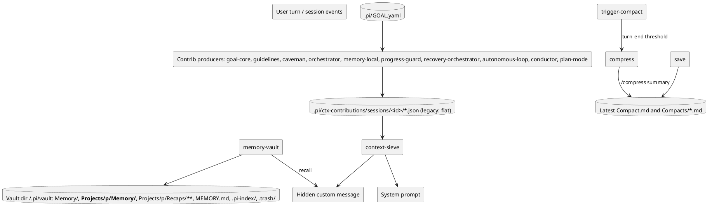
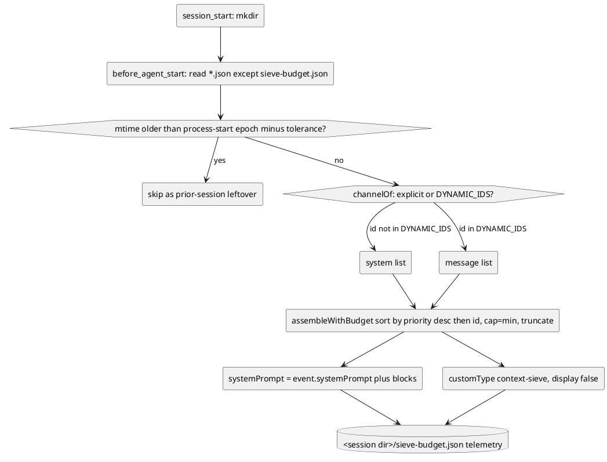
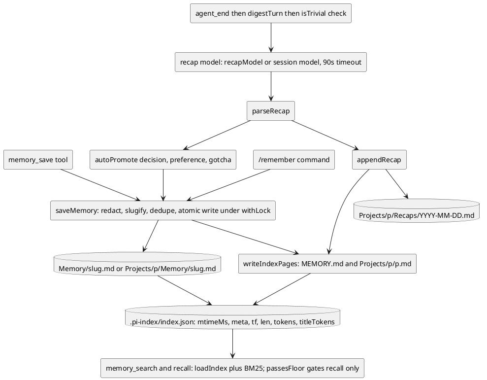
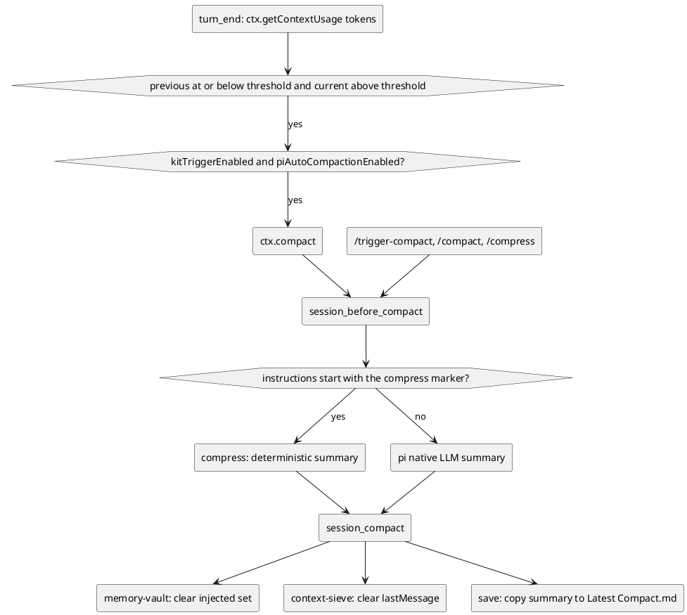
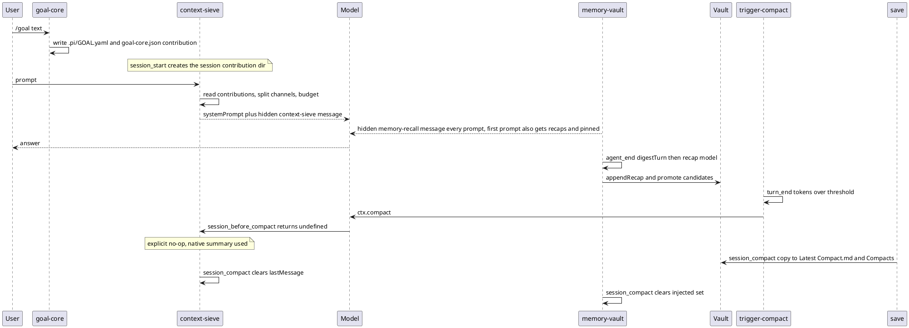

# Memory vault, compaction and context assembly

> Diagrams reflect commit b82d285 (branch overhaul/2026-09, 2026-09-23). If the code has changed since, regenerate them.

pi separates durable memory (memory-vault, an Obsidian-compatible Markdown vault under `~/.pi/vault` by default) from in-session context assembly (context-sieve, the single authority that merges `.pi/ctx-contributions/sessions/<session-id>/*.json` — the flat `.pi/ctx-contributions/*.json` is the legacy fallback when no session id is available — into the system prompt or one hidden message). Memory is managed by explicit tools (`memory_save`/`memory_search`/`memory_forget`, `/remember`, `/memory`) and automatically by per-turn recaps produced at `agent_end`. Compaction is triggered by a token threshold (`trigger-compact`, default 100k) or manually (`/compress`, `/compact`, `/trigger-compact`), and summaries are produced either natively by pi, deterministically by `/compress`, or by `save`'s check-in summarizer. `goal-core` persists `.pi/GOAL.yaml` and re-materializes a goal contribution that survives compaction, though one caveat applies: `session_before_compact` in context-sieve is an explicit no-op whose comment notes it deliberately does **not** import `GOAL.yaml`. As a result, any claim that context-sieve reads `GOAL.yaml` during compaction (previously stated in the `goal-core` README, corrected 2026-09-24) is not true of the code at this commit. This document maps each component to its hooks, files/dirs and env vars.

## Component and data flow

Producers write JSON contribution files into `<cwd>/.pi/ctx-contributions/` (session-scoped at `<cwd>/.pi/ctx-contributions/sessions/<session-id>/` when the host exposes a session id, with the flat directory kept as a legacy fallback); context-sieve is the only component that reads them and decides what becomes part of the system prompt versus one hidden message. memory-vault and the compaction extensions write to disk independently of that assembly path.

Relevant env vars and files: `PI_KIT_VAULT` (vault root), `PI_KIT_CTX_BUDGET_TOKENS` (context-sieve system budget), `PI_KIT_COMPACT_THRESHOLD_TOKENS` (trigger-compact threshold), and `PI_KIT_SAVE_VAULT` (save target vault).

## Context assembly (ctx-contributions to system prompt and hidden message)

context-sieve discovers contribution JSON files at `session_start` from its session directory (`<cwd>/.pi/ctx-contributions/sessions/<session-id>/`, falling back to the legacy flat `<cwd>/.pi/ctx-contributions/` when no session id is available), ignores leftovers from a prior session by skipping files whose modification time is meaningfully older than the process-start epoch — older than the epoch minus a tolerance/grace window (2 s) that absorbs coarse filesystem timestamps — (captured once at module load), splits each item by channel, then budgets and truncates each channel separately. Because the epoch is captured before any extension's `session_start` handler runs, and the grace makes the rule robust to timestamps that lag the wall clock, the skip rule is independent of extension load order: a producer that re-materializes its contribution before or after context-sieve's handler is still included. A contribution file larger than 256 KiB (`MAX_CONTRIBUTION_BYTES`) is skipped before parsing. A non-finite or absent `priority` is treated as `0`, and ties are broken by `id`, so assembly order is deterministic regardless of directory-read order. In the legacy flat `<cwd>/.pi/ctx-contributions/` fallback (no valid session id), a prior-session file is never aged out for a long-lived process, because the mtime skip only applies to files older than the process-start window; restart the process to shed such leftovers.

Budgets are 4096 system tokens (`PI_KIT_CTX_BUDGET_TOKENS`) and 1200 message tokens (`PI_KIT_CTX_MESSAGE_BUDGET_TOKENS`), with `CHARS_PER_TOKEN = 4`. A message block is suppressed when its text is identical to `lastMessage`.

## Memory lifecycle (save, search, recap)

Explicit tools and the automatic recap queue both write deduplicated Markdown notes into scope-specific vault folders; both search and recall read a BM25 index built from those notes, but only the automatic recall path applies the relevance floor.

## Compaction triggers and summaries

`turn_end` checks the token threshold; manual commands and the compaction hooks decide who produces the summary.

Annotation: the default threshold is 100k (`PI_KIT_COMPACT_THRESHOLD_TOKENS`, persisted to `<agentdir>/pi-kit/trigger-compact.json`); `/compress` uses `PI_KIT_COMPRESS_MAX_CHARS` (default 16000, minimum 4000); `save` skips on-compact work when `PI_KIT_SAVE_ON_COMPACT` is exactly `"0"`. The `compress` extension only activates when the custom instructions begin with its `[[pi-kit:compress]]` marker, so `/compact` and automatic compaction keep pi's native LLM summary.

## One run end to end

A single session showing goal persistence, context assembly, recap writing, and a threshold-triggered compaction whose summary is copied to disk.

## Key files

- `.pi/ctx-contributions/sessions/<id>/*.json` (legacy: flat) assembly — `packages/extensions/src/context-sieve/index.ts`
- goal / `.pi/GOAL.yaml` — `packages/extensions/src/goal-core/index.ts`
- memory tools / recaps / recall — `packages/extensions/src/memory-vault/index.ts`
- vault disk layout, config, index, dedupe, migration — `packages/extensions/src/memory-vault/vault.ts`
- recap prompt/parse/promote — `packages/extensions/src/memory-vault/recap.ts`
- BM25/search — `packages/extensions/src/memory-vault/search.ts`
- deterministic compaction — `packages/extensions/src/compress/index.ts`
- threshold trigger — `packages/extensions/third_party/trigger-compact/index.ts`
- snapshot / `Latest Compact.md` — `packages/extensions/src/save/index.ts`
- example producer (guidelines) — `packages/extensions/src/guidelines/index.ts`
