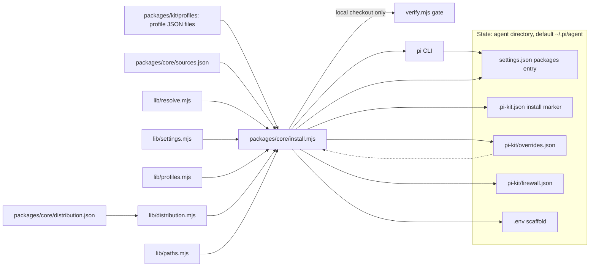
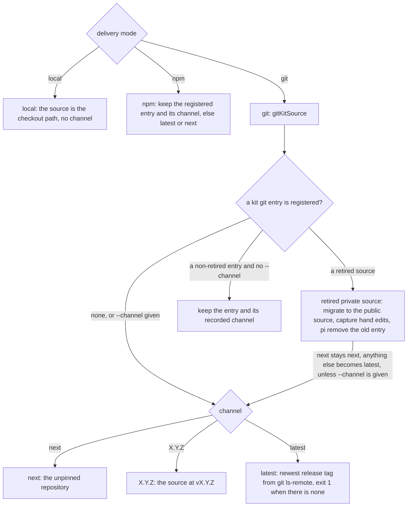
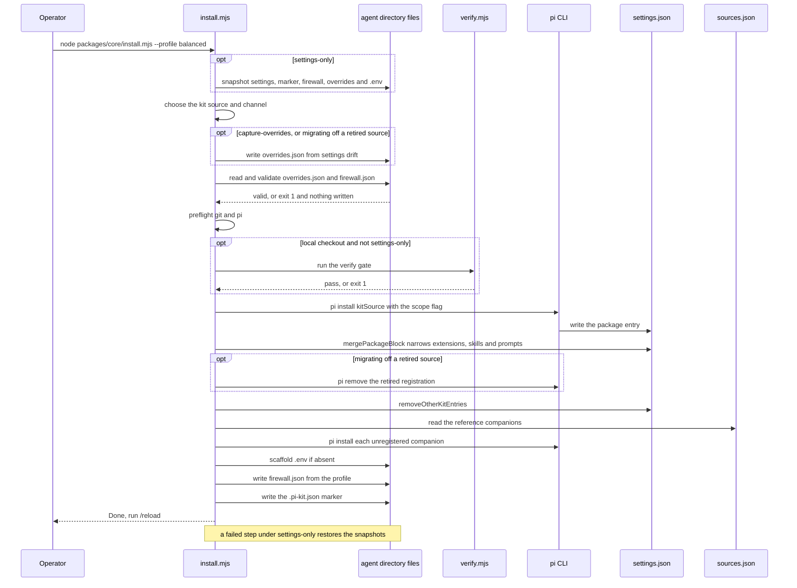
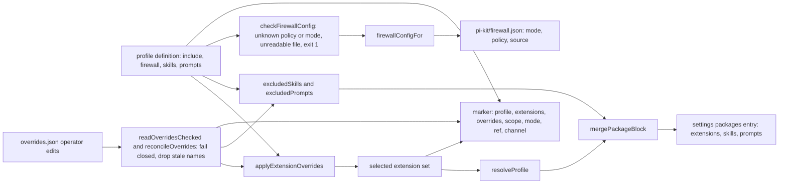
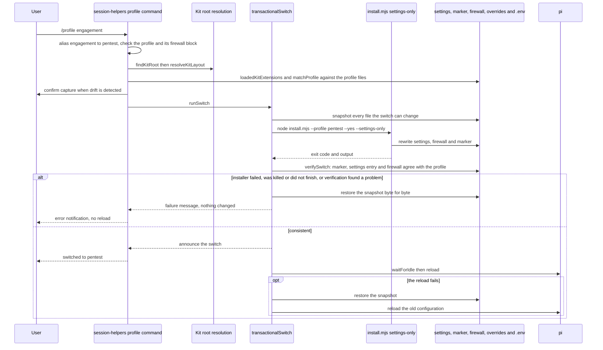

# Profiles, installer and the /profile switch

This page covers how a profile becomes a working pi configuration. It describes what a profile contains, how the installer (`packages/core/install.mjs`) turns one into `settings.json` entries, an install marker and a firewall config, how it chooses and migrates the kit's source, how operator overrides and firewall settings are validated before anything is written, and how the in-TUI `/profile` command switches profiles all-or-nothing. The diagrams show the state map, one installer run, the transformations from a profile to each artefact, source and channel selection, and the `/profile` round trip.

A *profile* is a JSON file under `packages/kit/profiles/` that selects which extensions load, which kit skills and prompt templates are hidden, and which tool-firewall policy and default mode apply. The installer is the single writer. It wraps `pi install`, narrows the kit's entry in `settings.json` to the resolved profile set, records a state marker and writes the firewall config. It records operator drift into `overrides.json` only under `--capture-overrides` (and automatically when it migrates off a retired source), and only when the installed entry has drifted from the marker's profile and no overrides exist yet. Unless it is the fast `--settings-only` path, a local checkout first passes the `verify.mjs` consistency gate. Overrides and firewall settings are validated before the first write and fail closed, and a `--settings-only` run restores every file it may have touched if it does not finish.

The in-TUI `/profile` command in `packages/extensions/src/session-helpers/index.ts` is a front end for that. It locates the kit checkout, picks a profile (accepting the `engagement` alias for `pentest`), and re-invokes the installer in `--settings-only` mode inside a transaction: it snapshots every file a switch can change, runs the installer, judges the result by the files on disk, rolls back on any failure, and only then reloads so pi re-reads its settings without a restart. Operator customisations live in `overrides.json` and are applied on top of every profile, so a profile switch never silently undoes a hand-made change.

The installer writes `settings.json` and the install marker to the scope chosen by `--scope` (global to `~/.pi/agent`, project to `<cwd>/.pi`). The other side files (`pi-kit/overrides.json`, `pi-kit/firewall.json` and the `.env` scaffold) stay in the global agent directory.

## Component and state map

This is the whole subsystem at a glance: the inputs the installer reads (profiles, `sources.json` and `distribution.json`), the runtime it drives (`pi`), and the on-disk state it owns. State normally lives in the agent directory (`settings.json`, the install marker `.pi-kit.json`, `pi-kit/overrides.json` and `pi-kit/firewall.json`, plus a scaffolded `.env`) under `PI_CODING_AGENT_DIR` (default `~/.pi/agent`). A project install instead puts `settings.json` and the marker under `<cwd>/.pi/`, and the other side files stay in the agent directory.



The installer parses these flags on `process.argv.slice(2)`:

| Flag | Default | Notes |
|---|---|---|
| `--profile <name>` | `balanced` | Canonicalised through `canonicalProfileName`. `--surface lite` is a deprecated alias for `--profile lite`; any other `--surface` exits 1. |
| `--only <a,b>` | null | Comma-split and trimmed. |
| `--all` | false | Every in-repo, vendor and external name; the package is not narrowed. |
| `--scope <global\|project>` | `global` | Project settings live at `<cwd>/.pi/settings.json`. |
| `--mode <local\|git\|npm>` | see below | `local` registers `WORKSPACE_ROOT`; `git` a source of the kit's repository; `npm` `npm:@satunix/pi-system[@channel]`. |
| `--channel <latest\|next\|X.Y.Z>` | see below | Validated against that grammar (`X.Y.Z` may carry a prerelease suffix such as `0.2.4-beta.0`); exits 1 otherwise. |
| `--git-ref <ref>` | null | Git only: register an arbitrary ref (`main` means the `next` channel). Implies `--mode git`. |
| `--dry-run` | false | Print actions without writing. |
| `--uninstall` | false | Delegates to `uninstall.mjs` (removes the kit and the companions recorded in the marker) and exits with its status. |
| `--no-externals` | false | Skip companion external packages. |
| `--settings-only` | false | Fast path used by `/profile`; skips the verify gate, skips re-registration only when the kit source is already registered, and restores every file it touched if the run does not finish. |
| `--capture-overrides` | false | Capture settings drift into `overrides.json`; alone, exits after capture. |

`--yes` appears in the usage comment and is passed by `/profile`, but `install.mjs` only forwards it to `uninstall.mjs`; otherwise it is a no-op.

**Mode.** An explicit `--mode` wins. Otherwise, when the installer runs from a copy pi installed itself (its path is under `<agent dir>/git/` or `.pi/git/`, or contains `node_modules`), it keeps that delivery (`git` or `npm`), so `/profile`, `/update` and the first-run auto-profile never register pi's clone as a local checkout. From a git checkout it is `local`, unless `--channel` or `--git-ref` is given, which means "install the released kit" with the configured delivery (`packages/core/distribution.json` `delivery`, `git` by default, overridden by `PI_KIT_DELIVERY`). Anywhere else it is the configured delivery.

**Channel and source.** Without `--channel`, a registered kit entry of the same delivery is kept as it is, with the channel recorded in the marker for that exact source (or, for git, inferred: no ref is `next`, a `v<semver>` tag is `latest`, any other ref is its own channel). With `--channel`, or when nothing is registered (default `latest`):

- git: `next` is the unpinned repository (pi follows its default branch), `X.Y.Z` is `<source>@vX.Y.Z`, and `latest` is the newest release tag found with `git ls-remote --tags` (the newest stable one once a stable release exists, otherwise the newest prerelease). `latest` therefore needs a release tag: the installer exits 1 when the repository has none or cannot be reached, and `--channel next` follows `main` instead. `--git-ref` bypasses channel selection: `main` means `next`, and any other ref is registered as `<source>@<ref>`. The base source is `PI_SYSTEM_GIT_SOURCE` (ignored, with a warning, when it names a retired source), else the registered git entry (keeping the user's HTTPS or SSH form), else `git.source` in `distribution.json`, which is `git:github.com/SATUNIX/pi-system`.
- npm: `latest` is the bare `npm:@satunix/pi-system`, anything else `npm:@satunix/pi-system@<channel>`; with nothing registered and no `--channel`, a running copy whose version is a `next` snapshot picks `next`.

**Retired private sources.** `distribution.json` lists `git.legacySources`, retired private GitLab sources. A kit registered from one is never reused and never reconnected to. The installer registers the public source instead, on the channel the install was following: `next` stays `next`, a release or a pin becomes `latest` because a private tag does not exist publicly, and an explicit `--channel` wins. Before anything is replaced it captures the old entry's hand edits (extensions added or removed, skill and prompt exclusions) into `overrides.json`, unless overrides already exist. It then runs `pi remove` for the old registration (or, if that fails, drops its settings entry) and removes every other copy of the kit. A `PI_SYSTEM_GIT_SOURCE` that still names a retired source is ignored and reported.



`--capture-overrides` runs as a pre-pass before anything is rewritten: it reads the marker, finds the kit entry (the retired entry when migrating), compares the settings entry against the marker's extension list via `captureDrift`, and writes `pi-kit/overrides.json` unless dry-run or overrides already exist. With no explicit profile, `--only` or `--all` it then exits 0.

## Installer run, end to end

A typical `node packages/core/install.mjs --profile balanced` execution runs, in order: the uninstall short-circuit; under `--settings-only`, the snapshot of every file it may write; the choice of kit source and channel; the capture pre-pass; validation of the overrides and the firewall settings; preflight (`pi`, plus `git` outside npm mode); the `verify.mjs` gate (local mode only, and not for `--settings-only`: a release and `main` were checked in CI, and the gate would check this copy rather than the one being registered); `pi install` (skipped under `--settings-only` when exactly this source is already registered); the package narrowing; removal of every other kit registration; companion externals; the `.env` scaffold; the firewall config; and finally the marker write.



The kit source is `WORKSPACE_ROOT` for local mode, or the git or npm source chosen above. `pi install` registers the full wildcard package; `mergePackageBlock` then narrows it so the profile actually controls what loads. Under `--all` nothing is narrowed. When a real profile is loaded the installer also computes skill and prompt filters; `--only` and `--all` pass no filters and leave whatever skill and prompt keys the entry already has. After registering, `removeOtherKitEntries` removes every other registration of the kit (another checkout, another delivery, or a legacy `dist/pi-kit-*` export or split package): exactly one may remain, or shared skill, prompt, extension and theme names collide. When a companion's registered spec differs from the kit's pin, it is reinstalled at the pin. Companion externals are the `mode: "reference"` entries in `sources.json` whose `provides` intersect the selected set; `pi-lean-ctx` is skipped when `leanCtxBinaryAvailable()` is false. The `.env` file is scaffolded from `packages/core/.env.example` only if absent. The installer reads `PI_SYSTEM_GIT_SOURCE`, `PI_KIT_DELIVERY`, `PI_CODING_AGENT_DIR` (through the settings helpers), `PI_KIT_FIREWALL_CONFIG` (through `firewallConfigPath`) and `PI_LEAN_CTX_BIN` or `LEAN_CTX_BIN`; it writes no environment variables, only the `.env` file.

### Validation and rollback

Safety-critical configuration is validated before the first write, and an error stops the run with exit 1 and nothing changed.

- **Overrides.** Only a profile install applies overrides, so only then can they stop the run. An `overrides.json` that exists but cannot be read, is not valid JSON, or is not a JSON object is refused, because it may hold the removal of a protection the installer cannot see. Removing a mandatory protection extension (`tool-firewall`, `secret-guard` or `protected-paths`) in `extensions.remove` is refused outright. Names that no longer exist in this kit (a renamed or removed extension, skill or prompt) are dropped with a warning, so a stale override does not fail the whole switch.
- **Firewall.** `checkFirewallConfig` runs first: a profile whose `firewall` block is not an object or names an unknown policy (`coding` or `pentest`) or mode (`auto` or `manual`), and an existing `firewall.json` that names an unknown policy or mode, cannot be read, or is not a JSON object, all stop the run. Nothing falls back to a default, so a typo cannot loosen the gate. Writing `firewall.json` at the end is fail-closed as well.
- **Rollback.** Under `--settings-only` the installer snapshots `settings.json`, the marker, `firewall.json`, `overrides.json` and `.env` first. Any exit that is not a clean finish (a failed step, an uncaught exception, `SIGINT`, `SIGTERM` or `SIGHUP`) restores every one of them, so the configuration is either the old one or the complete new one. The run counts as finished only once the marker, its last write, is on disk.

## How a profile becomes settings, overrides, marker and firewall

This diagram traces the transformations from a profile definition to each artefact. Overrides are validated first (`readOverridesChecked` and `reconcileOverrides`). Extensions flow through `applyExtensionOverrides` and `resolveProfile` into the settings entry; skill and prompt exclusions flow through `excludedSkills` and `excludedPrompts`; the firewall block is validated by `checkFirewallConfig` and flows through `firewallConfigFor`; and the marker records the profile, selected extensions, scope, mode, ref and channel.



**settings.json.** The profile filters live inside the kit's entry in `settings.packages[]`, never as a top-level key. `mergePackageBlock` converts that entry to object form:

- `source` is unchanged (local paths are stored relative to the settings directory).
- `extensions` are relative paths, exactly `packages/extensions/src/<name>/index.ts` or `packages/extensions/third_party/<name>/index.ts`; external companions are excluded because they are separate package entries.
- `skills` are `!packages/kit/skills/<name>/SKILL.md` patterns; the key is deleted when the list is empty.
- `prompts` are `!packages/kit/prompts/<name>.md` patterns; same set and delete rule.
- All other keys, such as `themes`, are preserved.

Writes go through a lock file `<settingsPath>.pi-kit.lock` plus tmp-and-rename, so pi never observes a half-written file. A `settings.json` that exists but does not parse is never rewritten.

**overrides.json** lives at `<agentDir>/pi-kit/overrides.json`. The installer writes it under `--capture-overrides` and when it migrates off a retired source; an operator can also edit it. Its normalised shape is:

```json
{
  "extensions": { "add": ["name"], "remove": ["name"] },
  "skills":     { "exclude": ["name"], "include": ["name"] },
  "prompts":    { "exclude": ["name"], "include": ["name"] }
}
```

Extensions are applied remove-then-append (`add`); skills and prompts use `excludedSkills` and `excludedPrompts`, where an `include` entry wins over an exclusion (and over a profile's `only` allowlist). The file is written pretty with a trailing newline via tmp and rename.

**firewall.json** lives at `<agentDir>/pi-kit/firewall.json` (overridable with `PI_KIT_FIREWALL_CONFIG`) and is written by `writeFirewallConfig`:

```json
{ "mode": "auto", "policy": "coding", "source": "profile" }
```

`policy` always follows the profile (`pentest` only when the profile says so, otherwise `coding`). `mode` follows the profile too, unless the existing file has `source: "user"` with the same policy and a valid mode; then the operator's `/auto` choice is kept with `source: "user"`. Other keys such as `judgeModel`, `learn`, `knownHosts` and `untrustedHosts` are always preserved.

**The install marker** is `<globalAgentDir()>/.pi-kit.json` for a global install and `<cwd>/.pi/.pi-kit.json` for a `--scope project` install, so a project install never clobbers the global marker (and vice versa). Runtime readers that resolve install state (`/update`, `/profile`, `/console`, the standalone web-ui installer) follow the same precedence as `uninstall.mjs`: a project marker in the current directory wins when it exists, otherwise the global marker is used. It is written with `writeSettingsAtomic`. Its exact keys are `kitSource`, `profile`, `extensions`, `overrides`, `scope`, `mode`, `ref`, `channel`, `companions` and `installedAt`.

- `profile` is `"all"` for `--all`, `"custom"` for `--only`, and the canonical profile name otherwise.
- `overrides` is `null` when empty.
- `ref` is the git ref of the registered source (null for `next` and outside git mode).
- `channel` is `latest`, `next`, a pinned version or (in git mode) a raw ref, and null for a local checkout.
- `companions` is the array of companion `source` strings this install is responsible for. Each entry is recorded whether it was installed just now or was already registered, and companions already recorded by a previous install are carried over, so a companion stays tracked until `pi remove` actually removes it. A later install that no longer selects it (including `--no-externals`) does not drop it. With no prior marker, `--no-externals` records `[]`. Each entry is exactly the string `uninstall.mjs` passes to `pi remove`. A companion skipped for a missing prerequisite (only `pi-lean-ctx` without its CLI) is not newly recorded by that run, but one recorded by an earlier install is still carried over.

The marker is the installer's last write, which is why `/profile` can use a fresh `installedAt` as evidence that the installer finished.

The per-profile firewall and exclusion data is fixed in the profile JSON:

| Profile | firewall mode | firewall policy | skills/prompts exclusions |
|---|---|---|---|
| quick | manual | coding | yes |
| balanced | manual | coding | yes |
| long-horizon | auto | coding | yes |
| autonomous | auto | coding | yes |
| self-improving | auto | coding | yes, plus `experimental: true` |
| pentest | manual | pentest | none: the profile has no `skills` or `prompts` keys |
| lite | manual | coding | allowlists: `skills.only` (12 skills) and `prompts.only` (the four `code-*` templates) |

The five other non-pentest profiles share the same exclusions: `skills.excludeCategories` is `["pentest","mcp-governance","evidence-reporting","maintainer"]`, `skills.exclude` is `["engagement-conductor","dynamic-agent-synthesis"]`, and `prompts.exclude` lists `golden-path-pentest`, `pentest-action-card`, `pentest-compact`, `pentest-plan`, `pentest-report-finding`, `pentest-triage-burp`, `pentest-verify-evidence`, `mcp-action-review`, `report-export-review`, `tool-policy-onboarding` and `hypothesis-lifecycle`. Because `pentest` carries no skill or prompt keys, no skill or prompt exclusions are applied for it. `--only` and `--all` likewise leave existing skill and prompt keys untouched.

The marker's `companions` array closes the loop: `packages/core/uninstall.mjs` reads it and removes each recorded `source` with `pi remove`, so a plain `uninstall.mjs` run does not leave the companions behind.

## The /profile round trip

`/profile` is the TUI front end. It resolves the kit root, reads the actually loaded set back out of `settings.json`, offers to capture drift, and then switches all-or-nothing. `transactionalSwitch` in `packages/extensions/src/session-helpers/profile-switch.ts` snapshots every file a switch can change, runs the installer with `--settings-only`, checks the result against the files on disk, and restores the snapshot byte for byte on any failure. It reloads only after a verified switch. The `engagement` alias is applied in the handler, mirroring `PROFILE_ALIASES` in `packages/core/lib/profiles.mjs`.



**Judging by the files.** `pi.exec()` reports a signal-killed child as exit code 0, so a zero exit code is not evidence that the installer finished. The switch counts as failed if the installer throws, is killed (it has a 120 s timeout), exits non-zero, or exits 0 after printing output that lacks its `[install] Done.` line. Otherwise `verifySwitch` checks the files:

- the marker parses as an object, names the requested profile and scope, was stamped after the switch started, and lists every expected extension;
- the kit entry in `settings.json` is filtered, its extension list equals the profile's (same names, same order, overrides applied) and every listed extension exists in the kit;
- `firewall.json` parses as an object, its policy is known and matches the profile, and its mode is known and matches the profile unless the operator set it (`source: "user"`).

The files snapshotted are `switchFiles()`: the global and the project `settings.json` and marker, `firewall.json`, `overrides.json` and `.env`, so a global switch cannot disturb a project and the reverse. Leftover lock and temporary files an interrupted installer leaves beside them are removed. If a file cannot be restored, the original bytes are saved to a backup directory and named in the error. Before any of this, `runSwitch` refuses a profile whose firewall block names an unknown policy or mode. The same transaction runs the first-run auto-profile: a kit registered unfiltered (a bare `pi install` of the git or npm source) gets the `balanced` profile at the first interactive session (`PI_KIT_AUTO_PROFILE=0` turns this off, a profile name picks another), applied without a reload and with a notice to run `/reload`.

Command surface: no argument opens an interactive `ui.select` picker in the TUI, or prints `profile: usage: /profile <autonomous|balanced|lite|long-horizon|pentest|quick|self-improving> (or /profile status)` in a non-UI context. `/profile <name>` switches. Arguments are validated before anything can change: one word or nothing, and a known profile name. `/profile list` and `/profile --list` print the current profile, the settings path, the profile list and, when the file exists, an overrides line. `/profile status` prints the effective configuration (profile, install mode, channel and source, the loaded extensions with a warning for a missing `tool-firewall` or `protected-paths`, the firewall policy and mode, the compaction state, overrides and companions), then `extra vs <closest>` and `missing vs <closest>` drift lines when a kit entry is loaded, no profile matches exactly and a closest profile exists, then the profile list. `getArgumentCompletions` offers `status`, `list` and every profile name.

Kit root resolution is `PI_KIT_ROOT` first (validated by `resolveKitLayout`; a value that is not a kit is an error, not a fall-through), then the marker's `kitSource` when it is a path, then the module's own location (four levels up in the monorepo layout, two in the legacy flat one). `resolveKitLayout` accepts the monorepo layout (`packages/core/install.mjs` plus `packages/kit/profiles/`) or the legacy flat layout (`kit/install.mjs` plus `profiles/`). The published npm package keeps the monorepo layout, so `/profile` works the same for npm installs; if no layout is found it errors and tells the operator to set `PI_KIT_ROOT`.

Apart from restoring a snapshot after a failure, `/profile` writes no file itself; the installer does. It spawns `pi.exec(nodeBinary(), args, { cwd, timeout: 120_000 })` with `cwd` set to the project directory for a project-scoped switch (when `<cwd>/.pi/settings.json` contains a pi-system package entry, filtered or unfiltered, or the marker says `scope: project`) and to `layout.root` otherwise. `install.mjs` derives a project install's `settings.json` and marker paths from `process.cwd()`, so a project-scoped switch must run in the project: running it in the kit root would write into the kit checkout and never update the user's project. It passes `args = [layout.installer, "--profile", target, "--yes", "--settings-only"]`, adding `--capture-overrides` when capturing, `--scope project` when the switch is project-scoped (or `--scope global` only when the marker says `scope: global`), and `--mode git` or `--mode npm` when the marker records that delivery (never a ref: the installer keeps the registered source and its recorded channel).

Helpers: `loadedKitExtensions` finds the kit entry (a local path equal to the kit root by `realpath`, or the npm or git package when the kit root is pi's installed copy), parses extension patterns matching `(?:src|third_party)/([^/]+)/index.ts`, and returns the names, or `null` for a missing entry or a string or unfiltered entry. `matchProfile` computes exact or closest-by-symmetric-difference against `profileKitExtensions` (the profile include plus overrides, filtered to in-repo names); when two profiles have the same set, the marker's profile wins the tie. The displayed "current" prefers the actually loaded set over the marker; with no readable entry it falls back to `marker.profile` and labels it "unfiltered package". `listProfiles` does not apply the `engagement` alias: it lists the JSON files as they are. Cancelling the picker, or re-selecting the current profile, does nothing.

## verify.mjs profile and source checks

The verify gate that runs before a normal local install (`packages/core/verify.mjs`) never reads `settings.json`. It checks the consistency of profiles against extension manifests and `sources.json`:

- **Forward check.** Every profile-included name must have an `extension.json` manifest or appear in `sources.json` `external[].provides` or name, else `profile include "..." has no extension.json and no sources.json entry`.
- **Bidirectional manifest check.** Each manifest's `meta.profiles` must exactly equal the actual membership derived from `profiles/*.json`, else `profile metadata drift for "..."`.
- **Orphan check.** A `stable` or `beta` manifest with zero memberships fails.
- **External cross-check.** Each `sources.json` entry's `profiles` must equal the membership for every name it provides, else `external source profile drift`.
- **Stub and TODO quarantine.** A `stub` or `experimental` extension shipping in a non-experimental profile fails, as does a `(stub)` or `: TODO` marker in those extensions.

The rest of verify covers TypeScript, the `extension.json` schema, name collisions, self-containment and the hooks manifest, the context-sieve injection monopoly, the firewall starter policy and security pattern parity, and catalogue, notices and docs drift. Profile filtering correctness itself, and the transactional switch, are exercised by `packages/core/profile-check.mjs`, `tests/profile-command-smoke.mjs`, `tests/profile-transaction-smoke.mjs` and `tests/profile-safety-smoke.mjs`, not by `verify.mjs`.

## sources.json and environment

`packages/core/sources.json` has one `external` array of entries with `name`, `mode` (`reference` or `bundle`), `source`, optional `entry`, `provides`, `profiles`, `review`, and optional `optional`. The installer reads it to extend `allExtensionNames()` for `--all`, to pick `reference` companions whose `provides` intersect the selection, and `lib/resolve.mjs` resolves any name not found in `src/` or `third_party/` as `avenue: "external"`. Verify cross-checks each entry's `profiles` against actual membership. External companions are installed as their own separate `settings.packages[]` entries and never appear inside the kit entry's `extensions`.

Environment variables that affect this subsystem:

- `PI_CODING_AGENT_DIR`: agent and config directory for the global `settings.json`, `.pi-kit.json`, `.env` and `pi-kit/` (a project-scope install keeps its `settings.json` and marker under `<cwd>/.pi/` instead).
- `PI_KIT_DELIVERY`: `git` or `npm`, overriding `delivery` in `distribution.json`.
- `PI_SYSTEM_GIT_SOURCE`: installer git source override; ignored, with a warning, when it names a retired private source.
- `PI_KIT_FIREWALL_CONFIG`: `firewall.json` path override, used by both the installer and the runtime.
- `PI_KIT_FIREWALL_PROFILE`: runtime policy override in tool-firewall; not read by the installer.
- `PI_KIT_AUTO_MODE`, `PI_KIT_AUTO_MODE_STATE_DIR`: runtime mode override and legacy state path; not the installer.
- `PI_KIT_ROOT`: pins the kit checkout `/profile` drives.
- `PI_KIT_AUTO_PROFILE`: `0`, `off`, `false` or `no` disables the first-run auto-profile; a profile name selects that profile instead of `balanced`.
- `PI_KIT_LEAN_CTX`: session-helpers lean-ctx preflight toggle.
- `PI_LEAN_CTX_BIN` or `LEAN_CTX_BIN`: lean-ctx binary path, used as the installer companion-skip gate and by preflight.
- `PI_KIT_FIREWALL_POLICY`, `PI_KIT_FIREWALL_AUDIT_LOG`, `PI_KIT_FIREWALL_FEEDBACK`, `PI_KIT_FIREWALL_SESSIONS_DIR`, `PI_KIT_FIREWALL_APPROVALS`: runtime firewall files, not the installer.
- `PI_KIT_COMPACT_THRESHOLD_TOKENS`: trigger-compact and session-helpers, not the installer.

## Source files

- Installer entry point, flag parsing, source and channel selection, ordered install steps, whole-run rollback: `packages/core/install.mjs`
- Delivery and source rules (`readDistribution`, `parseGitSource`, `isLegacyGitSource`, `gitSourceFor`, `releaseTags`, `latestRelease`, `channelOfGitSource`): `packages/core/lib/distribution.mjs`, with the settings in `packages/core/distribution.json`
- Profile definitions, firewall block and include lists: `packages/kit/profiles/quick.json`, `packages/kit/profiles/balanced.json`, `packages/kit/profiles/long-horizon.json`, `packages/kit/profiles/autonomous.json`, `packages/kit/profiles/self-improving.json`, `packages/kit/profiles/pentest.json`, `packages/kit/profiles/lite.json`
- `PROFILE_ALIASES`, `canonicalProfileName`, `applyExtensionOverrides`, `readOverridesChecked`, `reconcileOverrides`, `excludedSkills` and `excludedPrompts`, `skillFilterPatterns` and `promptFilterPatterns`, `captureDrift`, `readOverrides` and `writeOverrides`, `firewallConfigPath`, `checkFirewallConfig`, `firewallConfigFor` and `writeFirewallConfig`, `snapshotFiles` and `restoreSnapshots`: `packages/core/lib/profiles.mjs`
- `globalAgentDir`, `globalSettingsPath`, `mergePackageBlock`, `removeOtherKitEntries`, `isKitNpmSource`, `isKitGitSource`, `findPackageEntry`, `writeSettingsAtomic`, `updateSettings`, `withSettingsLock`, `leanCtxBinaryAvailable`: `packages/core/lib/settings.mjs`
- Layout constants (`WORKSPACE_ROOT`, `PROFILES_DIR`, `FIRST_PARTY_DIR`, `THIRD_PARTY_DIR`, `SOURCES_PATH`, `ENV_EXAMPLE`) and `extensionRelPath`: `packages/core/lib/paths.mjs`
- Name resolution to in-repo, vendor or external avenue: `packages/core/lib/resolve.mjs`
- `/profile` command, `findKitRoot`, `resolveKitLayout`, `loadedKitExtensions`, `matchProfile`, `profileKitExtensions`, `listProfiles`, `runSwitch`, the first-run auto-profile: `packages/extensions/src/session-helpers/index.ts`
- Snapshot, installer run, `verifySwitch` and rollback for a switch: `packages/extensions/src/session-helpers/profile-switch.ts`
- Consistency gate for profiles, manifests and sources: `packages/core/verify.mjs`
- External package catalogue and its schema: `packages/core/sources.json`, `packages/core/schema/sources.schema.json`
- Profile filtering replay and smoke tests: `packages/core/profile-check.mjs`, `tests/profile-command-smoke.mjs`, `tests/profile-transaction-smoke.mjs`, `tests/profile-safety-smoke.mjs`, `tests/distribution-smoke.mjs`
- Scanner that reads the `marker.companions` key written by the installer: `packages/core/uninstall.mjs`
