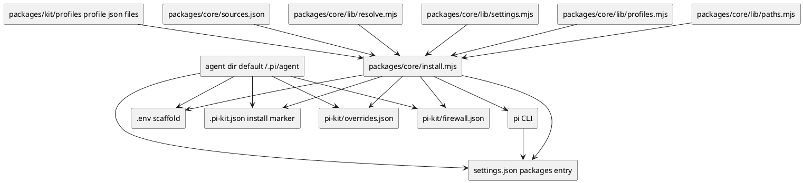
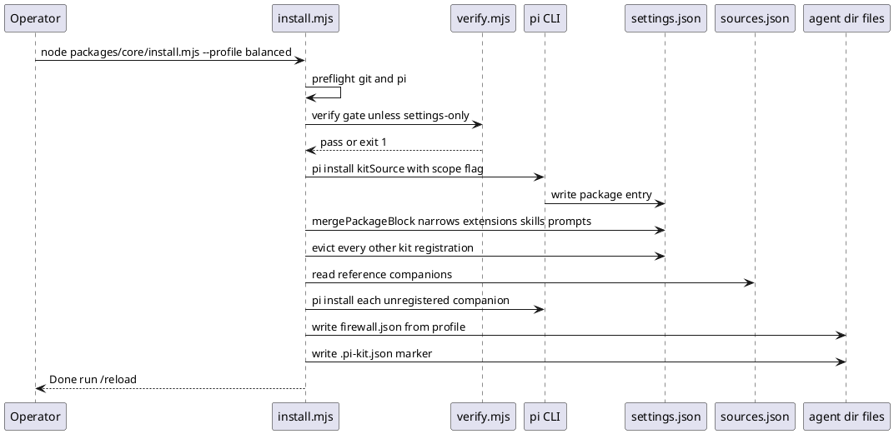
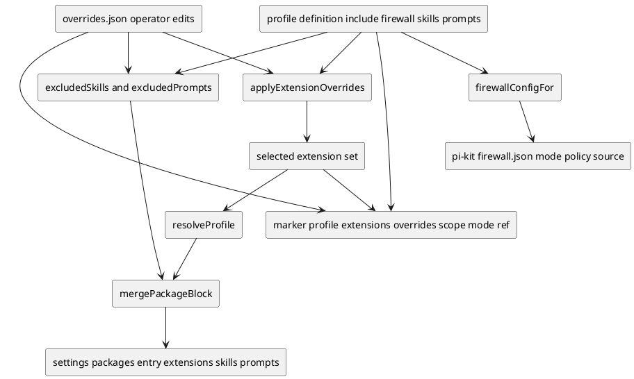
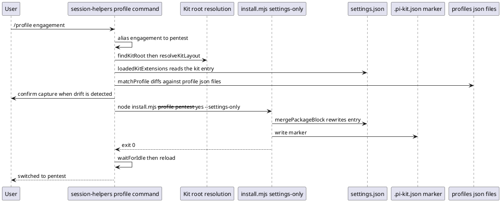

# Profiles, installer and the /profile switch
> Diagrams reflect commit b82d285 (branch overhaul/2026-09, 2026-09-23). If the code has changed since, regenerate them.

A *profile* is a JSON file under `packages/kit/profiles/` that selects which
extensions load, which kit skills and prompt templates are hidden, and which
tool-firewall policy and default mode apply. The installer
`packages/core/install.mjs` is the single writer: it wraps `pi install`, narrows
the kit's entry in `settings.json` to the resolved profile set, records a state
marker, writes the firewall config, and (only under `--capture-overrides`, and
only when the installed entry has drifted from the marker's profile) records
operator drift into `overrides.json`; unless it is the fast `--settings-only`
path it then runs the `verify.mjs` consistency gate before registration. The
in-TUI `/profile` command in `packages/extensions/src/session-helpers/index.ts`
is only a front end — it
locates the kit checkout, picks a profile (accepting the legacy
`engagement` alias for `pentest`), re-invokes the installer in
`--settings-only` mode, and then reloads so pi re-reads its settings without a
restart. Operator customisations live in `overrides.json` and are applied on top
of every profile, so a profile switch never silently undoes a hand-made change.
The installer writes `settings.json` and the install marker to the scope chosen by
`--scope` (global → `~/.pi/agent`, project → `<cwd>/.pi`); the other side files
(`pi-kit/overrides.json`, `pi-kit/firewall.json`, the `.env` scaffold) stay in the
global agent dir.

## Component and state map

This is the whole subsystem at a glance: the two inputs the installer reads
(profiles and `sources.json`), the runtime it drives (`pi`), and the on-disk
state it owns. State normally lives in the agent dir — `settings.json`, the install
marker `.pi-kit.json`, `pi-kit/overrides.json`, `pi-kit/firewall.json` — plus a
scaffolded `.env`, under `PI_CODING_AGENT_DIR` (default `~/.pi/agent`). A project
install instead puts `settings.json` and the marker under `<cwd>/.pi/`; the other
side files stay in the agent dir.



The installer parses these flags on `process.argv.slice(2)`:

| Flag | Default | Notes |
|---|---|---|
| `--profile <name>` | `balanced` | Canonicalised through `canonicalProfileName`. `--surface lite` is a deprecated alias for `--profile lite`; any other `--surface` exits 1. |
| `--only <a,b>` | null | Comma-split and trimmed. |
| `--all` | false | Every in-repo, vendor and external name. |
| `--scope <global\|project>` | `global` | Project settings live at `<cwd>/.pi/settings.json`. |
| `--mode <local\|git\|npm>` | see below | `local` registers `WORKSPACE_ROOT`; `git` a source of the kit's repository; `npm` `npm:@satunix/pi-system[@channel]`. |
| `--channel <latest\|next\|X.Y.Z>` | see below | Validated against that grammar; exits 1 otherwise. |
| `--git-ref <ref>` | null | Git only: register an arbitrary ref (`main` means the `next` channel). Implies `--mode git`. |
| `--dry-run` | false | Print actions without writing. |
| `--uninstall` | false | Delegates to `uninstall.mjs` (removes the kit and the companions recorded in the marker) and exits with its status. |
| `--no-externals` | false | Skip companion external packages. |
| `--settings-only` | false | Fast path used by `/profile`; skips the verify gate, and skips re-registration only when the kit source is already registered. |
| `--capture-overrides` | false | Capture settings drift into `overrides.json`; alone, exits after capture. |

Note that `--yes` appears in the usage comment and is passed by `/profile`, but
`install.mjs` only forwards it to `uninstall.mjs`; otherwise it is a no-op.
**Mode.** An explicit `--mode` wins. Otherwise: when the installer runs from a
copy pi installed itself (its path is under `<agent dir>/git/` or `.pi/git/`, or
contains `node_modules`), it keeps that delivery (`git` or `npm`), so `/profile`,
`/update` and the first-run auto-profile never register pi's clone as a local
checkout. From a git checkout it is `local`, unless `--channel` or `--git-ref` is
given, which means "install the released kit" with the configured delivery
(`packages/core/distribution.json` `delivery`, overridden by `PI_KIT_DELIVERY`).
Anywhere else it is the configured delivery.

**Channel and source.** Without `--channel`, a registered kit entry of the same
delivery is kept as is, with the channel recorded in the marker for that exact
source (or, for git, inferred: no ref is `next`, a `v<semver>` tag is `latest`).
With `--channel`, or when nothing is registered (default `latest`):

- git: `next` is the unpinned repository (pi follows its default branch), `X.Y.Z`
  is `<source>@vX.Y.Z`, and `latest` is the newest release tag found with
  `git ls-remote --tags` (the newest stable one once a stable release exists,
  otherwise the newest prerelease); it exits 1 when there are no release tags or
  the repository cannot be reached. The base source is `PI_SYSTEM_GIT_SOURCE`,
  else the registered git entry (keeping the user's HTTPS or SSH form), else
  `git.source` in `distribution.json`.
- npm: `latest` is the bare `npm:@satunix/pi-system`, anything else
  `npm:@satunix/pi-system@<channel>`; with nothing registered and no `--channel`,
  a running copy whose version is a `next` snapshot picks `next`.
`--capture-overrides` runs as a pre-pass before anything is rewritten: it reads
the marker, finds the kit entry, compares the settings entry against the marker's
extension list via `captureDrift`, and writes `pi-kit/overrides.json` unless
dry-run; with no explicit profile/only/all it then exits 0.

## Installer run, end to end

A typical `node packages/core/install.mjs --profile balanced` execution, in
order: the uninstall short-circuit, preflight (`pi`, plus `git` outside npm
mode), the `verify.mjs` gate (local mode only, and not for `--settings-only`: a
release and `main` were checked in CI, and the gate would check this copy rather
than the one being registered), `pi install` (skipped under `--settings-only`
when exactly this source is already registered), the package narrowing,
eviction of every other kit registration, companion externals, the `.env`
scaffold, the firewall config, and finally the marker write.



The kit source is `WORKSPACE_ROOT` for local mode, or the git or npm source
chosen above. `pi install` registers the
full wildcard package; step 2b then calls `mergePackageBlock` so the profile
actually controls what loads (this was the F-01 fix). When a real profile is
loaded the installer also computes skill/prompt filters; `--only` and `--all`
pass empty filters and leave whatever skill/prompt keys the entry already has.
After registering, `removeOtherKitEntries` removes every other registration of
the kit (another checkout, another delivery, or a
legacy `dist/pi-kit-*` export or split package) — exactly one may remain, or
shared skill/prompt/extension/theme names collide. When a companion's registered
spec differs from the kit's pin, it is reinstalled at the pin. Companion externals are the
`mode: "reference"` entries in `sources.json` whose `provides` intersect the
selected set; `pi-lean-ctx` is skipped when `leanCtxBinaryAvailable()` is false.
The `.env` file is scaffolded from `packages/core/.env.example` only if absent.
The installer reads `PI_SYSTEM_GIT_SOURCE`, `PI_CODING_AGENT_DIR` (through the
settings helpers), `PI_KIT_FIREWALL_CONFIG` (through `firewallConfigPath`) and
`PI_LEAN_CTX_BIN`/`LEAN_CTX_BIN`; it writes no environment variables, only the
`.env` file.

## How a profile becomes settings, overrides, marker and firewall

This diagram traces the transformations from a profile definition to each
artifact. Extensions flow through `applyExtensionOverrides` and
`resolveProfile` then into the settings entry; skill/prompt exclusions flow
through `excludedSkills`/`excludedPrompts`; the firewall block flows through
`firewallConfigFor`; and the marker records the profile, selected extensions,
scope, mode and ref.



**settings.json.** The profile filters live *inside the kit's entry in
`settings.packages[]`*, never as a top-level key. `mergePackageBlock` converts
that entry to object form:

- `source` — unchanged (local paths are stored relative to the settings dir).
- `extensions` — relative paths, exactly
  `packages/extensions/src/<name>/index.ts` or
  `packages/extensions/third_party/<name>/index.ts`; external companions are
  excluded because they are separate package entries.
- `skills` — `!packages/kit/skills/<name>/SKILL.md` patterns; the key is
  deleted when the list is empty.
- `prompts` — `!packages/kit/prompts/<name>.md` patterns; same set/delete rule.
- All other keys, such as `themes`, are preserved.

Writes go through a lock file `<settingsPath>.pi-kit.lock` plus tmp-and-rename,
so pi never observes a half-written file.

**overrides.json** lives at `<agentDir>/pi-kit/overrides.json` and is produced
only by `--capture-overrides`. Its normalised shape is:

```json
{
  "extensions": { "add": ["name"], "remove": ["name"] },
  "skills":     { "exclude": ["name"], "include": ["name"] },
  "prompts":    { "exclude": ["name"], "include": ["name"] }
}
```

Extensions are applied remove-then-append/`add`; skills and prompts use
`excludedSkills`/`excludedPrompts`, where an `include` entry wins over an
exclusion. The file is written pretty with a trailing newline via tmp and rename.

**firewall.json** lives at `<agentDir>/pi-kit/firewall.json` (overridable with
`PI_KIT_FIREWALL_CONFIG`) and is written by `writeFirewallConfig`:

```json
{ "mode": "auto", "policy": "coding", "source": "profile" }
```

`policy` always follows the profile (`pentest` only when the profile says so,
otherwise `coding`). `mode` follows the profile too, *unless* the existing file
has `source: "user"` with the same policy and a valid mode — then the operator's
`/auto` choice is kept with `source: "user"`. Other keys such as `judgeModel`,
`learn` and `knownHosts` are always preserved.

**The install marker** is `<globalAgentDir()>/.pi-kit.json` for a global install and
`<cwd>/.pi/.pi-kit.json` for a `--scope project` install, so a project install never
clobbers the global marker (and vice versa). Runtime readers that resolve install state
(`/update`, `/profile`, `/console`, the standalone web-ui installer) follow the same
precedence as `uninstall.mjs`: a project marker in the current directory wins when it
exists, otherwise the global marker is used. It is written with
`writeSettingsAtomic`. Its exact keys are `kitSource`,
`profile`, `extensions`, `overrides`, `scope`, `mode`, `ref`, `channel`,
`companions`, `installedAt`. `profile` is `"all"` for `--all`, `"custom"` for
`--only`, and the canonical profile name otherwise; `overrides` is `null` when
empty; `ref` is the git ref of the registered source (null for `next` and outside
git mode); `channel` is `latest`, `next` or the pinned version in git and npm
mode, and null for a local checkout; `companions` is the array of companion
`source` strings this install is responsible for. Each entry is recorded whether
it was installed just now or was already registered, and companions already
recorded by a previous install are carried over, so a companion stays tracked
until `pi remove` actually removes it — a later install that no longer selects it
(including `--no-externals`) does not drop it. With no prior marker,
`--no-externals` records `[]`. Each entry is exactly the string `uninstall.mjs`
passes to `pi remove`. A companion skipped for a missing prerequisite (only
`pi-lean-ctx` without its CLI) is not newly recorded by that run — this install
never registered it — but a companion recorded by an earlier install is still
carried over in the marker, so only a first install records nothing for a
skipped companion.

The per-profile firewall and exclusion data is fixed in the profile JSON:

| Profile | firewall mode | firewall policy | skills/prompts exclusions |
|---|---|---|---|
| quick | manual | coding | yes |
| balanced | manual | coding | yes |
| long-horizon | auto | coding | yes |
| autonomous | auto | coding | yes |
| self-improving | auto | coding | yes, plus `experimental: true` |
| pentest | manual | pentest | none — the profile has no `skills` or `prompts` keys |
| lite | manual | coding | allowlists: `skills.only` (12 skills) and `prompts.only` (the four `code-*` templates) |

The five other non-pentest profiles share the same exclusions:
`skills.excludeCategories` is `["pentest","mcp-governance","evidence-reporting","maintainer"]`,
`skills.exclude` is `["engagement-conductor","dynamic-agent-synthesis"]`, and
`prompts.exclude` lists `golden-path-pentest`, `pentest-action-card`,
`pentest-compact`, `pentest-plan`, `pentest-report-finding`,
`pentest-triage-burp`, `pentest-verify-evidence`, `mcp-action-review`,
`report-export-review`, `tool-policy-onboarding` and `hypothesis-lifecycle`.
Because `pentest` carries no skill/prompt keys, no skill or prompt exclusions
are applied for it. `--only` and `--all` likewise leave existing skill/prompt
keys untouched.

The marker's `companions` array closes the loop: `packages/core/uninstall.mjs`
reads it and removes each recorded `source` with `pi remove`, so a plain
`uninstall.mjs` run does not leave the companions behind.

## The /profile round trip

`/profile` is the TUI front end. It resolves the kit root, reads the actually
loaded set back out of `settings.json`, offers to capture drift, re-invokes the
installer with `--settings-only`, and reloads on success. The legacy name
`engagement` is aliased to `pentest` in the handler, mirroring
`PROFILE_ALIASES` in `packages/core/lib/profiles.mjs`.



Command surface: no argument opens an interactive `ui.select` picker in the
TUI, or prints
`profile: usage: /profile <autonomous|balanced|lite|long-horizon|pentest|quick|self-improving>`
in a non-UI context; `/profile <name>` switches. `/profile status`, `/profile
list` and `/profile --list` all print the current profile, the settings path, the
profile list and an overrides banner, but only `status` adds the `extra vs
<closest>` / `missing vs <closest>` drift lines, and only when a kit entry is
loaded, no profile matches exactly, and a closest profile exists.
`getArgumentCompletions` offers `status`, `list` and every profile name.

Kit root resolution is `PI_KIT_ROOT` first (validated by `resolveKitLayout`),
then the marker's `kitSource` when it is a path, then the module's own location
(four levels up in the monorepo layout, two in the legacy flat one).
`resolveKitLayout` accepts the monorepo layout (`packages/core/install.mjs` plus
`packages/kit/profiles/`) or the legacy flat layout (`kit/install.mjs` plus
`profiles/`). The published npm package keeps the monorepo layout, so `/profile`
works the same for npm installs; if no layout is found it errors and tells the
operator to set `PI_KIT_ROOT`.

`/profile` writes no file itself. It spawns
`pi.exec(nodeBinary(), args, { cwd, timeout: 120_000 })` with
`cwd` set to the project directory for a project-scoped switch — when
`<cwd>/.pi/settings.json` contains a pi-system package entry (filtered or
unfiltered), or the marker says `scope: project` — and to `layout.root`
otherwise. `install.mjs` derives a project install's `settings.json`
and marker paths from `process.cwd()`, so a project-scoped switch must run in the
project — running it in the kit root would write into the kit checkout and never
update the user's project. It passes
`args = [layout.installer, "--profile", target, "--yes", "--settings-only"]`,
adding `--capture-overrides` when capturing, `--scope project` when the switch is
project-scoped (or `--scope global` only when the marker says `scope: global`),
and `--mode git` or `--mode npm` when the marker records that delivery (never a ref:
the installer keeps the registered source and its recorded channel). Rounds:
`loadedKitExtensions` finds the kit entry by `realpath`, parses extension
patterns matching `(?:src|third_party)/([^/]+)/index.ts`, and returns the names,
or `null` for a missing entry or a string/unfiltered entry. `matchProfile`
computes exact or closest-by-symmetric-difference against
`profileKitExtensions` (the profile include plus overrides, filtered to in-repo
names). The displayed "current" prefers the actually-loaded set over the marker;
with no readable entry it falls back to `marker.profile` and labels it
"unfiltered package". `listProfiles` does *not* apply the `engagement` alias —
it lists the JSON files as they are.

On exit code 0 the handler calls `await c.waitForIdle?.()` then `await
c.reload()`, so pi re-reads its settings. On a non-zero exit it shows an error
notification and does **not** reload. Cancelling the picker, or re-selecting the
current profile, does nothing.

## verify.mjs profile and source checks

The verify gate that runs before a normal install (`packages/core/verify.mjs`,
root mode only) never reads `settings.json`. It checks the consistency of
profiles against extension manifests and `sources.json`:

- **Forward check** — every profile-included name must have an `extension.json`
  manifest or appear in `sources.json` `external[].provides`/name, else
  `profile include "..." has no extension.json and no sources.json entry`.
- **Bidirectional manifest check** — each manifest's `meta.profiles` must
  exactly equal the actual membership derived from `profiles/*.json`, else
  `profile metadata drift for "..."`.
- **Orphan check** — a `stable` or `beta` manifest with zero memberships fails.
- **External cross-check** — each `sources.json` entry's `profiles` must equal
  the membership for every name it provides, else `external source profile
  drift`.
- **Stub/TODO quarantine** — a `stub`/`experimental` extension shipping in a
  non-experimental profile fails, as does a `(stub)` or
  `: TODO` marker in those extensions.

The rest of verify covers TypeScript, the `extension.json` schema, name
collisions, the hooks manifest, the context-sieve injection monopoly,
firewall/security pattern parity, catalogue and docs drift. Profile filtering
correctness itself is exercised by `packages/core/profile-check.mjs` and
`tests/profile-command-smoke.mjs`, not by `verify.mjs`.

## sources.json and environment

`packages/core/sources.json` has one `external` array of entries with `name`,
`mode` (`reference` or `bundle`), `source`, optional `entry`, `provides`,
`profiles`, `review`, and optional `optional`. The installer reads it to extend
`allExtensionNames()` for `--all`, to pick `reference` companions whose
`provides` intersect the selection, and `lib/resolve.mjs` resolves any name not
found in `src/` or `third_party/` as `avenue: "external"`. Verify cross-checks
each entry's `profiles` against actual membership. External companions are
installed as their own separate `settings.packages[]` entries and never appear
inside the kit entry's `extensions`.

Environment variables that affect this subsystem:

- `PI_CODING_AGENT_DIR` — agent/config dir for the global `settings.json`, `.pi-kit.json`,
  `.env` and `pi-kit/` (a project-scope install keeps its `settings.json` and marker under
  `<cwd>/.pi/` instead).
- `PI_SYSTEM_GIT_SOURCE` — installer git source override.
- `PI_KIT_FIREWALL_CONFIG` — firewall.json path override, used by both the
  installer and the runtime.
- `PI_KIT_FIREWALL_PROFILE` — runtime policy override in tool-firewall; not read
  by the installer.
- `PI_KIT_AUTO_MODE`, `PI_KIT_AUTO_MODE_STATE_DIR` — runtime mode override and
  legacy state path; not installer.
- `PI_KIT_ROOT` — pins the kit checkout `/profile` drives.
- `PI_KIT_LEAN_CTX` — session-helpers lean-ctx preflight toggle.
- `PI_LEAN_CTX_BIN` / `LEAN_CTX_BIN` — lean-ctx binary path, used as the
  installer companion-skip gate and by preflight.
- `PI_KIT_FIREWALL_POLICY`, `PI_KIT_FIREWALL_AUDIT_LOG`,
  `PI_KIT_FIREWALL_FEEDBACK`, `PI_KIT_FIREWALL_SESSIONS_DIR` — runtime firewall
  files, not installer.
- `PI_KIT_COMPACT_THRESHOLD_TOKENS` — trigger-compact/session-helpers, not
  install.

No `PI_HOME` is used in this subsystem.

## Key files

- Installer entry point, flag parsing, ordered install steps — `packages/core/install.mjs`
- Profile definitions, firewall block and include lists — `packages/kit/profiles/quick.json`, `packages/kit/profiles/balanced.json`, `packages/kit/profiles/long-horizon.json`, `packages/kit/profiles/autonomous.json`, `packages/kit/profiles/self-improving.json`, `packages/kit/profiles/pentest.json`
- `PROFILE_ALIASES`, `canonicalProfileName`, `applyExtensionOverrides`, `excludedSkills`/`excludedPrompts`, `skillFilterPatterns`/`promptFilterPatterns`, `captureDrift`, `readOverrides`/`writeOverrides`, `firewallConfigPath`/`firewallConfigFor`/`writeFirewallConfig` — `packages/core/lib/profiles.mjs`
- `globalAgentDir`, `globalSettingsPath`, `mergePackageBlock`, `removeOtherKitEntries`, `isKitNpmSource`, `findPackageEntry`, `writeSettingsAtomic`, `updateSettings`, `withSettingsLock`, `leanCtxBinaryAvailable` — `packages/core/lib/settings.mjs`
- Layout constants (`WORKSPACE_ROOT`, `PROFILES_DIR`, `FIRST_PARTY_DIR`, `THIRD_PARTY_DIR`, `SOURCES_PATH`, `ENV_EXAMPLE`) and `extensionRelPath` — `packages/core/lib/paths.mjs`
- Name resolution to in-repo, vendor or external avenue — `packages/core/lib/resolve.mjs`
- `/profile` command, `findKitRoot`, `resolveKitLayout`, `loadedKitExtensions`, `matchProfile`, `profileKitExtensions`, `listProfiles` — `packages/extensions/src/session-helpers/index.ts`
- Consistency gate for profiles, manifests and sources — `packages/core/verify.mjs`
- External package catalogue — `packages/core/sources.json`
- External catalogue schema — `packages/core/schema/sources.schema.json`
- Profile filtering replay and smoke tests — `packages/core/profile-check.mjs`, `tests/profile-command-smoke.mjs`
- Scanner that reads the `marker.companions` key written by the installer — `packages/core/uninstall.mjs`