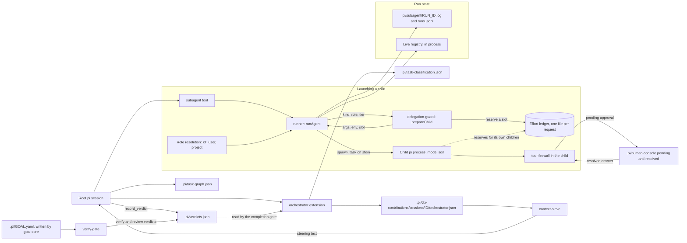
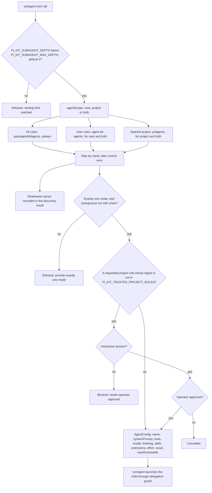
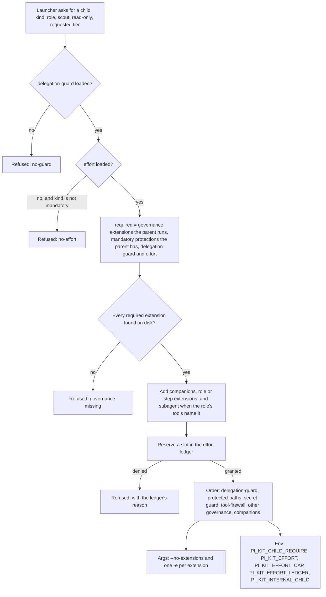
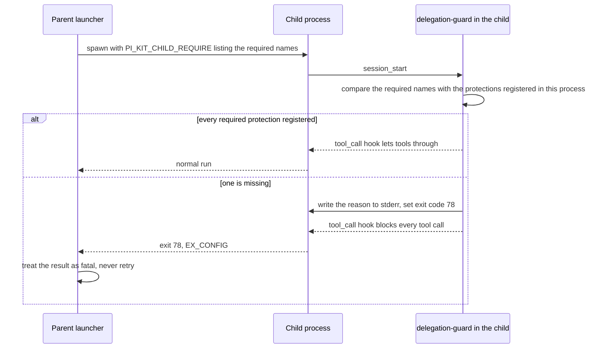
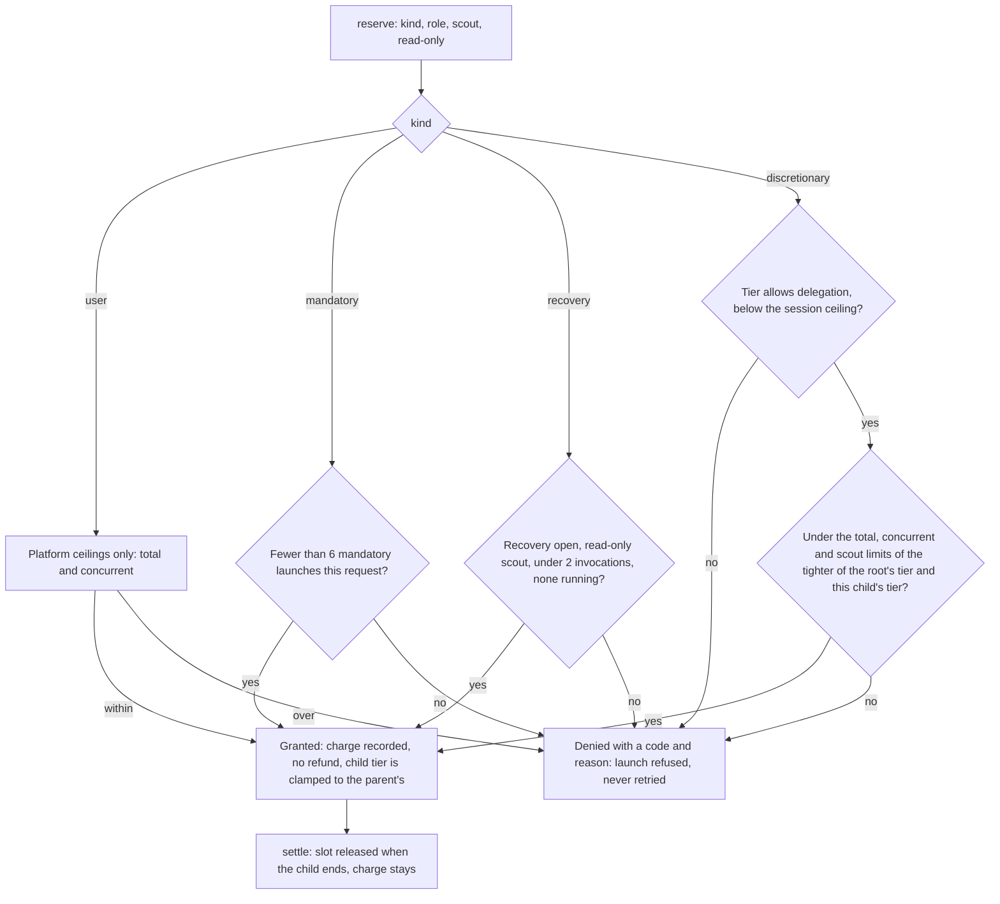
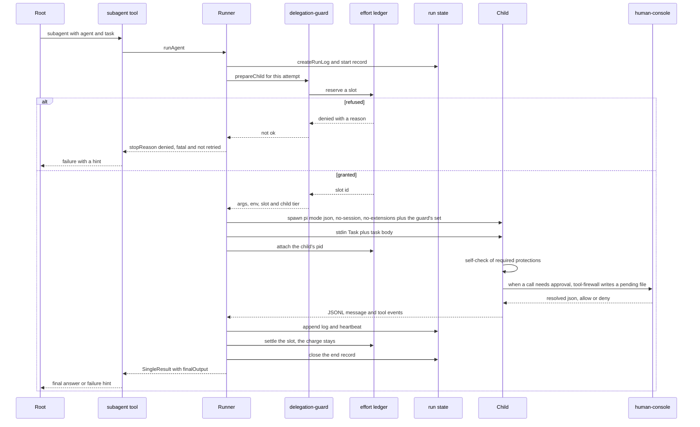
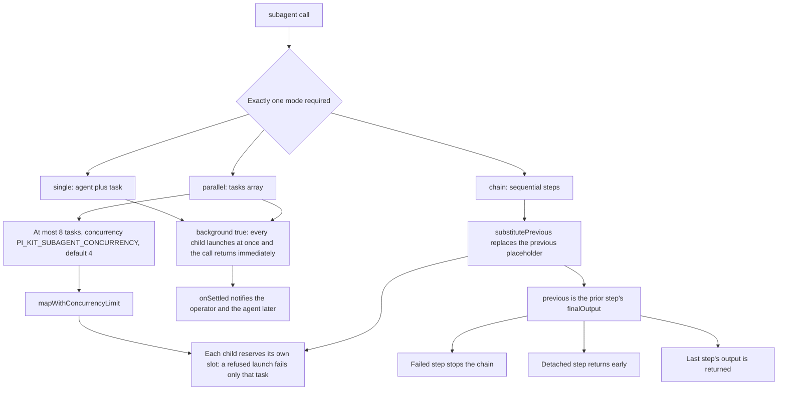
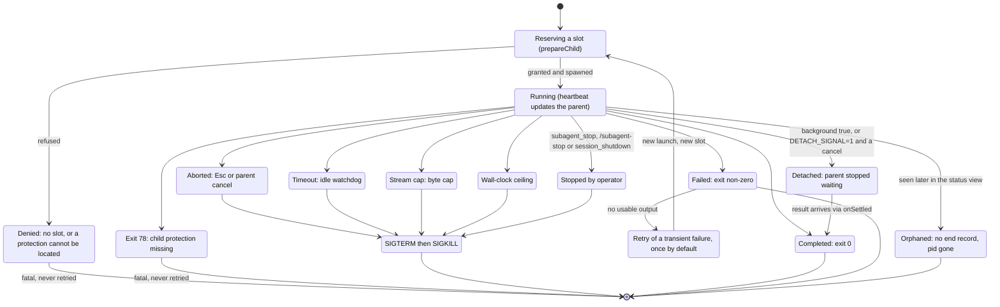

# Subagents, orchestration and the task graph

The subagent subsystem lets a root pi session delegate a self-contained task to a separate `pi`
process with its own context. The `subagent` tool resolves a role from the kit, user and project
agent directories, then asks `delegation-guard` how to start the child. That launch contract is the
one place that decides which extensions a child loads, reserves the child's slot in the shared effort
ledger and hands back the child's environment. Every child loads the mandatory protections its
parent has (`tool-firewall`, `secret-guard`, `protected-paths`) and every governance extension the
parent runs, that is, each one whose manifest declares `childGovernance: true`. Its effort tier is
never above its parent's. A launch that cannot meet the contract is refused, and a child that starts
without a protection its parent has blocks every tool call and exits with code 78. Roles run in
single, parallel or chain mode, and chain threads each step's output into the next step through a
`{previous}` placeholder. Background and detached runs report back through follow-up messages, while
Esc, `session_shutdown` and `subagent_stop` provide cancel and kill paths. On top of this, the
`orchestrator` extension is a context and steering layer, and the `task-graph`, `verifier-board` and
`human-console` extensions share file contracts under `.pi/` to plan work, record independent
verdicts and broker approvals.

For the tier table and the limits, see [Effort](../effort.md). For the operator-facing summary of the
rules on this page, see [Child governance](../agent-orchestration.md#child-governance).

## Component map and data flow

This flowchart shows the runtime pieces and where their state lives. The orchestrator writes
context-contribution and classification files and reads the verdict board. The `subagent` tool drives
child processes through the launch contract and records run state. The task graph and verifier board
are tools the agents call, and they and the human console each own a small file contract under the
project `.pi` directory. Children reserve against the same ledger as the root, so delegation cannot
multiply by nesting.

The file contracts, and who touches them:

| File | Written by | Read by |
|---|---|---|
| `.pi/subagent/<run id>.log`, `.pi/subagent/runs.jsonl` | `subagent` runner | `subagent_status`, `/subagents`, `subagent_stop` |
| `<agent dir>/pi-kit/effort/ledgers/<scope>.json` | `effort` (root opens it, every descendant reserves in it) | `effort`, `/effort status` |
| `.pi/task-graph.json` | `task-graph` tools | `task-graph` tools, `verify-gate` (definition of done) |
| `.pi/verdicts.json` | `verifier-board`, `verify-gate`, `conductor` validator | `orchestrator`, `verifier-board` |
| `.pi/verify-pending.json`, `.pi/verify-report.md` | `verify-gate` | `orchestrator` (pending marker) |
| `.pi/ctx-contributions/` | `orchestrator` | `context-sieve` |
| `.pi/task-classification.json` | `orchestrator` | `provider-router` |
| `.pi/human-console/pending` and `resolved` | `tool-firewall` (pending), `human-console` (resolved) | both |

## Role resolution and trust gate

The nesting limit is checked first: a child that already sits at `PI_KIT_SUBAGENT_MAX_DEPTH` (default
2) cannot delegate further. Agent roles are then loaded from up to three directories and merged into
a map keyed by name, with later sources overriding earlier ones: kit, then user, then the nearest
project `.pi/agents`. The default `agentScope` is `user`, which means kit plus user roles. Project
roles need `agentScope: "project"` or `"both"`, and they must clear a trust gate, either an
interactive confirmation or a matching digest in `PI_KIT_TRUSTED_PROJECT_ROLES`. The digest covers the
role's name, system prompt, tools and model. A headless session cannot confirm, so it is blocked.

## The launch contract

`prepareChild` in `packages/extensions/src/delegation-guard/index.ts` is the only code that builds a
child's extension arguments and environment. It publishes itself on a `globalThis` registry
(`Symbol.for("pi-kit.delegation")`) because extensions may not import one another, and every
launcher looks it up there: the subagent runner through `launch.ts`, `verify-gate`, and the
`conductor` specialist and validator paths. If the registry is missing, the launcher refuses to
start the child. There is no unguarded fallback.

What the child loads:

- **Required set (`requiredForChild`).** Every extension whose `extension.json` says
  `childGovernance: true` that the parent has actually loaded, plus the mandatory protections the
  parent has. `delegation-guard` and `effort` are always required. In the kit the governance
  extensions are `delegation-guard`, `effort`, `tool-firewall`, `secret-guard`, `protected-paths` and
  `pentest-governance-domain`.
- **Order.** `delegation-guard` first, so its blocking hook runs before anything else, then
  `protected-paths`, `secret-guard` and `tool-firewall`, then the remaining governance extensions by
  name, then the optional ones. The firewall is always ahead of anything that could act.
- **Optional additions only add.** The companions `finish-reason-retry` and `todo` load when the
  operator has them enabled, `PI_KIT_SUBAGENT_EXTENSIONS=a,b` replaces the companion list (never the
  governance set), and a role's or workflow step's `extensions:` adds more. A role whose tools include
  `subagent` also gets the `subagent` extension, which is how a `delegator` child can delegate again.
  An unknown optional extension is skipped, because it is not a protection.
- **Isolation.** By default a child is isolated: `--no-extensions` plus exactly that set.
  `conductor` specialists and validators use `isolation: "ambient"` because their children need the
  operator's own extensions (for example MCP servers). The guard then hands back only the
  environment, and the child-side check below still applies. `PI_KIT_SUBAGENT_ISOLATE` no longer
  disables isolation, and the guard removes it from the child's environment.

The child verifies its own protections before any tool runs:

Where the contract fails closed:

1. The guard is not loaded, so the launcher refuses (`no-guard`).
2. `effort` is not loaded and the launch is not mandatory verification (`no-effort`).
3. A required protection cannot be located next to the extension (`governance-missing`).
4. The ledger denies the reservation, or the policy or ledger cannot be read.
5. A protection did not load inside the child, which blocks every tool and exits 78.

Mandatory verification is the one exception to the budget rules: with no `effort` extension, or no
readable ledger, it runs unbudgeted rather than not at all. It never skips the protections.

### Who starts a child

| Launcher | Launch kind | Isolation | Notes |
|---|---|---|---|
| `subagent` tool (single, parallel, chain) | `discretionary` | isolated | Each task or chain step reserves its own slot. The `effort` argument can ask for a lower tier. |
| `workflow_run` tool | `discretionary` | isolated | Hidden together with `subagent` at E1. |
| `/workflow run` and `/workflow resume` | `user` | isolated | You typed it, so only the platform ceilings bound it. |
| Completion reviewer (`/verify`, `verify_completion`) | `mandatory` | isolated | Role `reviewer`, read-only, tools `read,grep,find,ls`. |
| `dispatch_specialist` (`conductor`) | `discretionary` | ambient | Read-only when the role's tools include none of `write`, `edit` and `bash`. |
| `dispatch_validator` (`conductor`) | `mandatory` | ambient | Role `validator`, read-only. |
| `recovery-orchestrator` | starts no child | none | Opens the recovery budget on the effort registry when `progress-guard` escalates a stuck loop. |

### The shared effort ledger

The root's `effort` extension opens one ledger file per user request under
`<agent dir>/pi-kit/effort/ledgers/`. A child receives its path in `PI_KIT_EFFORT_LEDGER` and reserves
against the same file, so the root's limits bound the whole tree. Reservations are atomic (an
exclusive lock file around each read-modify-write), a charge is never refunded, and settling a child
frees only its concurrent slot. A child's tier is its parent's tier or lower, and is passed down as
both a pin (`PI_KIT_EFFORT`) and a cap (`PI_KIT_EFFORT_CAP`). Slots whose process has died are
reclaimed, and ledgers older than a day are pruned when a root session starts.

If the policy or the ledger cannot be read, discretionary, recovery and user launches are refused.
At E1 the `subagent` and `workflow_run` tools are taken out of the prompt for the turn, because they
could only be refused, and they return while the recovery budget is open or once a higher tier is
chosen.

## Single delegation end to end

A typical single-agent run. The runner creates the run log, asks the guard for the launch, spawns the
child with the task on stdin, and settles the slot when the child ends. The child's `tool-firewall`
writes a pending approval to the shared `.pi/human-console` directory, and the attended root session's
`human-console` extension polls that directory, prompts the operator and writes a resolved file that
the child reads back.

The child's argv is `--mode json -p --no-session`, then `--model`, `--thinking` and `--tools` when
set, then the guard's `--no-extensions` and `-e` arguments, then `--append-system-prompt` pointing at
a temporary file holding the role's prompt and any preloaded skills. The runner adds
`PI_KIT_SUBAGENT_DEPTH` (parent depth plus one), `PI_KIT_SUBAGENT_STATE_DIR` and, unless already set,
a shorter `PI_KIT_HUMAN_CONSOLE_TIMEOUT_MS` (`PI_KIT_SUBAGENT_APPROVAL_TIMEOUT_MS`, default 2 minutes)
so an approval nobody answers fails closed quickly. The task travels over stdin, which print mode
merges into the prompt, so a large chained task cannot hit the 128 KiB argument limit. The run log
records the extensions loaded, the child's tier and its slot id, or the reason a launch was refused.

## Modes and previous threading

The tool requires exactly one mode. Single runs one agent and task. Parallel runs up to eight tasks
under a concurrency limit, and single and parallel can be detached with `background: true`. Chain
runs steps sequentially and substitutes each step's prior output into the next step's task, so it
cannot be backgrounded. A failed step stops the chain. A detached step ends the call early: that
child keeps running in the background and the later steps are not started. Every task or step is its
own launch and reserves its own slot, so a refused launch fails just that parallel task, or stops the
chain at that step.

## Lifecycle, cancel and kill switch

A spawned child is cancel-by-default: the parent's abort signal is passed to the child, so Esc kills
it as an `aborted` run. `background: true` and `PI_KIT_SUBAGENT_DETACH_SIGNAL=1` restore detach. Idle,
stream-cap and wall-clock budgets each end the run with a distinct `KillReason`, the operator can stop
runs with `subagent_stop` or `/subagent-stop`, and `session_shutdown` stops all live children. Every
kill sends SIGTERM and escalates to SIGKILL after five seconds.

Only a transient failure is retried: a spawn failure, or a non-zero exit with no usable output, up
to `PI_KIT_SUBAGENT_RETRIES` times (default 1). Nothing else is. A refused launch and a child that
exits 78 are fatal, because retrying a policy outcome cannot help and would only spend attempts.
Aborts and operator stops are fatal too, and the idle, stream-cap and wall-clock kills are never
retried, whether or not the child produced output. Each attempt is a new launch, so a retry reserves
another slot and the first attempt's charge stays. An end record that never arrives leaves the run
marked `orphaned` in the status views.

The `orchestrator` extension is a steering layer only. It scores each request, writes a
context-contribution and a classification file, and reads the verdict board to decide whether the
mission may be reported complete; it starts no children itself. A child never steers itself:
`orchestrator` disables itself when `PI_KIT_INTERNAL_CHILD=1`, and a child does not load it unless a
role or step names it in `extensions:`.

## Task graph and verifier board

Two small extensions give the agents shared state under `.pi/`. They are tools the agents call, not
part of the launch contract, and a child only has them when a role's or workflow step's
`extensions:`, or `PI_KIT_SUBAGENT_EXTENSIONS`, adds them.

- **`task-graph`** keeps a dependency graph of tasks in `.pi/task-graph.json`, with the statuses
  `pending`, `in_progress`, `done` and `blocked`. Parallel implementers are separate processes, so
  every mutating call holds an exclusive lock file (`.pi/task-graph.lock`). `task_create` validates
  `depends_on`, `task_next` claims the next unblocked pending task by marking it `in_progress` in the
  same locked step (two implementers cannot receive the same task), and `task_update` and
  `task_complete` refuse `done` while a dependency is unfinished.
- **`verifier-board`** keeps the latest verdict per source in `.pi/verdicts.json`, through
  `record_verdict`, `verdict_status` and `/verdicts`. The sources `verify`, `review` and
  `validator:<id>` are reserved for independent writers (`verify-gate` and the `conductor` validator),
  so `record_verdict` refuses them. Board writes share `.pi/verdicts.lock` with the validator.
- **The completion gate** in `orchestrator` fails closed. It blocks when the board is missing,
  unreadable or empty, while a verify run is still pending, when any verdict has failed or is older
  than 24 hours (`PI_KIT_VERDICT_MAX_AGE_MS`), and when no trusted source has passed.

## Source files

- `packages/extensions/src/delegation-guard/index.ts`: `prepareChild`, `requiredForChild`, governance discovery from `extension.json`, the child-side self-check and exit 78.
- `packages/extensions/src/effort/index.ts`, `packages/extensions/src/effort/ledger.ts`, `packages/extensions/src/effort/policy.ts`: tiers, the shared ledger, atomic reservations and `setRecoveryActive`.
- `packages/extensions/src/effort/policy/effort.json`: the five tiers, the platform ceilings and the recovery budget.
- `packages/extensions/third_party/subagent/launch.ts`: the launcher side of the contract, `prepareChildLaunch`, read-only and scout role checks.
- `packages/extensions/third_party/subagent/runner.ts`: `runAgent`: argv, model selection, per-attempt reservation and settling, env vars, budgets, cancel and retry.
- `packages/extensions/third_party/subagent/child-process.ts`: spawn, stdin delivery, JSONL streaming, kill escalation, byte caps.
- `packages/extensions/third_party/subagent/tools.ts`: the `subagent` tool, mode validation, trust gate, nesting check, `subagent_stop` and `settledNotifier`.
- `packages/extensions/third_party/subagent/agents.ts`: `discoverAgents`, kit, user and project directories, name precedence and shadowed names.
- `packages/extensions/third_party/subagent/result.ts`: `substitutePrevious` and `classifyFailure` (a denied or exit 78 launch is fatal).
- `packages/extensions/third_party/subagent/logging.ts`: run ids, `.pi/subagent/<runId>.log` and `.pi/subagent/runs.jsonl`.
- `packages/extensions/third_party/subagent/live.ts`: in-process live-run registry and orphan PID guards.
- `packages/extensions/third_party/subagent/status.ts`: run table and the `orphaned` state.
- `packages/extensions/third_party/subagent/config.ts`: defaults and env knobs for depth, concurrency, budgets, retries and approval timeout.
- `packages/extensions/src/verify-gate/index.ts`: the completion reviewer launch (`mandatory`).
- `packages/extensions/src/conductor/index.ts`, `packages/extensions/src/conductor/validate/validator.ts`: specialist and validator launches.
- `packages/extensions/src/recovery-orchestrator/index.ts`: opens the recovery budget.
- `packages/extensions/src/orchestrator/index.ts`: classification, context contribution and verification steering.
- `packages/extensions/src/task-graph/index.ts`: `task_create`, `task_update`, `task_list`, `task_next` and `task_complete` over `.pi/task-graph.json`.
- `packages/extensions/src/verifier-board/index.ts`: `record_verdict`, `verdict_status` and `.pi/verdicts.json`.
- `packages/extensions/src/human-console/index.ts`: pending and resolved polling and the `.pi/human-console` file contract.
- `packages/extensions/src/tool-firewall/index.ts`: `brokerApproval` for headless children.
- `packages/kit/agents/scout.md`, `planner.md`, `implementer.md`, `reviewer.md`, `delegator.md`: role frontmatter and system prompts.
