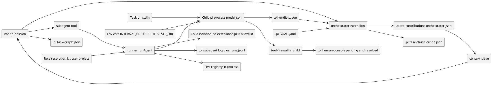
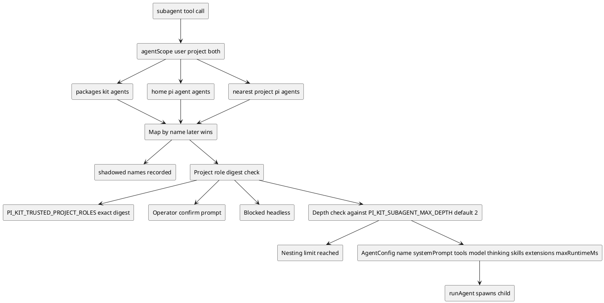
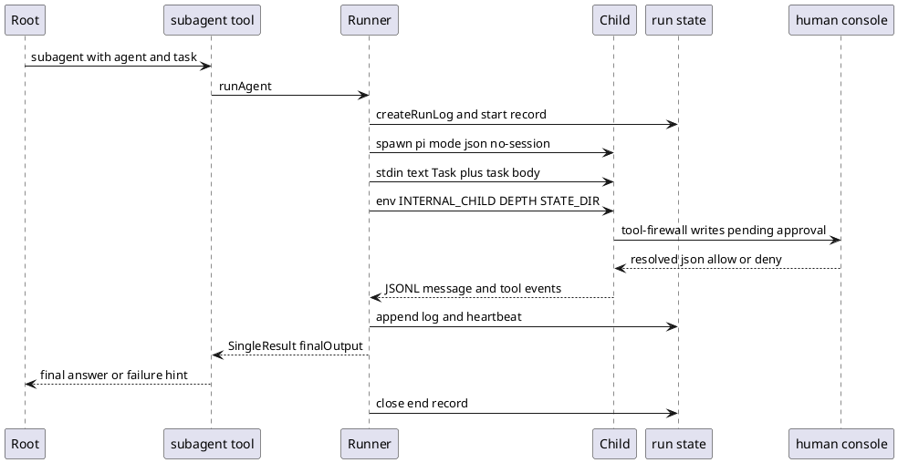
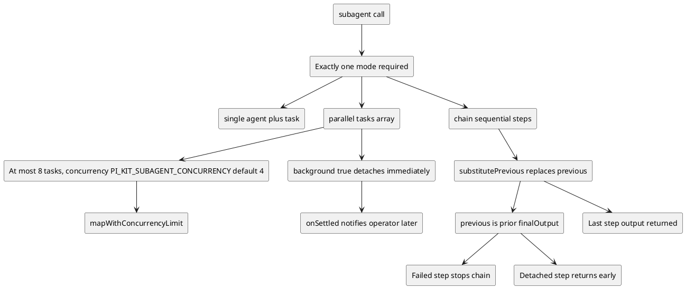
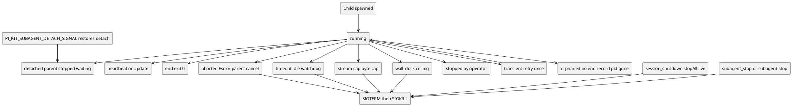

# Subagents, orchestration and the task graph

> Diagrams reflect commit b82d285 (branch overhaul/2026-09, 2026-09-23). If the code has changed since, regenerate them.

The subagent subsystem lets a root pi session delegate a self-contained task to a separate `pi`
process with an isolated context. The `subagent` tool resolves a role from kit, user and project
agent directories, then spawns a child in `--mode json -p --no-session` with a restricted extension
set, the task on stdin, and state env vars that point back at the parent's `.pi` directory. Roles can
run in single, parallel or chain mode; chain threads each step's output into the next step through a
`{previous}` placeholder. Background and detached runs report back through follow-up messages, while
Esc, `session_shutdown` and `subagent_stop` provide cancel and kill paths. On top of this, the
`orchestrator` extension is a context and steering layer, and the `task-graph`, `verifier-board` and
`human-console` extensions share file contracts under `.pi/` to plan work, record independent
verdicts and broker approvals.

## Component map and data flow

This flowchart shows the runtime pieces and where their state lives. The orchestrator only writes
context-contribution and classification files and reads the goal and verdict board; the subagent
tool drives child processes and records run state. The task graph and verifier board are tools
the agents call, and they and the human console each own a small file contract under the project
`.pi` directory.

## Role resolution and trust gate

Agent roles are loaded from three directories and merged into a map keyed by name, with later
sources overriding earlier ones: kit, then user, then the nearest project `.pi/agents`. Project roles
must clear a trust gate — either an interactive confirmation or a matching digest in
`PI_KIT_TRUSTED_PROJECT_ROLES` — and a nesting limit refuses further delegation past
`PI_KIT_SUBAGENT_MAX_DEPTH`.

## Single delegation end to end

A typical single-agent run: the tool builds the child argv and environment, writes run state, and
launches the child. The child's `tool-firewall` writes a pending approval to the shared
`.pi/human-console` directory, and the attended root session's `human-console` extension polls that
directory, prompts the operator, and writes a resolved file that the child reads back.

## Modes and previous threading

The tool requires exactly one mode. Single runs one agent and task; parallel runs many tasks under a
concurrency limit and can detach all of them with `background: true`; chain runs steps sequentially
and substitutes each step's prior output into the next step's task. A failed step stops the chain,
and a detached step returns early with the remaining work running in the background.

## Lifecycle, cancel and kill switch

A spawned child is cancel-by-default: the parent's abort signal is passed to the child, so Esc kills
it as an `aborted` run. `background: true` and `PI_KIT_SUBAGENT_DETACH_SIGNAL=1` restore detach. Idle,
stream-cap and wall-clock budgets each end the run with a distinct `KillReason`, the operator can
stop runs with `subagent_stop` or `/subagent-stop`, and `session_shutdown` stops all live children.
Transient launch failures are retried once; an end record that never arrives leaves the run marked
`orphaned`.

## Key files

- `packages/extensions/third_party/subagent/runner.ts` — `runAgent`: argv, model selection, env vars, budgets, cancel and retry.
- `packages/extensions/third_party/subagent/child-process.ts` — spawn, stdin delivery, JSONL streaming, kill escalation, byte caps.
- `packages/extensions/third_party/subagent/isolation.ts` — `childExtensionArgs`, `--no-extensions` plus `DEFAULT_CHILD_EXTENSIONS` allowlist and `enabledKitExtensions`.
- `packages/extensions/third_party/subagent/tools.ts` — `subagent` tool, mode validation, trust gate, nesting check, `subagent_stop` and `settledNotifier`.
- `packages/extensions/third_party/subagent/agents.ts` — `discoverAgents`, kit/user/project directories, name precedence and shadowed names.
- `packages/extensions/third_party/subagent/logging.ts` — run ids, `.pi/subagent/<runId>.log` and `.pi/subagent/runs.jsonl`.
- `packages/extensions/third_party/subagent/live.ts` — in-process live-run registry and orphan PID guards.
- `packages/extensions/third_party/subagent/config.ts` — defaults and env knobs for depth, concurrency, budgets, retries and approval timeout.
- `packages/extensions/third_party/subagent/result.ts` — `substitutePrevious` and `classifyFailure`.
- `packages/extensions/src/orchestrator/index.ts` — classification, context contribution and verification steering.
- `packages/extensions/src/task-graph/index.ts` — `task_create`, `task_update`, `task_list`, `task_next`, `task_complete` over `.pi/task-graph.json`.
- `packages/extensions/src/verifier-board/index.ts` — `record_verdict`, `verdict_status` and `.pi/verdicts.json`.
- `packages/extensions/src/human-console/index.ts` — pending/resolved polling and `.pi/human-console` file contract.
- `packages/extensions/src/tool-firewall/index.ts` — `brokerApproval` for headless children.
- `packages/kit/agents/scout.md`, `planner.md`, `implementer.md`, `reviewer.md`, `delegator.md` — role frontmatter and system prompts.