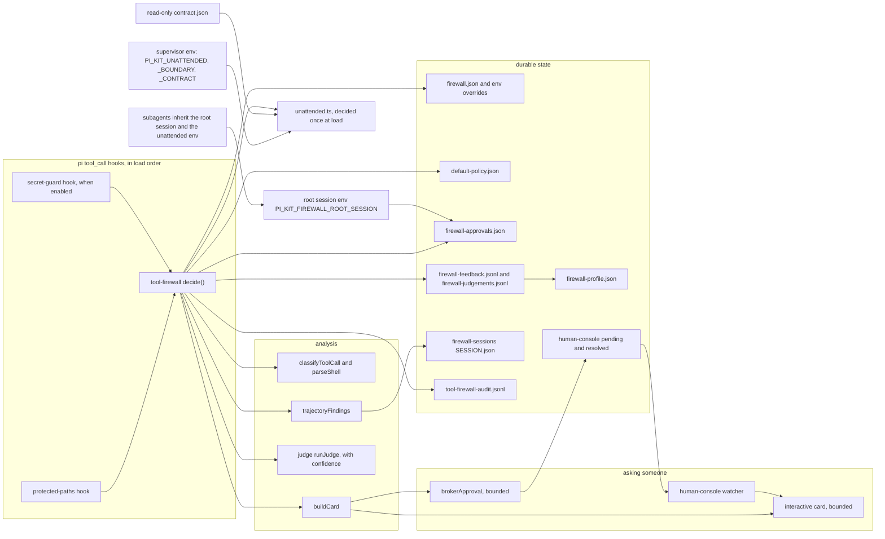
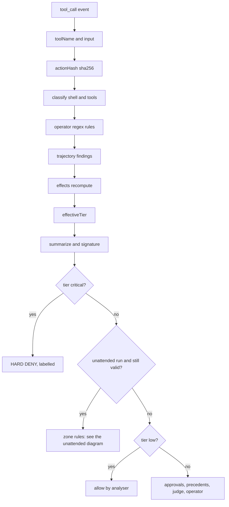
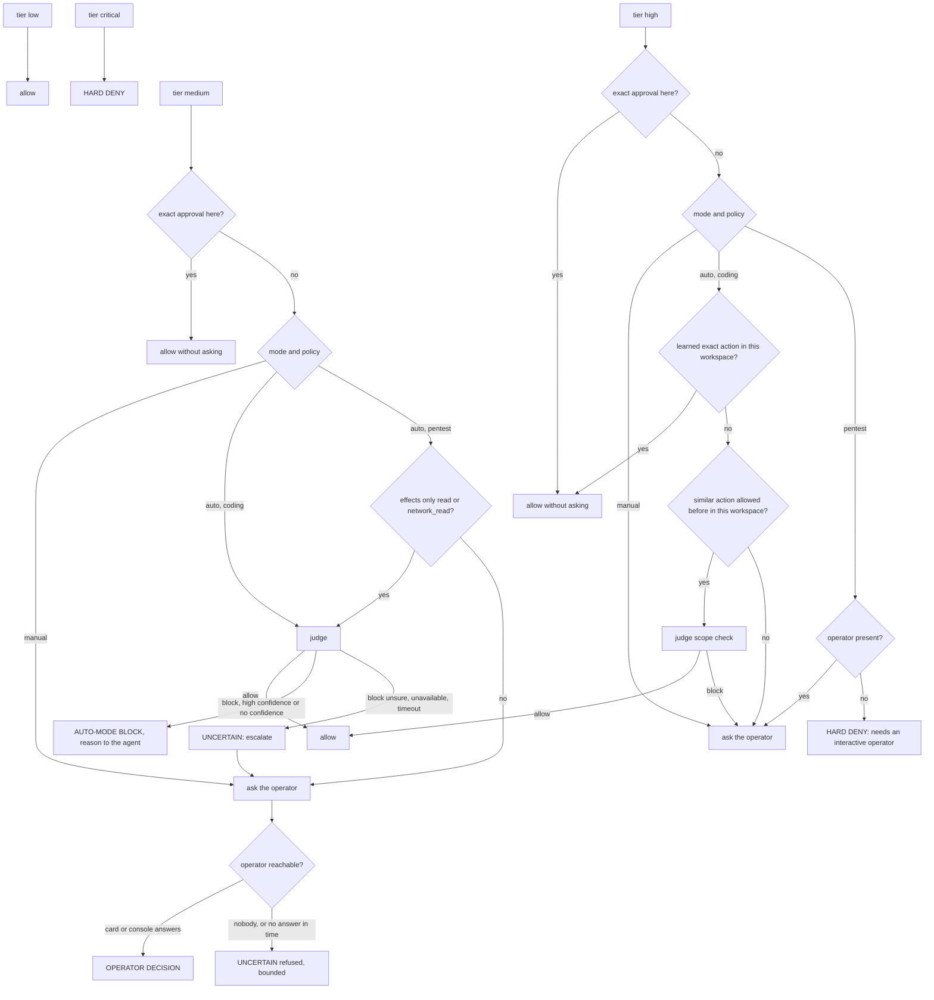
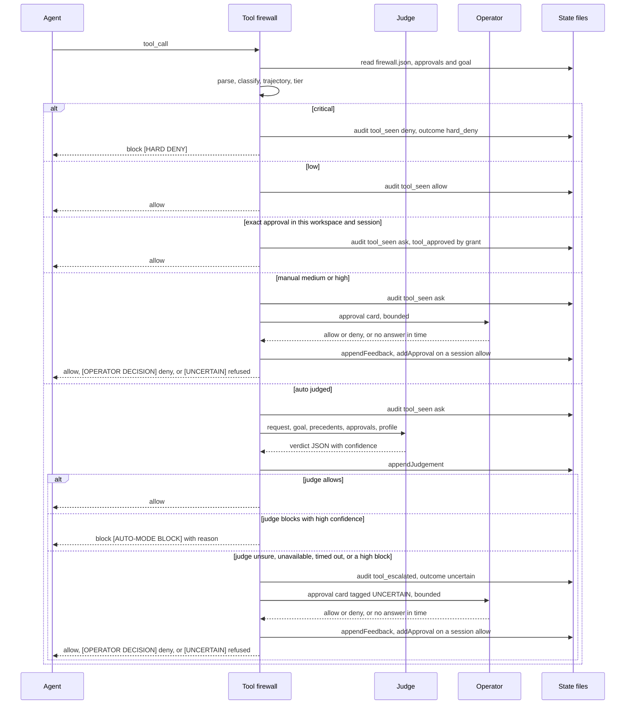
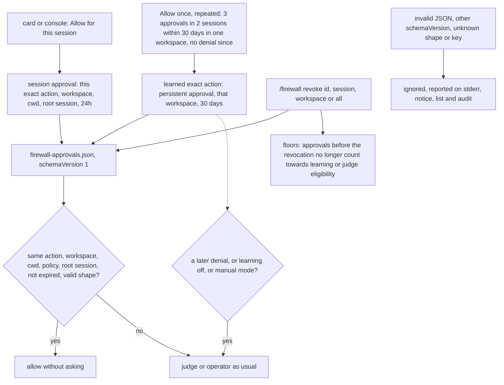
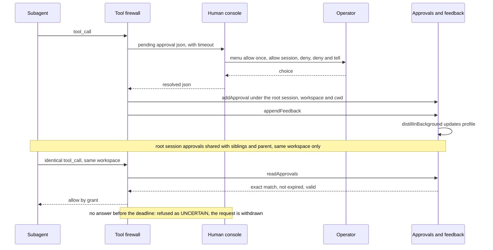
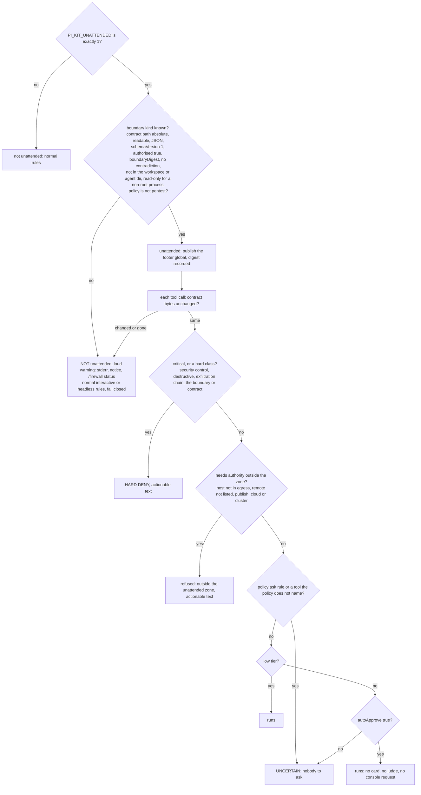

# Tool firewall and auto mode

> Diagrams reflect the change that added `approvals.ts` (scoped, revocable approvals), the labelled outcomes and `unattended.ts`. If the code has changed since, regenerate them. They are Mermaid; the site needs the Mermaid custom fence enabled in `mkdocs.yml` to draw them, and otherwise shows them as code.

The `tool-firewall` extension decides, before every tool call runs, whether it may proceed, parsing shell commands and non-shell tools, classifying them into effects and one of four tiers, folding in session history, then either allowing, denying, or asking a human. In `auto` mode with the `coding` policy a small in-process judge decides medium actions, and high actions only when the operator previously allowed something similar in the same workspace. `manual` mode routes medium and high actions to the operator; the `pentest` policy does too, except that in `auto` mode a medium action whose effects are all `read` or `network_read` reaches the judge. Operator requests render as a bounded approval card or, headless, through the human-console broker. Every refusal is exactly one of three labelled outcomes: HARD DENY (policy says never), UNCERTAIN (the automatic layers could not settle it, or nobody could be asked) or OPERATOR DECISION (a human allowed or denied it); a high-confidence judge block is a fourth, labelled case. What the operator allows is remembered only as a scoped, inspectable, revocable approval. A worker started by the autonomy supervisor inside a container boundary runs in unattended mode: no prompts and no judge inside the zone, hard classes and anything outside the zone refused. `protected-paths` runs as a separate `tool_call` hook that blocks writes to secrets, control surfaces and firewall state.

## Components and where state lives

The firewall is wired through three `pi.on` hooks (`session_start`, `before_agent_start`, `tool_call`) plus a sibling `protected-paths` hook. Runtime configuration comes from `firewall.json` with environment overrides, the policy comes from `default-policy.json`, and all durable state lives under `~/.pi/agent/pi-kit/` and `<cwd>/.pi/`. Unattended mode is not configuration: it is decided once from the supervisor's environment and a read-only contract file.

`protected-paths` blocks writes to secrets, the control surfaces, the firewall's state (including `firewall-approvals.json`) and the unattended contract path, plus `.git/`, `node_modules/`, `.pi/agents/`, `.pi/pentest/` and `.pi/engagement/` under the pentest policy (`PI_KIT_PROTECTED_PATHS` can only add entries; `PI_KIT_WRITE_ALLOWLIST` switches it to allowlist mode).

## Decision pipeline

Inside `decide`, the call is hashed, classified into findings, enriched with operator regex rules and trajectory findings, reduced to a tier, and summarised before any allow or block decision. Critical is a HARD DENY at once. In an unattended run the contract's rules apply next. Low runs. Everything else enters the approval, precedent, judge and operator path.

## Decision matrix by mode and policy

The effective matrix depends on mode and policy. `manual` never auto-approves a new action above low and the judge is never called; only an exact approval given for this session, workspace and directory runs without asking. `auto` with `coding` lets the judge decide medium actions, and high actions only when the operator allowed something similar in this workspace; `pentest` disables learning and approvals and denies high actions when no operator is present. An exact approval never overrides a hard deny.

## A typical run

This sequence shows the common auto-mode path: a medium action reaches the judge with its inputs, every newly computed verdict is recorded as a judgement before the allow or block branch, a high-confidence block is returned to the agent with its reason, and an unsure one goes to the operator. In `manual` mode the judge is never called; high, unavailable-judge and non-judged cases fall through to the operator.

## Approvals: storage, scope and revocation

Every silent allow of a medium or high action is backed by an entry in `firewall-approvals.json`. An entry is bound to one exact action, workspace, working directory, policy and, for a session approval, root session; it records who or what granted it, when, and its expiry (24 hours for a session approval, 30 days for a learned one). Decisions read the file on every call, so `/firewall revoke` takes effect on the next tool call, and an entry of an unknown shape is ignored and reported, never treated as an allow.

## Approval cards, the broker and recording

A headless request is written as a pending JSON file and answered by the human-console watcher, which presents the same menu and writes a resolved file. The wait is bounded by `PI_KIT_HUMAN_CONSOLE_TIMEOUT_MS` and the turn's abort signal, and a console that cannot be written to is UNCERTAIN at once. A session allow becomes an approval under the root session id, so subagents inherit it; every operator decision appends feedback and can trigger background distillation.

## Unattended mode

The supervisor sets `PI_KIT_UNATTENDED=1`, a known `PI_KIT_UNATTENDED_BOUNDARY` and `PI_KIT_UNATTENDED_CONTRACT` (a read-only JSON copy). `unattended.ts` decides once at load; nothing in a session can enable it, and a changed contract switches it off. Children read the same environment and validate the contract themselves.

## Key files

- `packages/extensions/src/tool-firewall/index.ts` — hooks, `decide`, decision matrix, approvals, judge gate, card and broker branching, bounded prompts, outcomes, audit, `/firewall` and `/auto`.
- `packages/extensions/src/tool-firewall/approvals.ts` — the approvals file: schema, validation, expiry, scope matching, revocation and floors.
- `packages/extensions/src/tool-firewall/unattended.ts` — the run contract, unattended state, egress and remote checks, hard and outside-the-zone denials.
- `packages/extensions/src/tool-firewall/config.ts` — modes, policies, config file, state paths, known hosts (with sources and revocation), workspace root.
- `packages/extensions/src/tool-firewall/classify.ts` — effects, tiers, path classes, per-command handlers, hosts and remotes contacted, signatures and families.
- `packages/extensions/src/tool-firewall/shell.ts` — tokenizer and parser feeding the classifier.
- `packages/extensions/src/tool-firewall/trajectory.ts` — per-session state, trajectory findings, root-session sharing.
- `packages/extensions/src/tool-firewall/judge.ts` — judge prompt, in-process model call, verdict and confidence parsing, timeout.
- `packages/extensions/src/tool-firewall/card.ts` — bounded card, choices, detail view, outcome tag.
- `packages/extensions/src/tool-firewall/feedback.ts` — feedback record, redaction, learning thresholds, per-workspace scoping, precedents.
- `packages/extensions/src/tool-firewall/profile.ts` — judgements, distillation stats, global profile and its lock.
- `packages/extensions/src/tool-firewall/default-policy.json` — shipped tools and pentest command rules.
- `packages/extensions/src/human-console/index.ts` — pending/resolved broker, approval menu, `ask_human` (bounded).
- `packages/extensions/third_party/protected-paths/index.ts` — protected lists, allowlist mode, path matching, the approvals file and the contract path.
- `docs/autonomy-gate.md` — prose description of the same decision gate.
