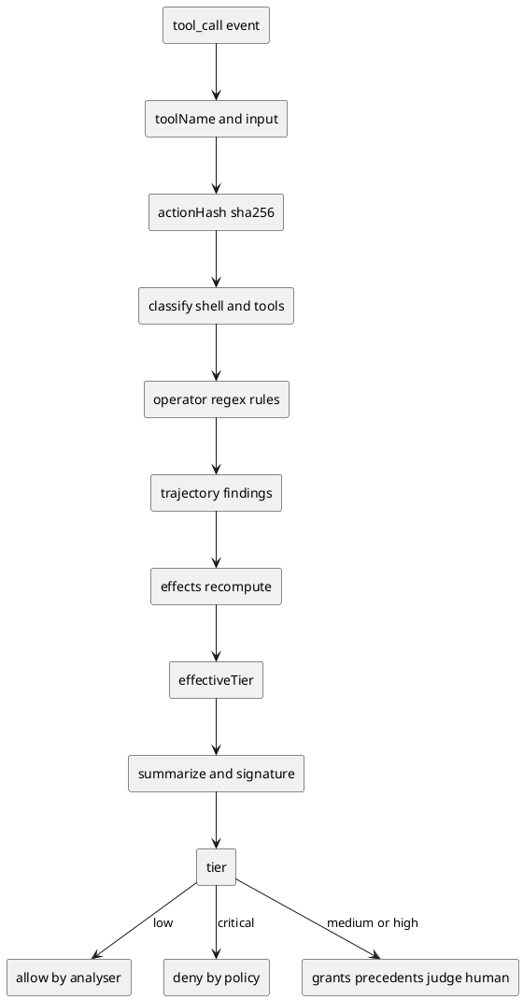
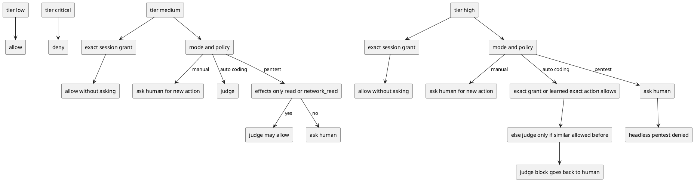
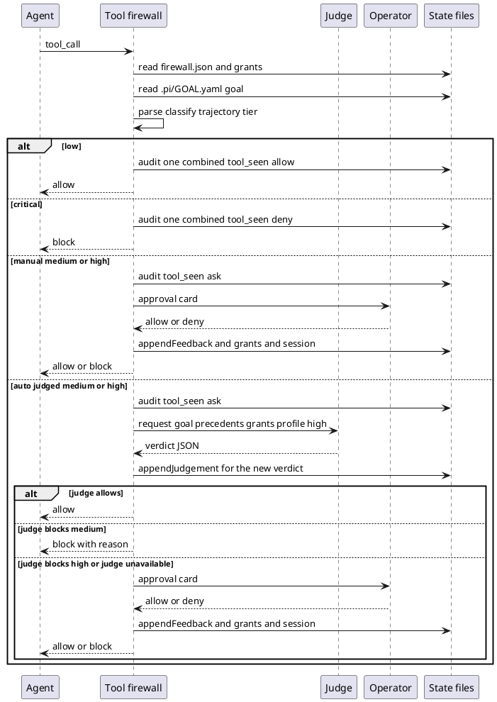
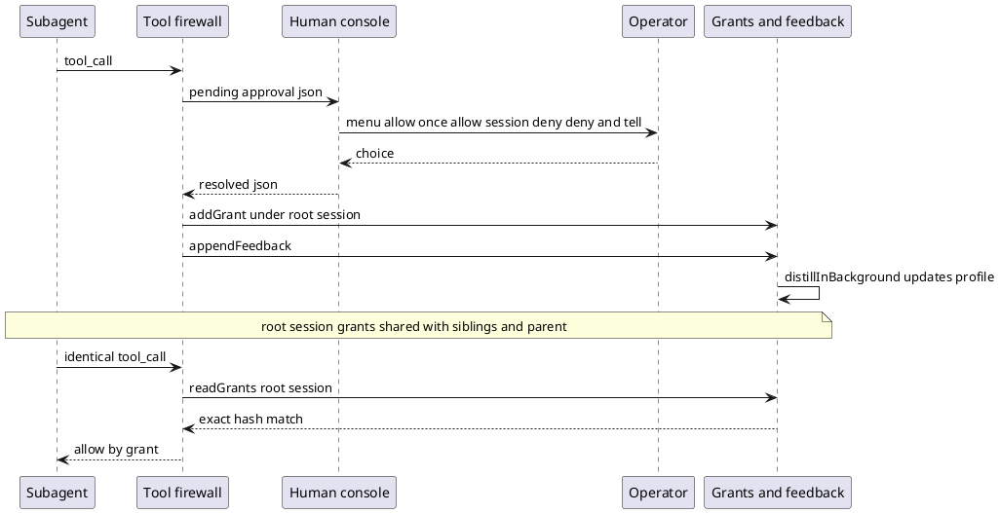

# Tool firewall and auto mode

> Diagrams reflect commit bc0ec11 (branch overhaul/2026-09, 2026-09-23). If the code has changed since, regenerate them.

The `tool-firewall` extension decides, before every tool call runs, whether it may proceed, parsing shell commands and non-shell tools, classifying them into effects and one of four tiers, folding in session history, then either allowing, denying, or asking a human. In `auto` mode with the `coding` policy a small in-process judge decides medium actions, and high actions only when the operator previously allowed something similar. `manual` mode routes medium and high actions to the operator; the `pentest` policy does too, except that in `auto` mode a medium action whose effects are all `read` or `network_read` reaches the judge. Operator requests render as a bounded approval card or, headless, through the human-console broker. Every operator decision and every judge verdict is written to the feedback and judgement logs and distilled in the background into a global profile that only informs the judge. `protected-paths` runs as a separate `tool_call` hook that blocks writes to secrets, control surfaces and firewall state.

## Components and where state lives

```plantuml
@startuml
rectangle "pi tool_call hook" as A
rectangle "protected-paths hook" as A2
rectangle "CODING_PROTECTED secrets control surfaces firewall state" as PP
rectangle "PENTEST_PROTECTED adds .git/ node_modules/ .pi/agents/ .pi/pentest/ .pi/engagement/ and PI_KIT_PROTECTED_PATHS can only add" as PT
rectangle "PI_KIT_WRITE_ALLOWLIST allowlist mode" as AL
rectangle "block write to protected path" as BL
rectangle "decide in index.ts" as B
rectangle "classifyToolCall and parseShell" as C
rectangle "trajectoryFindings" as D
rectangle "judge runJudge" as E
rectangle "buildCard" as F
rectangle "brokerApproval" as G
rectangle "operator menu or confirm" as H
rectangle "human-console watcher" as H2
rectangle "session grants" as I
rectangle "appendFeedback and appendJudgement" as J
rectangle "distillInBackground" as K
rectangle "global profile" as L
rectangle "default-policy.json" as M
rectangle "firewall.json" as N
rectangle "env overrides PI_KIT_FIREWALL_PROFILE PI_KIT_AUTO_MODE" as O
rectangle "firewall-sessions ROOT.grants.json" as P
rectangle "firewall-sessions SESSION.json" as Q
rectangle "firewall-feedback.jsonl and firewall-judgements.jsonl" as R
rectangle "firewall-profile.json" as S
rectangle "tool-firewall-audit.jsonl" as T
rectangle "human-console pending and resolved" as U
rectangle "root session env PI_KIT_FIREWALL_ROOT_SESSION" as V
rectangle "subagents" as W

A --> B
A2 --> PP
A2 --> PT
A2 --> AL
PP --> BL
PT --> BL
AL --> BL
B --> C
B --> D
B --> E
B --> F
B --> G
F --> H
G --> H2
H2 --> H
B --> I
B --> J
J --> K
K --> L
B --> M
B --> N
N --> O
I --> P
D --> Q
J --> R
L --> S
B --> T
G --> U
V --> I
W --> V
@enduml
```

The firewall is wired through three `pi.on` hooks (`session_start`, `before_agent_start`, `tool_call`) plus a sibling `protected-paths` hook. Runtime configuration comes from `firewall.json` with environment overrides, the policy comes from `default-policy.json`, and all durable state lives under `~/.pi/agent/pi-kit/` and `<cwd>/.pi/`.

## Decision pipeline

Inside `decide`, the call is hashed, classified into findings, enriched with operator regex rules and trajectory findings, reduced to a tier, and summarised before any allow or block decision. Low and critical tiers short-circuit to allow and deny; everything else enters the grant/precedent/judge/human path.

## Decision matrix by mode and policy

The effective matrix depends on mode and policy. `manual` never auto-approves a new action above low and the judge is never called; only an exact repeat matching a session grant runs without asking. `auto` with `coding` lets the judge decide medium actions and high actions only when the operator allowed something similar; `pentest` disables learning and session grants and denies high actions when no operator is present.

## A typical run

This sequence shows the common auto-mode path: a medium action reaches the judge with its inputs, every newly computed verdict is recorded as a judgement before the allow or block branch, and a block is returned to the agent with its reason. In `manual` mode the judge is never called; high, unavailable-judge and non-judged cases fall through to the operator.

## Approval cards, the broker, grants and recording

A headless request is written as a pending JSON file and answered by the human-console watcher, which presents the same menu and writes a resolved file. A session allow becomes a grant stored under the root session id, so subagents inherit it; every operator decision appends feedback and can trigger background distillation.

## Key files

- `packages/extensions/src/tool-firewall/index.ts` — hooks, `decide`, decision matrix, grants, judge gate, card and broker branching, audit.
- `packages/extensions/src/tool-firewall/config.ts` — modes, policies, config file, state paths, known hosts, workspace root.
- `packages/extensions/src/tool-firewall/classify.ts` — effects, tiers, path classes, per-command handlers, signatures and families.
- `packages/extensions/src/tool-firewall/shell.ts` — tokenizer and parser feeding the classifier.
- `packages/extensions/src/tool-firewall/trajectory.ts` — per-session state, trajectory findings, grants, root-session sharing.
- `packages/extensions/src/tool-firewall/judge.ts` — judge prompt, in-process model call, verdict parsing, timeout.
- `packages/extensions/src/tool-firewall/card.ts` — bounded card, choices, detail view.
- `packages/extensions/src/tool-firewall/feedback.ts` — feedback record, redaction, learning thresholds, precedents.
- `packages/extensions/src/tool-firewall/profile.ts` — judgements, distillation stats, global profile and its lock.
- `packages/extensions/src/tool-firewall/default-policy.json` — shipped tools and pentest command rules.
- `packages/extensions/src/human-console/index.ts` — pending/resolved broker, approval menu, `ask_human`.
- `packages/extensions/third_party/protected-paths/index.ts` — protected lists, allowlist mode, path matching.
- `docs/autonomy-gate.md` — prose description of the same decision gate.
