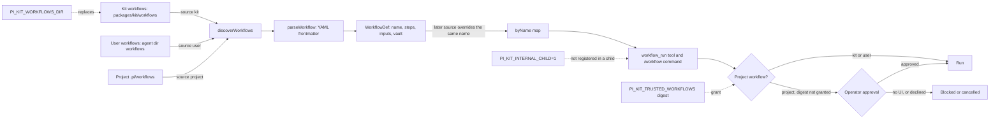
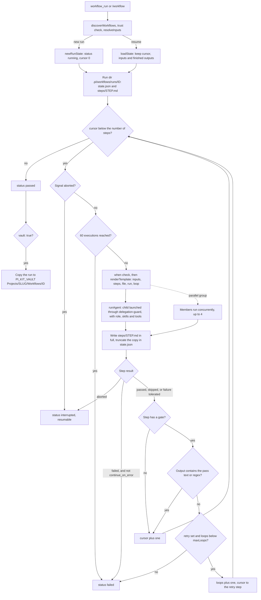
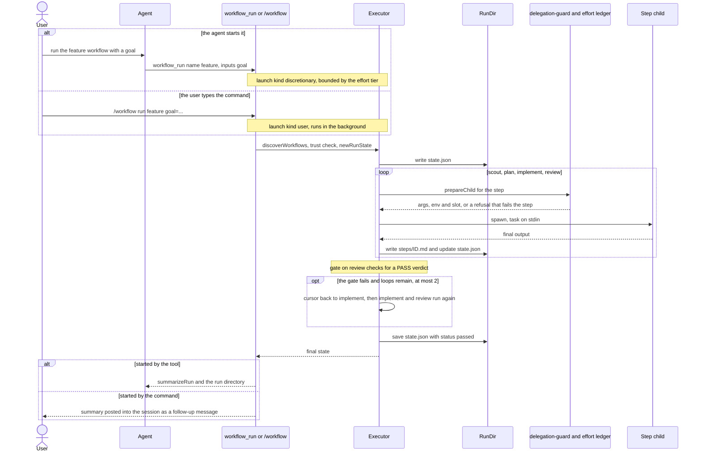
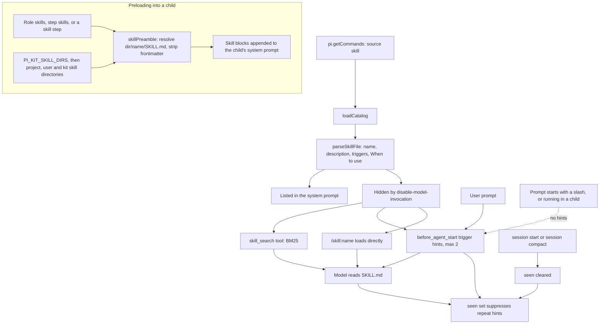
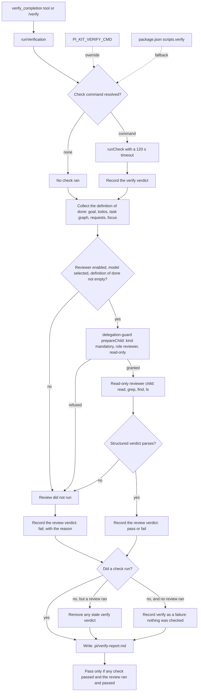
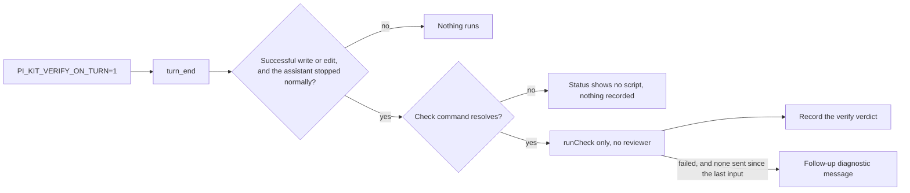

# Workflows and skill routing

Workflows are declarative chains of subagent and skill steps: a Markdown file with YAML frontmatter that a deterministic executor, not a model, turns into an ordered run. Every run gets a blackboard directory under `.pi/workflows/runs/<id>` where `state.json` records progress and `steps/<id>.md` holds each step's final answer, so an interrupted run can resume from where it stopped. Workflow files are discovered from three locations in order (the shipped kit, the user's agent directory and the project), with a later location overriding an earlier one of the same name and project files requiring approval.

Each step is a subagent launch like any other, so it goes through the delegation launch contract: `delegation-guard` decides which extensions the step's child loads and reserves a slot in the shared effort ledger. A `/workflow` command is launch kind `user`, because you typed it, and is bounded only by the platform ceilings. The `workflow_run` tool is `discretionary`, so it draws on the effort tier's budget like the `subagent` tool and is hidden at E1. That matters for workflows that fan out: `research` starts three scouts at once, and when the agent starts it with `workflow_run` the scout limit allows all three only at E5, whereas `/workflow run research` is not tier-limited. See [Subagents, orchestration and the task graph](subagents-and-orchestration.md) for the contract and [Effort](../effort.md) for the limits.

Skills feed the same system from two directions. A workflow step (or a role) can preload named `SKILL.md` bodies into its child's system prompt, while the skill-router extension keeps most skills out of the system prompt and surfaces them progressively through BM25 search, automatic trigger hints and direct slash invocation. This page diagrams both mechanisms, and the separate completion gate in `verify-gate`, and shows where their state lives.

## Where workflows live and how they are discovered

`discoverWorkflows` scans `*.md` (excluding `readme.md`) in `PI_KIT_WORKFLOWS_DIR` or the shipped kit directory, then the agent's `workflows` directory, then `<cwd>/.pi/workflows`, and a later source overrides an earlier one of the same name. Only project-sourced workflows are untrusted: they need interactive operator approval or an exact SHA-256 digest listed in `PI_KIT_TRUSTED_WORKFLOWS`, and the same check applies to a resumed run. `PI_KIT_INTERNAL_CHILD=1` means the workflow tools and the `/workflow` command are not registered inside a child at all. A step's role is resolved from the kit and user role directories only, so a project role cannot be used by a workflow.

## The run blackboard and control flow

The executor walks top-level steps by a `cursor` index and keeps everything on disk: `state.json` carries the `RunState` (`version`, `id`, `workflow`, `workflowFile`, `inputs`, `status`, `cursor`, `loops`, `steps`, `startedAt`, `updatedAt`, `error`, `executions`) and each `StepState` (`status`, `attempts`, `runIds`, `output`, `error`, `cost`, `startedAt`, `endedAt`). Step output is written in full to `steps/<id>.md` and truncated into the state at `MAX_OUTPUT_IN_STATE = 4000` characters, with `MAX_EXECUTIONS = 60` as a hard ceiling. A failing step `gate` loops the cursor back to its `retry` step when one is set, failing immediately when no `retry` is set and once `maxLoops` (clamped to 0..10) is exhausted, and a resumed parallel group re-runs only members that had not passed. A step whose launch is refused (for example because the effort budget is used up) fails like any other failed step. This executor gate is entirely separate from the verify-gate completion check in the last two diagrams.

Steps render their task with `{{inputs.x}}`, `{{steps.<id>.output}}`, `{{steps.<id>.status}}`, `{{file:rel/path}}` (capped at 64 KiB), `{{run.dir}}`, `{{run.id}}` and `{{loop}}`; a trailing `?` makes a missing value empty rather than an error. A step may declare `outputs`, and it fails if a declared file was not written into the run directory.

## A workflow run end to end

The shipped `feature` workflow has four steps (`scout`, `plan`, `implement`, `review`) with the gate on `review`: its `## Verdict` must be `PASS`, or the cursor goes back to `implement` with the review as feedback, at most twice. Invoked as a slash command, `/workflow` runs in the background as launch kind `user` and posts its summary into the session with `sendMessage` using `deliverAs: "followUp"`, while the `workflow_run` tool is launch kind `discretionary` and returns the summary plus the run directory. Aborting (Esc) cancels the active child and leaves the run `interrupted`, which can be resumed with `workflow_run {resume: id}` or `/workflow resume <id>`.

## How skills are listed, searched and loaded

skill-router builds its catalogue from `pi.getCommands()` entries whose source is `"skill"` and parses each `SKILL.md`; a skill with `disable-model-invocation: true` is `hidden`, that is, kept out of the system prompt. Triggers are parsed as a JSON array or a comma-separated list, where a `re:` prefix is a raw case-insensitive regex and anything else is a phrase match, and the longest matching trigger wins (a `re:` trigger counts as 40 characters). Hints fire on at most two hidden skills per prompt (code spans stripped, first 8000 characters), as a hidden message rather than a system prompt edit. They are skipped for a prompt that starts with `/` and inside a child, never repeat within a session, and the `seen` set is cleared on session start and session compact. BM25 search weights name 3, description 2, triggers 2 (the phrase triggers, not `re:` ones) and the "When to use" section 1. A workflow step, or a role, instead resolves `<dir>/<name>/SKILL.md` across `PI_KIT_SKILL_DIRS`, then the project, user and `packages/kit/skills` directories, and appends the frontmatter-stripped body to the child's system prompt as a skill block.

## The completion gate is separate from step gates

`verify-gate` powers `/verify` and the `verify_completion` tool through `runVerification`. It first resolves a check command from `PI_KIT_VERIFY_CMD`, else a real `package.json` `scripts.verify` run as `npm run verify`, else none, and a resolved check runs with a 120 second timeout. It then collects the definition of done (the goal in `.pi/GOAL.yaml`, the todo list, the task graph, recent user requests and any focus you gave) and, unless `PI_KIT_VERIFY_REVIEW=0`, starts an independent read-only reviewer child (`read,grep,find,ls`) that sees only the definition of done, the git change summary and the check output. The reviewer is launched through `delegation-guard` with launch kind `mandatory`: it runs at every effort tier and never draws on the discretionary budget, and a refused launch means the review did not run. Verdicts land on the board at `.pi/verdicts.json` as `verify` (the check) and `review` (the reviewer), with a human-readable `.pi/verify-report.md`. It fails closed: having no check command is never recorded as a pass. When neither a check nor a review ran, `verify` is recorded as a failure, and a run passes only when the reviewer ran and passed and any check that ran also passed.

`PI_KIT_VERIFY_ON_TURN=1` enables a fast turn-end mode. After a turn that made successful `write` or `edit` calls and ended normally, it runs only the check command (when one resolves), records the `verify` verdict and, on a failure, sends one follow-up diagnostic until the next user input. It starts no reviewer. This gate does not intercept shell tools and is unrelated to a workflow step's own `gate`.

## Source files

- `packages/extensions/third_party/subagent/workflow.ts`: workflow discovery, parsing, trust digest, executor, blackboard, step gates, resume and vault copy.
- `packages/extensions/third_party/subagent/workflow-tools.ts`: `workflow_run`, `workflow_status`, the `/workflow` command, the project-workflow trust prompt and the launch kind (`user` for the command).
- `packages/extensions/third_party/subagent/runner.ts`: `runAgent`, which every workflow step calls (per-attempt reservation, `launchKind`).
- `packages/extensions/third_party/subagent/launch.ts`: the launcher side of the delegation contract.
- `packages/extensions/third_party/subagent/skills.ts`: step and role skill preloading and skill directory resolution.
- `packages/extensions/src/delegation-guard/index.ts`, `packages/extensions/src/effort/ledger.ts`: the launch contract and the shared ledger each step reserves against.
- `packages/extensions/src/skill-router/index.ts`: skill catalogue, trigger hints, the `skill_search` tool and the `/skills` command.
- `packages/extensions/src/skill-router/match.ts`: `parseSkillFile`, `matchTriggers` and the `searchSkills` BM25 ranking.
- `packages/extensions/src/verify-gate/index.ts`: completion gate, check command, reviewer launch and the verdicts it writes to the verifier board.
- `packages/extensions/src/verifier-board/index.ts`: the board file `.pi/verdicts.json` and its trusted verdict sources.
- `packages/kit/workflows/`: the shipped `feature`, `bugfix` and `research` workflows.
- `packages/kit/skills/`: the shipped skills, one `<name>/SKILL.md` each.
