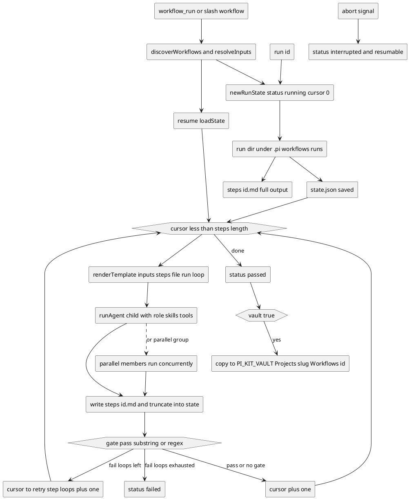
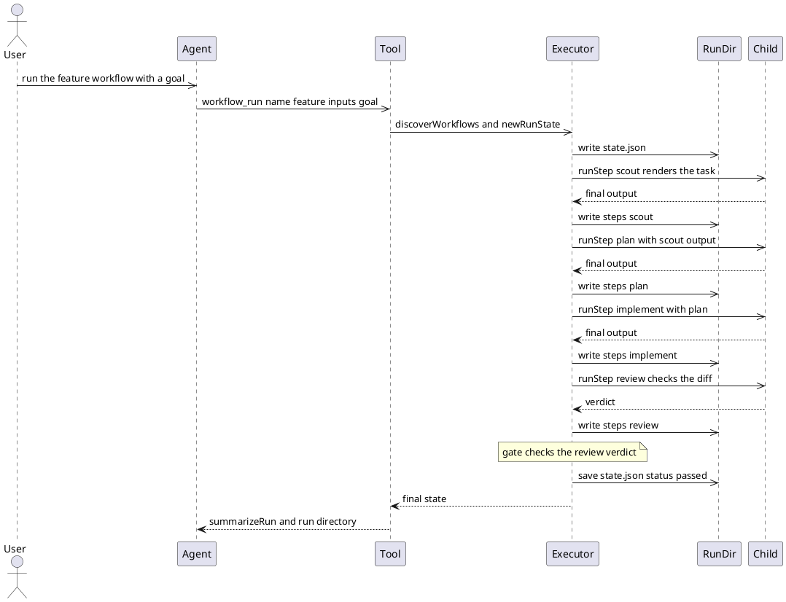
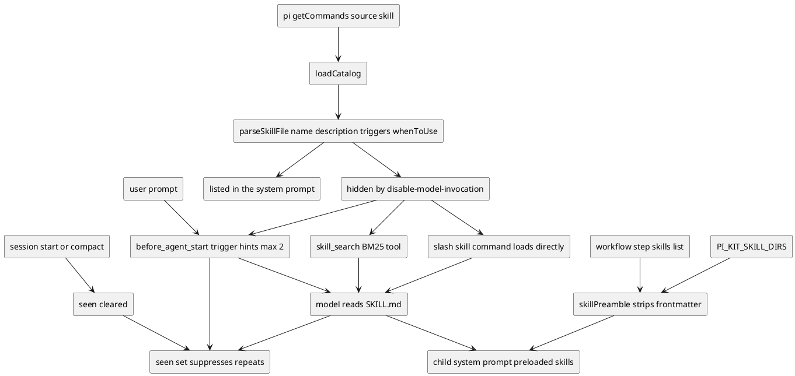
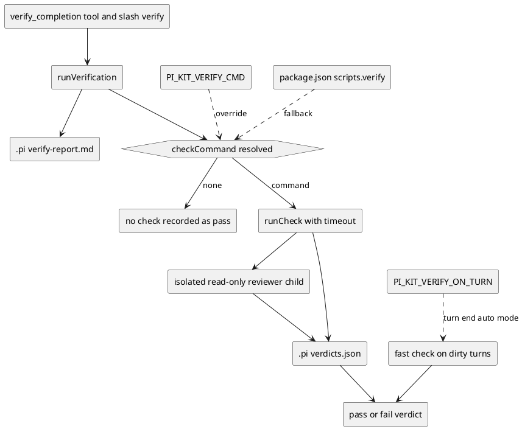

# Workflows and skill routing

> Diagrams reflect commit b82d285 (branch overhaul/2026-09, 2026-09-23). If the code has changed since, regenerate them.

Workflows are declarative chains of subagent and skill steps: a Markdown file with YAML frontmatter that a deterministic executor, not a model, turns into an ordered run. Every run gets a blackboard directory under `.pi/workflows/runs/<id>` where `state.json` records progress and `steps/<id>.md` holds each step's final answer, so an interrupted run can resume from where it stopped. Workflow files are discovered from three locations in order — the shipped kit, the user's agent directory, and the project — with a later location overriding an earlier one of the same name and project files requiring approval. Skills feed the same system from two directions: a workflow step can preload named `SKILL.md` bodies into its child's system prompt, while the skill-router extension keeps most skills out of the system prompt and surfaces them progressively through BM25 search, automatic trigger hints and direct slash invocation. This page diagrams both mechanisms and shows where their state lives.

## Where workflows live and how they are discovered

```plantuml
@startuml
left to right direction
rectangle "PI_KIT_WORKFLOWS_DIR" as ENVKIT
rectangle "packages kit workflows" as KIT
rectangle "pi agent workflows dir" as USER
rectangle "project .pi workflows" as PROJ
rectangle "discoverWorkflows" as DISC
rectangle "parseWorkflow reads YAML frontmatter" as PARSE
rectangle "WorkflowDef name steps inputs vault" as DEF
rectangle "byName map dedupes" as OVER
rectangle "workflow_run and slash workflow" as RUN
rectangle "PI_KIT_INTERNAL_CHILD" as ENVCHILD
rectangle "trustError" as TRUST
rectangle "PI_KIT_TRUSTED_WORKFLOWS" as ENVTRUST
rectangle "runs" as OK
rectangle "operator approval" as CONFIRM
ENVKIT ..> KIT : overrides
KIT --> DISC : source kit
USER --> DISC : source user
PROJ --> DISC : source project
DISC --> PARSE
PARSE --> DEF
DEF --> OVER : later dir overrides same name
OVER --> RUN
ENVCHILD ..> RUN : blocks child
RUN --> TRUST
ENVTRUST ..> TRUST : digest grant
TRUST --> OK : kit or user
TRUST --> CONFIRM : project
CONFIRM --> OK
@enduml
```

`discoverWorkflows` scans `*.md` (excluding `readme.md`) in `PI_KIT_WORKFLOWS_DIR` or the shipped kit directory, then the agent's `workflows` directory, then `<cwd>/.pi/workflows`, and a later source overrides an earlier one of the same name. Only project-sourced workflows are untrusted: they need interactive operator approval or an exact SHA-256 digest listed in `PI_KIT_TRUSTED_WORKFLOWS`, and `PI_KIT_INTERNAL_CHILD=1` disables the workflow tools entirely inside a child.

## The run blackboard and control flow

The executor walks top-level steps by a `cursor` index and keeps everything on disk: `state.json` carries the `RunState` (`version`, `id`, `workflow`, `workflowFile`, `inputs`, `status`, `cursor`, `loops`, `steps`, `startedAt`, `updatedAt`, `error`, `executions`) and each `StepState` (`status`, `attempts`, `runIds`, `output`, `error`, `cost`, `startedAt`, `endedAt`). Step output is written in full to `steps/<id>.md` and truncated into the state at `MAX_OUTPUT_IN_STATE = 4000` characters, with `MAX_EXECUTIONS = 60` as a hard ceiling; a failing step `gate` loops the cursor back to its `retry` step when one is set, failing immediately when no `retry` is set and once `maxLoops` — clamped to 0..10 — is exhausted, and a resumed parallel group re-runs only members that had not passed. This executor gate is entirely separate from the verify-gate completion check in the last diagram.

Steps render their task with `{{inputs.x}}`, `{{steps.<id>.output}}`, `{{steps.<id>.status}}`, `{{file:rel/path}}` (capped at 64 KiB), `{{run.dir}}`, `{{run.id}}` and `{{loop}}`; a trailing `?` makes a missing value empty rather than an error.

## A workflow run end to end

The shipped `feature` workflow has four sequential steps — `scout`, `plan`, `implement`, `review` — with the gate on `review`. Invoked as a slash command, `/workflow` runs in the background and posts its summary into the session with `sendMessage` using `deliverAs: "followUp"`, while the `workflow_run` tool returns the summary plus the run directory. Aborting (Esc) cancels the active child and leaves the run `interrupted`, which can be resumed with `workflow_run {resume: id}` or `/workflow resume <id>`.

## How skills are listed searched and loaded

skill-router builds its catalog from `pi.getCommands()` entries whose source is `"skill"` and parses each `SKILL.md`; a skill with `disable-model-invocation: true` is `hidden`, i.e. kept out of the system prompt. Triggers are parsed as a JSON array or a comma-separated list, where a `re:` prefix is a raw case-insensitive regex and anything else is a phrase match, and the longest matching trigger wins. Hints fire on at most two hidden skills per prompt (code spans stripped, first 8000 chars), never repeat within a session, and the `seen` set is cleared on session start and session compact; BM25 search weights name 3, description 2, triggers 2 and the "When to use" section 1, while a workflow step instead resolves `<dir>/<name>/SKILL.md` across `PI_KIT_SKILL_DIRS` plus the project and user skill directories and `packages/kit/skills` and appends the frontmatter-stripped body as a skill block.

## The completion gate is separate from step gates

`verify-gate` powers `/verify` and the `verify_completion` tool through `runVerification`: it resolves a check command from `PI_KIT_VERIFY_CMD`, else a real `package.json` `scripts.verify` run as `npm run verify`, else `null` — and no check command is never recorded as a pass (fail-closed). A resolved check runs with a timeout, and an isolated read-only reviewer child (`read,grep,find,ls`) independently judges the definition of done; verdicts land on the board at `.pi/verdicts.json` with a human-readable `.pi/verify-report.md`. `PI_KIT_VERIFY_ON_TURN=1` enables a fast turn-end mode that runs only the check command on dirty turns; this gate does not intercept shell tools and is unrelated to a workflow step's own `gate`.

## Key files

- Workflow discovery, parsing, trust check, executor, blackboard, step gates, resume, vault copy: `packages/extensions/third_party/subagent/workflow.ts`
- `workflow_run`, `workflow_status` tools and `/workflow` command: `packages/extensions/third_party/subagent/workflow-tools.ts`
- Step skill preloading and skill directory resolution: `packages/extensions/third_party/subagent/skills.ts`
- Skill catalog, trigger hints, `skill_search` tool, `/skills` command: `packages/extensions/src/skill-router/index.ts`
- `parseSkillFile`, `matchTriggers`, `searchSkills` BM25 ranking: `packages/extensions/src/skill-router/match.ts`
- Completion gate, check command, verifier board: `packages/extensions/src/verify-gate/index.ts`
- Shipped workflows `feature`, `bugfix`, `research`: `packages/kit/workflows/`
- Shipped skills as `<name>/SKILL.md`: `packages/kit/skills/`
