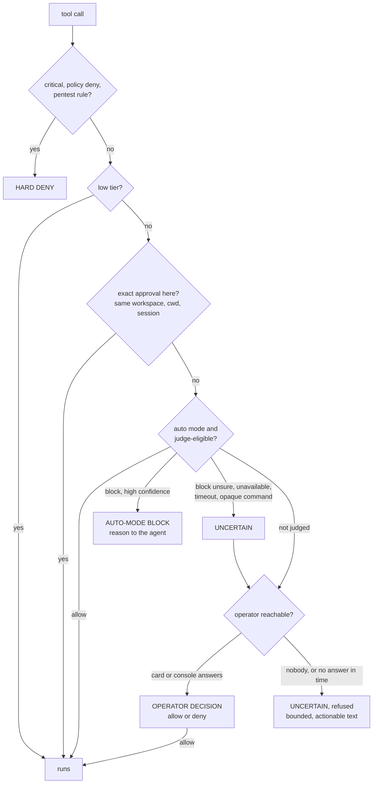

# Autonomy Gate (tool-firewall v2)

`tool-firewall` decides, before every tool call runs, whether it may run. The goal is
simple: an agent in auto mode should do routine work without asking, and dangerous actions
should still be stopped or brought to you. This page describes how that decision is made. It
implements the deterministic core of
`docs/proposals/PI_AUTONOMY_GATE_SPEC.md` (phases 1–3 and a light phase 5). The spec's
ML models, separate daemon and sandboxing are deferred.

## How a decision is made

1. **Parse.** Shell commands are parsed, not pattern-matched. The parser handles:
   - quotes, `$'…'`, `$( )`, backticks, heredocs, redirections, pipes and `cd`/variable
     tracking;
   - obfuscation such as `r''m`, `r\m` and `$'\x72m'`;
   - wrappers: `sudo`, `env`, `timeout`, `nice`, `xargs`, `find -exec`, `bash -c`, `eval`,
     `tmux send-keys`, and `ssh host '…'`, whose remote command is parsed and classified
     too.

   Anything it cannot parse reliably is treated as opaque and never auto-allowed. A writer
   fed by `xargs` or `parallel` (`touch`, `cp`, `mv`, `tee`, `chmod`, …) writes to paths the
   parser cannot see, so it is medium, not routine.
2. **Classify.** Each command and each non-shell tool call becomes a set of **effects**:
   read, workspace write, delete, network send, remote exec, privilege, persistence,
   credential read, security control, destructive system, obfuscated exec, and others.
   Targets are scoped by path class:
   - build output inside the workspace, e.g. `rm -rf node_modules`, is routine;
   - other deletes in the workspace are medium;
   - deletes outside the workspace are high;
   - deletes of `/`, `~` or system roots are critical.
3. **Session history.** The following raise the tier:
   - reading a secret, then sending data to a remote host;
   - downloading a file, then running it or making it executable;
   - a burst of deletions.

   History is kept per session under `~/.pi/agent/pi-kit/firewall-sessions/`.
4. **Tier and decide:**

   | Tier | manual | auto (coding policy) | pentest policy |
   |---|---|---|---|
   | low | allow | allow | allow |
   | medium | ask | judge: allow, block (high confidence) or ask you (unsure) | ask (the judge may only clear pure reads) |
   | high | ask | exact approval runs; else the judge, if you allowed something similar here; else ask | ask each time, no approvals; denied headless |
   | critical | deny | deny | deny |

   In auto mode with the coding policy, two cases count as low:
   - read-only `ssh` to a known host (from `~/.ssh/config` or `knownHosts`);
   - read-only `sudo -n` commands. `sudo` inside `ssh host '…'` counts as `sudo -n`, because it
     has no terminal to prompt on.

   Remote writes, mounts, key installs and interactive sudo stay medium or high. Manual mode
   never applies these two shortcuts: a read-only `ssh` to a known host asks there.

What runs without asking in every mode is the **low** tier: reads of paths that are not
credentials (inside or outside the workspace), git reads, network GETs, workspace writes,
ordinary development tooling, and tools whose name reads as read-only (`get_…`, `list_…`).
`/firewall status` prints this for the mode in force.

## Three outcomes

Every refusal is exactly one of these, and the tool result the agent reads, the approval card
and the audit log all say which:

| Outcome | Meaning | What happens |
|---|---|---|
| **HARD DENY** | Policy says never: the critical tier, a policy `deny`, a pentest rule, and in an unattended run the hard classes below. | Never shown to you, never judged. No approval, session allow or judge can override it. The agent is told to leave it out or ask you to run it. |
| **UNCERTAIN** | The automatic layers could not settle it: the judge is unsure of a block, unavailable, timed out or aborted, or the command cannot be read; or nobody could be asked. | With a UI or console it goes to you (the card is tagged `UNCERTAIN`). Without one it fails closed after a bounded wait, with a message the agent can relay. |
| **OPERATOR DECISION** | You allowed or denied it (card or console). | Remembered only within the scope the card names (below). |

A high-confidence block by the auto-mode judge is its own labelled case (`AUTO-MODE BLOCK`):
final, with the reason returned to the agent.



Nothing waits on a UI that is not there. The human-console broker honours
`PI_KIT_HUMAN_CONSOLE_TIMEOUT_MS` (15 minutes by default; subagents get a shorter one) and the
turn's abort signal. An interactive card, confirm or note prompt is bounded by pi's own dialog
timeout and abort signal and again by the firewall, with `PI_KIT_FIREWALL_PROMPT_TIMEOUT_MS`
(15 minutes by default). The judge waits at most `PI_KIT_FIREWALL_JUDGE_TIMEOUT_MS` (15 seconds
by default) and stops at once when the turn is aborted. A console that cannot even be written to
is UNCERTAIN, not "the operator declined". An interactive `ask_human` question gives up at the
console timeout too.

## Action families

"This kind of action" means a set of **families**. Work on a remote host or as root is grouped
by where it runs and what it does, e.g. `srv02 as root:write_outside` or
`srv02 as root:credential_read`. Ops commands there vary in every path and flag, but your
decision is about the host and the kind of effect.

Some families keep an exact key instead, because their meaning depends on the exact target:
- local work;
- network sends (per destination);
- history rewrites and publishes (per remote);
- security-control, destructive, obfuscated and opaque actions;
- cross-action chains such as secret → send.

Families and scopes decide what counts as *similar* and whether the judge may look at an
action at all. They never allow anything by themselves.

## The judge (auto mode)

**Medium** actions go to a model called in-process, with a 15-second timeout. It sees:
- your **latest** request and the session goal (`.pi/GOAL.yaml`, if set);
- the last few actions;
- this action's parsed effects and reasons;
- up to five of your past decisions on similar actions.

It answers `allow` or `block`, and says how sure it is (`confidence`: high, medium or low):
- `allow` runs the action, whatever the confidence.
- A **high-confidence block** is final. It is returned to the agent as the tool result, with the
  reason, so the agent can change course or explain to you why the step is needed. You get a
  quiet notice, not a prompt. An answer that states no confidence (the older shape) is treated
  the same way.
- A **medium- or low-confidence block** is UNCERTAIN, not final. It goes to you with the judge's
  doubt on the card (or to the human console when headless).
- If the judge is unavailable, times out or is aborted, the action is UNCERTAIN too.

A **high** action goes to the judge only when all of these hold:
- auto mode is on, with the coding policy;
- the action is learnable;
- you have already allowed something similar in this workspace: either a **session allow**
  that shares a family or a host/root scope with it, or approvals of **every family in it**
  (within 30 days, with no denial since, and none revoked).

The judge then reasons over the **whole actions** you allowed: their command, steps,
severity, reasons and chain. It also sees your latest request, the goal, precedents, and your
learned profile. It allows only when this is the same kind of step: same host and privilege,
same or narrower paths and services, no new kind of effect, no higher severity, continuing the
same work. "Block" does not refuse outright. It asks you, and the card says exactly **how
this differs** from what you allowed. A kind you have never allowed always comes to you first,
and critical actions never reach the judge.

Model: `PI_KIT_AUTO_MODE_MODEL`, then `judgeModel` in `firewall.json`, then the session model.

## Approval cards and remembered approvals

A card is at most **10 lines** of at most 116 characters, so it fits a pane and the human
console. It contains:
- the tier and summary (prefixed `UNCERTAIN` when the automatic layers could not settle it);
- the command;
- the reasons, highest first, then "+N more";
- the session history;
- the judge's note;
- your past decisions on this kind;
- what a session allow would cover, and how far it reaches.

`/auto explain` shows the full analysis of the last card.

The choices are:
- *Allow once*;
- *Allow for this session*: an exact repeat runs, and in auto mode similar steps go to the
  judge, checked against this action. It is not a blanket allow for "root on srv02". This
  choice is not offered under the pentest policy;
- *Deny*;
- *Deny and tell the agent why*.

Headless sessions and subagents send the same menu through the human console. A console
without menu support still answers yes/no.

### What an approval covers

An approval is never broader than the choice you made. Each one is an entry in
`~/.pi/agent/pi-kit/firewall-approvals.json` (`PI_KIT_FIREWALL_APPROVALS`), and it is bound to:
- **one exact action** (tool and arguments, by hash);
- **one workspace and working directory**: the same command in another workspace, or another
  directory of the same one, is asked again;
- **the policy** it was given under (never the pentest policy, which offers no session allows);
- for a **session** approval, the **root session**, shared with the subagents it spawns (they
  inherit `PI_KIT_FIREWALL_ROOT_SESSION`); a `/new` session starts with none. It expires after
  24 hours.

A **persistent** approval is a *learned exact action* (below). It is bound to the workspace it
was learned in and expires after 30 days.

Each entry records who or what granted it (you, through the card or the console, or the
learning rule), when, why the action needed approval, and its expiry:

```json
{ "schemaVersion": 1, "updated": "2026-09-30T10:00:00.000Z",
  "approvals": [ { "id": "apr_1a2b3c4d", "createdAt": "…", "expiresAt": "…",
    "context": "session", "session": "s1", "workspace": "/work/repo", "cwd": "/work/repo",
    "policy": "coding", "tool": "bash", "hash": "…64 hex…", "families": ["…"], "scopes": ["local"],
    "tier": "medium",
    "grantedBy": { "actor": "operator", "via": "card", "session": "s1", "mode": "manual",
                   "policy": "coding", "choice": "Allow for this session (exact repeats only)" },
    "action": { "command": "git push origin feature/a", "summary": "…", "steps": [], "reasons": [], "chain": [] } } ],
  "floors": { "all": null, "workspaces": {}, "actions": {} } }
```

The file is treated as untrusted input. A file of another `schemaVersion`, invalid JSON, or an
entry of any unknown shape (a wrong type, a missing field, an unknown key) is **ignored, never
treated as an allow**, and reported: on stderr, as a warning in an interactive session, in
`/firewall list`, and as an `approvals_malformed` audit record. A rejected file is kept beside
the rewrite as `firewall-approvals.json.rejected-<hash>`. The file, like the rest of the
firewall's state, is protected from the agent's own writes.

`/reload` and compaction keep the same session and read the same file, so an approval persists
across them and is neither widened nor lost. A different session never sees it.

### Learning

Every decision you make is also appended, with secrets redacted, to
`~/.pi/agent/pi-kit/firewall-feedback.jsonl`. One "yes" is never "allow always", and "allow
once" is remembered only by this rule:

An action that you approved at least **3 times, in at least 2 sessions, within 30 days, all
after your last denial of it, in the same workspace** becomes a *learned exact action* in auto
mode with the coding policy. It is stored as a persistent approval (so it is listed and can be
revoked) and only the **exact same action** then runs without the judge. Families are counted
the same way, per workspace, and make similar actions judge-eligible. A learned action requires
all of these:
- never critical;
- never security-control, destructive-system or obfuscated-exec effects;
- never secret egress, uploads of secrets, a shell piped from the network, unguarded agent
  spawns or safety-env overrides.

A later denial suspends it (it is checked each time it would run), and it expires after 30
days. Manual mode never applies a learned allow.

### Revoking

`/firewall list` shows every approval with its scope, grantor, expiry and whether it applies
to this session and workspace, then the known hosts and how many kinds you approved here.
`/firewall revoke` withdraws them, and the next tool call already asks again:

| Command | Effect |
|---|---|
| `/firewall revoke <id>…` | one or more approvals (a unique prefix of six or more characters works). Revoking a learned action also restarts its learning from zero. |
| `/firewall revoke session` | this root session's approvals |
| `/firewall revoke workspace` | everything for this workspace, and everything learned there (the judge-eligibility of similar actions too) |
| `/firewall revoke all` | every approval, and everything learned |
| `/firewall revoke host:<name>` | trust in a known host (below) |

Every target is checked before anything changes: an unknown id, an ambiguous prefix, a missing
argument or a scope word combined with another target is an error and changes nothing. In a
headless session the output goes to stderr instead of a notice.

### Known hosts

`knownHosts` in `firewall.json` and the hosts named in `~/.ssh/config` make read-only `ssh` and
`sudo -n` reads routine in auto mode (they never allow a write). `/firewall list` shows each one
with its source. `/firewall revoke host:<name>` removes it from `knownHosts`, or, for a host that
only `~/.ssh/config` names, lists it under `untrustedHosts` (your ssh config is never edited).
`~/.ssh/config` is writable by the agent (with an approval), so hosts it names are trusted only
while the file is unchanged since the session started; after a change the firewall trusts
`firewall.json`'s hosts alone until you run `/firewall reload`.

### Global learning (background)

Every decision you make, and every verdict the judge gives, is kept globally:
- `firewall-feedback.jsonl` holds your decisions, with steps, chain, note, and the judge's
  view when it ran first;
- `firewall-judgements.jsonl` holds the judge's verdicts, with their confidence. It rotates at
  4 MiB and keeps one old copy.

After every 8 new decisions (or once a day if there are any new ones), a background
distillation compresses these into `firewall-profile.json`. The profile holds:
- per-kind statistics: approvals, denials, judge allows and blocks, and where you overrode or
  agreed with the judge;
- up to 12 short **principles** (how you decide) and up to 12 **cautions** (what you refuse),
  written by the judge model.

The distillation is off the hot path, runs one at a time across processes, and never blocks
a tool call. The judge sees the profile, plus the history of this action's kinds, as data.
The profile only informs the judge: what may reach the judge and what runs without it stays
deterministic. Precedents and the profile are global examples for the judge and never allow
anything by themselves.

`/auto profile` shows the profile, `/auto profile rebuild` rebuilds it now, and
`/auto profile reset` clears it (your decisions are kept).

## Policies and profiles

`~/.pi/agent/pi-kit/firewall.json`:

```json
{ "mode": "auto", "policy": "coding", "judgeModel": "provider/id", "learn": true, "knownHosts": ["buildbox"], "untrustedHosts": [], "source": "profile" }
```

The installer and `/profile` write it from the profile's `firewall` field:

| Profile | mode | policy |
|---|---|---|
| quick, balanced | manual | coding |
| long-horizon, autonomous, self-improving | auto | coding |
| pentest (formerly `engagement`) | manual | pentest |

- The policy always follows the profile.
- The mode follows the profile, unless you set it with `/auto on|off` and the policy did not
  change.
- Environment variables override the file: `PI_KIT_AUTO_MODE=1|0` and
  `PI_KIT_FIREWALL_PROFILE=coding|pentest`.
- A project `.pi/auto-mode.json` from the old per-directory auto mode is still honoured.

The **pentest** policy differs from coding in several ways:
- it adds the operator regex rules in `policies.pentest.command_rules` of the shipped policy
  (for example, any recursive `rm` is denied);
- it never trusts the auto-low shortcuts;
- it does not learn, and it offers no session allows;
- it denies high actions when no operator is present (a HARD DENY: the policy needs an
  interactive operator);
- `protected-paths` also blocks `.git/`, `node_modules/`, `.pi/agents/` and the engagement
  records.

Under **coding**, `protected-paths` blocks only secrets, key files, agent-control and audit
surfaces, kit policy files and the firewall's own state (including the approvals file).

## Unattended mode

The autonomy runner starts each worker inside a hard boundary (a container) with an environment
only the supervisor sets:

| Variable | Value |
|---|---|
| `PI_KIT_UNATTENDED` | exactly `1` |
| `PI_KIT_UNATTENDED_BOUNDARY` | a known boundary kind: `container` |
| `PI_KIT_UNATTENDED_CONTRACT` | absolute path of a read-only, sanitised JSON copy of the run contract |

```json
{ "schemaVersion": 1,
  "unattended": { "authorised": true, "autoApprove": true },
  "boundaryDigest": "sha256:…",
  "permissions": { "egress": ["relay", "*.internal.example"], "remotes": ["origin"] } }
```

When, and only when, all of that holds, the firewall enters **unattended** mode: the container
is the boundary, so there are no approval prompts and no judge calls inside the zone, and
low, medium and high actions run. What still applies:

- **Refused, always** (HARD DENY): everything critical; tampering with the kit's controls
  (settings, the firewall's config, approvals and audit state, policy files, the contract,
  `PI_KIT_*` safety and `PI_KIT_UNATTENDED*` variables, `pi --no-extensions`); destructive
  system actions; credential-exfiltration chains, including a secret read in one call and a
  send in a later one; and anything that reaches for the boundary itself (privileged or
  socket-mounting containers, mounts, routes, capabilities, sysctl, kernel modules).
- **Needs authority outside the zone, fails closed** with a message the agent can relay:
  a network read or send to a host that is not in `permissions.egress` (an exact host or
  `*.suffix`; loopback is always inside; `host.docker.internal` is the host and is not; a web
  search has no fixed destination), a git remote that is not in `permissions.remotes` (also one
  retargeted in the same command, or configured to reach a foreign host), publishing, and cloud
  or cluster APIs. Nothing in a contract authorises publishing: the host does that.
- **UNCERTAIN, nobody to ask**: an `ask` rule in the policy, or a tool the policy does not name.
- `autoApprove: false` runs only the low tier and refuses everything above it at once.
- `secret-guard` and `protected-paths` are separate hooks and keep working, and both protect the
  contract path.

The mode can be entered **only** from that environment and contract, decided once when the
extension loads:

- A `firewall.json` setting, `/auto`, settings, a tool call, an environment variable changed
  afterwards, or a forged footer global cannot enable it. Launching a child with
  `PI_KIT_UNATTENDED…` from a tool call is a safety-setting override: asked when attended, hard
  denied when unattended.
- A missing, malformed or contradictory contract, an unknown boundary kind, a boundary named in
  the contract that differs from the environment, `authorised` other than `true`, a contract
  inside the workspace or agent directory (the agent could have written it), one a non-root
  process could rewrite, or the pentest policy, means **not unattended**, with a loud warning
  (stderr at load, a notice at session start, `/firewall status`). The normal interactive or
  headless rules then apply: fail closed, never silently permissive.
- The contract is re-read on every call. Any change to it, or its removal, turns the mode off
  for the rest of the process.
- It is visible: `globalThis[Symbol.for("pi-kit.unattended")]` is a frozen
  `{ active, boundary, autoApprove, label }` for the footer, and `/firewall status` shows the
  boundary, the contract digest and the egress and remote lists. The firewall never reads the
  global back.
- Effort and model choices never grant a permission: no decision depends on them.

**Children.** Subagents and their children are separate processes that inherit the environment
(the subagent runner copies `process.env`), read the same contract and validate it themselves.
A child that cannot read the contract, or whose environment was cleared, is not unattended and
follows the normal headless rules. A launcher may hand a child a narrower contract through
`PI_KIT_UNATTENDED_CONTRACT`; it applies to that child only.

## Commands

- `/firewall [status]` shows the mode, policy, what runs without asking, the three outcomes,
  unattended state, approvals, known hosts and the session. `/firewall:status` is an alias.
- `/firewall list` and `/firewall revoke …` inspect and withdraw remembered approvals (above).
- `/firewall reload` (alias `/firewall:reload`) reloads the policy file and re-baselines
  `~/.ssh/config`.
- `/auto status|on|off` sets the mode globally (`/auto-mode` is an alias).
- `/auto learn on|off`, `/auto learned` and `/auto forget <sig>` (a trailing `*` matches a
  prefix) manage learning. `/auto learned` shows the precedents of this workspace.
- `/auto stats` shows prompts per 100 actions, judge calls and blocks, learned hits, and
  repeats of session allows.
- `/auto profile [rebuild|reset]` shows or rebuilds the learned profile.
- `/auto explain [n]` explains the last *n* decisions.
- `/auto check <command>` classifies a command without running it.

In a headless session the output of these commands goes to stderr.

## Audit and tuning

Every decision is one line in `PI_KIT_FIREWALL_AUDIT_LOG` (default
`.pi/tool-firewall-audit.jsonl`). Each line includes:
- the tier, mode (`unattended` inside an unattended run), policy, workspace, effects and
  reason codes;
- the signature;
- the redacted command;
- the **decider** (analyser, policy, grant, precedent, judge, judge+grant, human, unattended);
- the **outcome** on a refusal (`hard_deny`, `uncertain`, `operator_decision`, `judge_block`);
- the latency.

Decisions that wait for someone add a `tool_approved` or `tool_blocked` line, and an
escalation adds a `tool_escalated` line saying why (`judge_unsure`, `judge_unavailable`,
`classifier_unsure`). Records carry the `toolCallId` and `actionHash`, which join them to the
exact arguments and output in the [tool I/O capture](tool-capture.md).

`npm run firewall:replay` replays the classifier and the decision matrix over your real
sessions in `~/.pi/agent/sessions`. Options include `--mode`, `--policy`, `--show` and
`--json`. It also reports how many prompts remain if every card is answered "allow for this
session". It is the regression and tuning tool:
- on 839 real calls, it cut about 54 human prompts to 6, all of them genuinely sensitive;
- in a root-over-ssh ops session on srv02 (29 prompts), one session allow on the first card
  sends the other 28 to the judge, which asks you only about steps that differ from it.

## Limits

This is still a decision gate, not a sandbox. An allowed call runs with the agent's full
privileges. The parser covers the shell forms agents actually produce, and unparseable input
fails towards asking. A determined adversary with arbitrary code execution inside an allowed
interpreter is out of scope; see [security.md](security.md). In unattended mode the container's
network and filesystem policy is the hard stop: the firewall cannot attribute the network use of
a package manager or an opaque tool to a host, so those are left to the boundary, and it trusts
the supervisor's word that the boundary named in the environment is really there.
