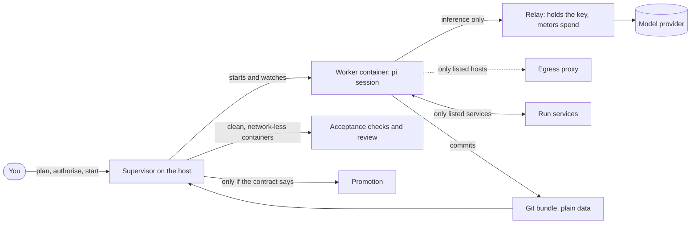
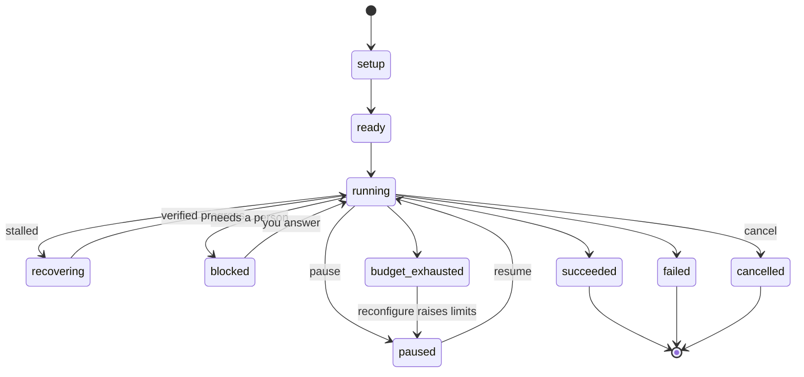

# Autonomous runs

`packages/autonomy` runs a task with the kit's agent **without you at the keyboard**: implement
something to a specification, build and deploy it against services inside the run, or improve a
repository in reviewed cycles. Each run happens inside a hardened container boundary that you read
and authorise first, is bounded by a budget in money, steps and time, judges its own success only
by checks the supervisor runs, and ends in one of four distinct outcomes.

It is optional and separate from interactive use. It needs a container engine, an image built for
it and a model provider key. Interactive work never needs any of these.

> **Status: beta.** The engine, its contract and its boundary are covered by offline suites and by a
> test on a real container engine, but no full run against a real model provider was made for this
> release. See [What has been verified](#what-has-been-verified).

## The idea

A run is one **contract** (`run.json`), one **supervisor** on the host that owns it, and a
**worker**: a `pi` session in a container that can reach only what the contract lists.



The supervisor never trusts the worker's word. It runs the **acceptance checks** itself, in clean
containers with no network, from definitions in the run directory that the worker never sees;
worker-written tests and reports are inputs to review, not proof. Success needs every required
check to pass in a trusted evaluation **and** the independent review to approve.

## The boundary

Every container the supervisor starts has these properties, and they cannot be configured away.
The supervisor also re-checks the finished `run` argument list against them before it executes
(`packages/autonomy/lib/containment.mjs`), so a bug in an argument builder cannot start a
privileged container or one holding the engine socket:

- non-root, read-only root filesystem, all capabilities dropped, `no-new-privileges`, and pids,
  memory and CPU limits;
- on an **internal** network: no route off the host and no DNS beyond container names (only the
  relay and the egress proxy face outward, and only toward fixed destinations);
- never privileged, never on the host network, never sharing a host namespace;
- no container-engine socket, no home directory and no credential store mounted.

What a worker can do beyond that is exactly what the contract lists, and `plan` prints it before
anything runs:

| Path | Allowed | How it is enforced |
|---|---|---|
| **Model inference** | Only through the relay | The relay forwards to one fixed upstream, for the run's models only, holds the real key (received on stdin, never in a worker mount or environment), and meters spend from the upstream's reported cost. It refuses other paths and models, and refuses requests beyond the budget as a backstop. |
| **The internet** | Only hosts and ports in `permissions.network.egress` | Through the egress proxy, which resolves DNS itself, validates every address (no loopback, private, link-local, metadata or reserved ranges, in any spelling), connects to the validated address, never inspects TLS, does not follow redirects and audits every decision. With no `egress`, there is none: no package downloads, no LAN. |
| **Run services** | Only those the contract declares | Databases, web servers or queues from an allowlisted image list, started by the supervisor on the run's own network, with health checks. Deploying "in the zone" means to these. |
| **Files** | The worker writes to `/work`, its own state and a tmpfs | Changes are accepted only under `permissions.writeAreas`. The contract, checks and held-out tests are supervisor-held. |
| **Credentials** | Names only, delivered only to the service that declares them | A credential value never appears in a contract (credential-shaped strings are rejected), a worker environment or a check. |
| **Promotion** | Only what `promotion` says | `none` by default: nothing leaves the run directory. `local-branch` fast-forwards a branch in a local repository. `push` fast-forwards a listed remote and asks you first unless you turn that off. The worker never promotes. |

### Unattended operation, and how it stays inside the zone

With `permissions.unattended.authorised`, the worker runs the kit's tool firewall in
[unattended mode](autonomy-gate.md#unattended-mode): in-zone actions run without prompts, hard
denials stay, and anything that would need authority outside the zone fails closed. The supervisor
gives the worker `PI_KIT_UNATTENDED=1`, `PI_KIT_UNATTENDED_BOUNDARY=container` and a read-only,
sanitised copy of the contract at `/run/contract.json`; the firewall activates only when all of
that agrees, and cannot be switched on from inside a session. With `autoApprove`, the worker's
approval dialogs are answered automatically; a question that needs a person **blocks the run**
instead.

The firewall trusts the supervisor's statement that the boundary is a container. It cannot verify
it, which is why the boundary probe runs before every start and resume, and why the host-side
containment check exists.

### Authorisation is bound to the boundary

`start` shows the resolved boundary and a **digest** (a SHA-256 over every security-relevant field:
what the run may write, reach, spend, run, promote and check). It proceeds only if you confirm at a
terminal, or the contract carries an `authorisation` block whose digest equals the current one.
Change anything that widens what a run may touch and the digest changes, so an old authorisation no
longer applies; changing the title, the specification or the backlog does not, so one authorised
configuration can be reused. A digest mismatch always refuses. With no terminal, a flag alone is
not consent: without a matching authorisation, `start --yes` still refuses.

The authorisation record is a consent and integrity record, not a signature: whoever can write the
contract file can write it. The supervisor runs on the host from a checkout outside the worker's
writable area, so the worker cannot change the contract, the digest, the check definitions or the
supervisor's own code.

## Quick start

From a shell, or from inside pi with `/autonomy` in the `autonomous` profile (below):

```sh
node packages/autonomy/cli.mjs templates                       # what kinds of run exist
node packages/autonomy/cli.mjs init --template implement --out run.json \
    --spec "A small HTTP API for todos" --check unit="node --test tests/"
node packages/autonomy/cli.mjs plan --config run.json          # the boundary, its digest, problems
node packages/autonomy/cli.mjs start --config run.json         # confirm the boundary; then it runs
node packages/autonomy/cli.mjs status --run <run>              # or `status` for every run
node packages/autonomy/cli.mjs export --run <run>              # results, evidence, usage, the work
```

Every command accepts `--json` and then prints exactly one JSON object (`{ ok: true, ... }` or
`{ ok: false, error, code }`). Exit codes: 0 ok; 1 error; 2 usage or invalid contract; 3 refused
(authorisation, duplicate run, lock, illegal state). A foreground `start` or `resume` ends 0
succeeded, 10 failed, 11 cancelled, 12 budget exhausted, 13 parked (blocked, paused or signalled).
`--detach` starts the supervisor in the background and returns its pid.

Working examples are in `packages/autonomy/examples/`.

### From inside pi

The `autonomy-run` extension, in the `autonomous` profile, adds `/autonomy`:

```
/autonomy templates | init <template> [flags] | plan <run.json> | start <run.json>
/autonomy status [run] | pause | cancel | resume | steer | promote | export | reconfigure
```

It is a **command, not a tool**: the model has no tool that starts, authorises, steers, promotes or
reconfigures a run. (A model with a shell tool can run the CLI itself; see "Limits" below for what
the firewall does about that.) `start` shows the boundary and its digest and asks you to confirm it; confirming records the
authorisation for exactly that digest and starts the run in the background. Without a screen it
refuses unless the contract already carries a matching authorisation, made earlier at a terminal
with `plan --authorise`. `cancel`, `promote`, `reconfigure` and `resume --approve` ask first. See
`packages/extensions/src/autonomy-run/README.md`.

## The run contract

One JSON document, `schemaVersion: 1` (`packages/autonomy/schema/run-contract.schema.json`). It is
validated by dependency-free code so the supervisor runs on plain Node, and the suite checks the
two agree. The rules are **fail closed**: unknown top-level keys, and unknown or malformed keys
under `permissions`, `promotion` and `authorisation`, are errors; anything absent defaults to the
closed choice (no egress, no services, no unattended approval, no promotion), never a wider one.

| Field | What it says |
|---|---|
| `run`, `template` | The run id (`a-z0-9-`, 3 to 41 characters) and its template. |
| `objective` | `title`, and `spec` or `specFile`; an optional `backlog` of items with their own acceptance. |
| `inputs` | `repository` (a local path or URL and a ref, or none for an empty start) and read-only `references`. |
| `acceptance` | `checks` (each `id`, `run`, `timeoutMinutes`, `required`), `overlay` (held-out files the supervisor copies over the clone before checking), `review` (independent approval required). |
| `permissions` | `writeAreas`, `network.egress`, `network.services` and `serviceImages`, `credentials.names`, `outputs`, `unattended`. |
| `model`, `providerSettings` | Provider, worker, manager and review models, upstream and key name. The key value is never in the contract. |
| `effort` | An [effort](effort.md) tier and cap for the run (default E3). It is fixed at start. |
| `budget` | `totalUsd`, `perStepUsd`, `maxSteps`, `maxMinutes` (active time). Every run is bounded by money, steps and time; none may be omitted. |
| `recovery` | `softNudges` (default 2), `hardRestarts` (default 1), `maxAttemptsPerStep` (default 8). |
| `promotion` | `policy` (`none`, `local-branch`, `push`), `destinations`, `requiresOperatorApproval` (default true). |
| `runtime` | Engine (`podman` or `docker`), image, memory, CPUs, pids and the git identity for commits. |
| `authorisation` | Written by `plan --authorise` or an interactive `start`: the boundary digest, who and when. |

## Templates

| Template | Kind | What it does |
|---|---|---|
| `implement` | finite | Build or change something to a specification until the acceptance checks pass and the independent review approves. |
| `deploy` | finite | Like `implement`, plus run-scoped services the supervisor starts on the run's internal network, so the worker can build, deploy and test against them. Nothing leaves the zone. |
| `self-improve` | cycling | Repeated review, plan, improve and verify cycles on a repository, each merged into one integration branch only when it completes, passes the checks and passes a merge review (see below). Optional: one template among several. |

A template supplies prompts and defaults; everything that must not vary (lifecycle, lock,
boundary, budgets, acceptance, recovery, promotion, evidence) belongs to the engine.

## The lifecycle



The outcomes are never conflated: **succeeded** (every required check passed in a trusted
evaluation and the required review approved), **failed** (with a reason such as
`boundary_violation`, `recovery_exhausted`, `step_attempts_exhausted`, `review_rejected`,
`final_gate_red`), **cancelled** (an operator ended it) and **budget_exhausted** (money, steps or
active minutes ran out). **blocked** is not terminal: a genuinely external blocker or an approval
needs a person, and `resume --answer` (or `--approve`, `--deny`) continues it.

Exactly one supervisor owns a run at a time. A lock file holds its pid, process start time, host and
a heartbeat; a duplicate `start` refuses, and after a crash the next supervisor takes the stale lock
over, removes the orphaned containers and continues. A silent but live owner is never taken over
automatically, because two supervisors on one run would repeat side effects.

## Recovery and budgets

**Recovery is bounded.** When a run stops making verified progress (no check newly passing and the
accepted head not moving inside the write areas), it climbs a ladder: soft nudges (a steering message
in the same session), then hard restarts (a fresh session on the same workspace, briefed from verified
state), then the run **fails** as `recovery_exhausted`. Counters persist across a supervisor crash and
reset only on verified progress; `maxAttemptsPerStep` bounds the turns spent on one target for the
life of the run. Recovery never resets spending, extends a budget or widens scope, and the hard
limits are not decided by it.

**Budgets are hard.** The relay meters the provider's reported cost for every response, the
manager's and reviewer's calls included; the run stops as `budget_exhausted` at the money, step or
active-minute limit. `reconfigure` is the **only** way effort or limits change for an existing run:
it cannot touch permissions, network, credentials, promotion, the image or the acceptance definitions
(those are the authorised boundary; changing them means a new run), it asks for confirmation, and it
is logged in the run's state.

**Effort inside a run.** The worker's effort tier is pinned from the contract and capped, so an
in-session `/effort` cannot exceed the cap and its children never exceed their parent; see
[Effort](effort.md).

## Promotion and results

Nothing leaves the run directory unless the contract's promotion policy says so, and `export` is
always available:

- `none`: use `export` to take out the results, evidence, usage, decisions and the work.
- `local-branch`: fast-forward a branch in a local repository. No remote is contacted.
- `push`: fast-forward push to a listed remote branch, after your approval (`promote`) unless
  `requiresOperatorApproval` is false.

Every promotion step is idempotent and recorded as started before and done after; a run resumed after
a crash checks the destination's real ref before repeating anything, so a resume never publishes twice.
Public deployment, production changes and anything outside the zone are never done by a worker.

## The `self-improve` template

The original behaviour of this package, now one template: repeated cycles on a repository, each a
fresh pi session that reviews, plans, improves and verifies, and every cycle that completes, passes
the acceptance checks and passes a merge review is fast-forwarded into one integration branch
(`pi-autonomy/integration` by default, never `main`), from which the next cycle starts. Nothing is
force-pushed, and by default nothing leaves the machine: promotion is `local-branch` unless you choose
`push`.

- **A cycle ends** once its report is on the branch. If the worker stops without writing it, it gets
  two reminders, and then the manager decides. The **acceptance checks** run on the accepted head, in
  a clean clone with no network, and the head is tagged whatever happens next.
- **The merge review** is a separate model call from the host that answers `MERGE` or `REJECT` from the
  charter, the report, the commits and the diff. A malformed answer, or none after three attempts,
  counts as `REJECT`. A cycle that is not merged is kept by its tag and shown to the next cycle so it
  can salvage what is sound.
- **The manager** is a separate model call, made only when a trigger fires (20 minutes without
  events, 90 minutes without a push, the 3-hour soft limit, the per-cycle budget, a crash, two red
  gates in a row, repeated stall escalations, or a session that ended without a report). It answers
  with exactly one of `CONTINUE`, `NUDGE`, `RESTART_SESSION`, `NEW_CYCLE`, `RESET_TO_LAST_GOOD` or
  `ABORT_RUN`, which the supervisor validates and carries out; at most 3 calls per cycle, and the hard
  limits (a 5-hour cycle ceiling, and the run's budget) never consult it. These limits are the
  template's defaults and can be changed in `templateOptions.limits`.
- **Modes.** Cycles work in *fix* mode while there is something to fix, in *improve* mode only when a
  review finds nothing (and the need must be evidenced), and in *consolidate* mode for the cycle after
  a merged improvement. A run whose reviews find nothing three times in a row (`nothingFoundToStop`)
  stops rather than inventing work: the acceptance checks run once more on the integration branch,
  and if they pass the run **succeeds** with the reason `backlog_exhausted`; if they are red it fails
  as `final_gate_red`. The same final check ends a run that reaches its cycle limit.

The charter, backlog and handoff a repository is seeded with are in `packages/autonomy/seed/`.

## Setting up

1. **A container engine.** The default is `podman` (rootless: no daemon, no `docker` group, and an
   escape gets your user's rights rather than root's). Docker works with `"runtime": {"engine":
   "docker"}`, but membership of the `docker` group is root-equivalent; do not run the supervisor with
   `sudo`.
2. **A provider key.** For the default `openrouter` provider, `OPENROUTER_API_KEY` in the supervisor's
   environment. The supervisor hands it to the relay on stdin; it never enters a worker container or a
   log. `openai-compatible` takes `providerSettings.upstream` and `apiKeyEnv`. The relay sends that key
   to that host, so `plan` says in words which variable (or `pi` login) goes to which host, the
   variable, login and extra headers are part of the boundary digest, a `pi` login is used only for its
   own provider's upstream, and a variable that names another service's credential (for example
   `GITHUB_TOKEN` or `AWS_*`) is refused.
3. **The image**, built from local git objects with no credentials in it:

   ```sh
   git fetch --tags origin
   packages/autonomy/build-image.sh --kit-ref v0.2.4-beta.0 --base-ref origin/main
   ```

   `--kit-ref` is the kit release the worker runs (before the release tag exists, pass a branch such as
   `origin/main`). `--base-ref` optionally prebakes that repository's dependencies for offline
   installs. Add toolchains your tasks need in a derived image and name it in `runtime.image`.
4. Run the supervisor from a checkout of `main`, not from the branch a worker is changing.

## The run directory

Everything is under `$PI_AUTONOMY_HOME/<run>` (default `~/.local/state/pi-autonomy/<run>`); nothing
is written to `~/.pi`.

| Path | Contents |
|---|---|
| `contract.json`, `state.json` | The authorised contract, and the one authoritative record of the run (status, usage, tasks, acceptance evidence, recovery counters, history). |
| `supervisor.log`, `supervisor.lock`, `control/` | The event log, the single-owner lock, and queued control commands. |
| `checks.json`, `overlay/` | The check definitions and the held-out files: supervisor-held, never mounted for the worker. |
| `public/` | The sanitised contract, mounted read-only at `/run`. |
| `mirror.git`, `steps/`, `results/` | The host's copy of the work, each step's evidence, and exports. |
| `egress/`, `meter/`, `boundary.json` | Proxy audit, spend records, the last boundary probe. |
| `remote.git`, `work/`, `agent-state/` | The worker's side, written by the container. |

## What has been verified

- **Offline suites** (`npm run check:all`): the contract validator and schema, the lifecycle and its
  legal transitions, the boundary renderer and digest, the containment validator, the egress proxy's
  address and hostname handling, the run engine end to end against a fake runtime (acceptance,
  recovery, budgets, promotion, crash and resume), the `self-improve` template, the CLI, and the
  `/autonomy` command.
- **A real container engine** (`npm run smoke:autonomy-container`, run against Docker 29 in the
  release environment): the run network is internal (no DNS, no route out, none to the host); workers
  run non-root, read-only, with no capabilities and no engine socket; `inspect` agrees (mounts only
  under the run directory, no host namespaces, no published ports, the key in no environment or
  argument list); the relay injects the key the worker never had and refuses other paths and models;
  the egress proxy tunnels a listed host and refuses unlisted hosts, wrong ports and private,
  loopback and odd-spelled addresses; git plumbing works with no network; acceptance checks run in
  clean network-less containers with the held-out overlay applied; a run service serves a staged,
  read-only copy; cleanup removes everything it made. Without an engine, the test prints a `SKIPPED`
  line and exits 0, so it adds evidence where an engine exists; `check:all` still runs its offline
  counterpart.

**Not verified:** a full run against a real model provider (the relay talks to a local fake upstream
in the tests); rootless Podman (the container test used Docker); long runs (hours to days); macOS
and Windows; and the effect of the boundary on an adversarial worker beyond what the probe and the
container checks assert. Run `pi-autonomy boundary --config run.json --probe` on your own engine, and
start with a small budget, before trusting a long run.

## Limits

- **Consent is by whoever holds the terminal, and a shell is a terminal.** `plan --authorise --yes`,
  `start`, `promote` and `reconfigure` accept `--yes` without a screen, and the authorisation record
  is a consent and integrity record, not a signature. A model with a shell tool could therefore run
  them. The tool firewall classifies those commands as high and never learns an approval for them,
  so each one asks you, and an unattended worker is refused (`tests/firewall-unattended-smoke.mjs`);
  this is a guard rail, not proof. `/autonomy start` binds its authorisation to the digest you were
  shown (`--digest`), and refuses if the file changed while you read it. A run id is a name
  (3–41 lowercase characters), never a path.
- **`runtime.user: "0:0"`** (root inside the container) is accepted only when the engine reports
  itself rootless, where that root is your own user; on a rootful engine it would be host uid 0, so
  the run refuses to start. `plan` prints the user the containers run as.
- **The boundary is the container.** The firewall's unattended mode is a second layer that trusts it.
  Anything the worker can read (the repository, references) can go to the model provider: do not add
  references that hold secrets.
- **Acceptance checks are quality evidence, not a security boundary.** They run the worker's own code
  in a clean container; the container's limits are what contain them.
- **One run per integration branch at a time.** Two runs merging into the same branch would diverge;
  a diverged branch stops the run as `integration_diverged`.
- **Dependencies are prebaked** from the base ref's lockfile. A change to dependencies fails the
  offline install; propose dependency changes rather than making them in a run.
- **Model specifications.** pi's catalogue may not know a new model id; the supervisor fetches limits
  and prices from the provider at start so compaction and cost match the model.
- **The v0 configuration format** (`supervisor.mjs`, no `schemaVersion`) is mapped onto the
  `self-improve` template with a deprecation warning, and now needs an explicit remote and promotion
  policy. Its old defaults, which pushed to a fixed private host, are gone.
