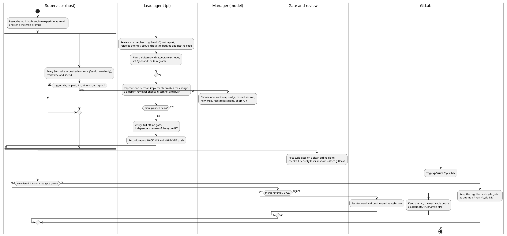

# Unattended improvement runs

`packages/autonomy` runs the kit's own agent against this repository without supervision,
for many cycles. Each cycle is a fresh pi session that reviews, plans, improves and verifies.
Every cycle that completes, passes the gate and passes a merge review is merged into one
integration branch, `experimental/main`. The next cycle starts from there, so the run builds
on its own accepted work instead of starting from the same state each time. A person reviews
`experimental/main` later, and changes reach `main` only through that person's merge
request.

The agent runs with the `long-horizon` profile at a pinned kit release. It runs **without the
auto-mode judge, with every approval granted**. The agent is told that an operator gave it
the task. That's only safe inside a hard boundary, so the boundary is the container rather
than the agent's policy:

| Path out of the container | Allowed | How it's enforced |
|---|---|---|
| Model inference | yes, through the relay | The agent is on an `--internal` Docker network. The relay forwards `POST /v1/chat/completions` and `GET /v1/models` to one fixed upstream, for the run's models only. It holds the real key, which it receives on stdin, and meters spend. |
| Git | push to a local bare repo | The agent's only remote is `/git/remote.git`. The **host** publishes `experimental/main` and the run's tags to GitLab with your credentials. |
| Anything else (DNS, the internet, the LAN, GitLab, npm, the host) | no | No route off the internal network, and no DNS beyond container names. The probe (`packages/autonomy/tests/boundary-probe.mjs`) checks this before every start and resume. It also confirms that the real key is in no mounted file, by comparing against the key's SHA-256, the only form of the key the probe is given. |

The containers run as a non-root user with a read-only root filesystem, all capabilities
dropped, `no-new-privileges`, and pids, memory and CPU limits. None of them gets a container
engine socket or your home directory. With rootless Podman (the default), the containers run
as your user rather than root. The helpers (bundling, the gate) run with `--network none`.

## How a run works

```
host: supervisor (node) ── manager model (called on events only, from the host)
  │  mirror.git (yours) ── fast-forward push ──► GitLab experimental/main + exp/<run>/* tags
  │        ▲ git fetch from a bundle (plain data)
  │  bundle helper (--network none, agent repo mounted read-only)
  └─ internal network ─ agent (pi --mode rpc) ── /git/remote.git, /work, /state
                     └─ relay ──► https://openrouter.ai/api/v1 (egress network)
```

### One cycle at a glance

Who does what, and when, in one cycle. The full process map, with timings, merge rules and
the backlog lifecycle, is [`assets/autonomy-flow.html`](assets/autonomy-flow.html) (open it in
a browser).



- **Seeding.** The integration branch (`integration.branch`, default `experimental/main`)
  is shared by every run. If it doesn't exist on the remote yet, the supervisor creates it from
  `main` with one commit adding `autonomy/CHARTER.md` (the acceptance criteria),
  `autonomy/BACKLOG.md` and `autonomy/HANDOFF.md`. If it does exist, the run continues it,
  with its backlog and handoff. When `main` has moved on (you merged an MR), `main` is merged
  into it first; if that merge conflicts, the run continues without it and logs that you need
  to merge by hand. A run id is used once: `start` refuses an id whose `exp/<run>/` tags are
  already on the remote.
- **A cycle.** Each cycle starts by moving its working branch, `experimental/<run>`, to the
  head of `experimental/main`. If you pushed to `experimental/main` in the meantime, the
  cycle starts from your commit. The supervisor then starts the agent container and sends
  the cycle prompt (`packages/autonomy/prompts/cycle.md`) over pi's RPC channel. The agent
  works through review → plan → improve → verify → record, writes
  `autonomy/cycles/<run>/NN/`, and pushes after every commit. The working branch never leaves
  the machine, so GitLab has one branch however many cycles and runs there are.
- **Mirroring.** Every 30 seconds a network-less helper bundles the agent's branch. The host
  fetches the bundle into its own repository and accepts it only if it fast-forwards. It then
  pushes `experimental/main` and the run tags to GitLab when they change. The host never runs
  git inside a repository the agent can write to, so a planted hook or config can't run on
  the host. Nothing is ever force-pushed.
- **The end of a cycle.** The cycle ends once `autonomy/cycles/<run>/NN/report.md` is on the
  branch. If the agent stops without writing it, it gets two reminders, and after that the
  manager decides. Next, a **post-cycle gate** runs `check:all`, `test:security`,
  `mkdocs --strict` and `gitleaks` on the accepted head, in a clean clone with no network.
  The head is tagged `exp/<run>/cycle-NN` whatever happens next.
- **Merging.** A cycle is merged into `experimental/main` (fast-forward only) when all of
  these hold:
  - the cycle completed, rather than being closed as partial, reset or aborted;
  - it has commits;
  - the gate is green;
  - the **merge review** approves it.

  The merge review is a separate model call made from the host (`integration.reviewModel`,
  by default the manager's model). It sees the charter, the cycle's report and `verify.md`,
  the commits and the diff, and answers `MERGE` or `REJECT` with a reason. A malformed
  answer, or no answer after three attempts (5 minutes each, with pauses between), counts as
  `REJECT`. You can turn the review off with `"integration": {"review": false}`; then a green
  gate is enough.

  A cycle that isn't merged is not lost. Its tag keeps it. The next cycle starts from
  `experimental/main` without it, gets it in its repository as `attempts/<run>/cycle-NN`, and
  is told why it was rejected and to salvage what is sound before starting new work.
- **The manager** is a separate model call made from the host, only when a trigger fires. The
  triggers are:
  - 20 minutes with no session events;
  - 90 minutes without a push;
  - the 3-hour soft limit;
  - the per-cycle review budget (`budget.perCycleUsd`, default $5);
  - an agent crash;
  - two red gates in a row (red cycles are never merged);
  - repeated progress-guard escalations;
  - a session that ends without a report.

  It gets a bounded summary of the cycle and must answer with exactly one decision:

  | Decision | Effect |
  |---|---|
  | `CONTINUE` | Extend the cycle's time by 10–120 minutes. |
  | `NUDGE` | Send the agent one steering message. |
  | `RESTART_SESSION` | Start a fresh pi session on the same workspace, briefed with the manager's message. |
  | `NEW_CYCLE` | Close the cycle as partial. Pushed work is kept. |
  | `RESET_TO_LAST_GOOD` | Tag the head `exp/<run>/abandoned-NN` and move the cycle's working branch back to the head of `experimental/main`, the last merged state. |
  | `ABORT_RUN` | Stop the run for a person to look at. |

  The supervisor validates and carries out the decision, and the manager's call ends there.
  The hard limits don't consult it: at 5 hours or the hard cycle budget (`budget.perCycleHardUsd`, default $10), the cycle closes as
  partial, and at most 3 manager calls are made per cycle.
- **Budget.** The relay meters OpenRouter's reported cost for every response, and the
  manager's own calls are counted too. The run stops at `budget.totalUsd`, and the relay
  refuses requests beyond it as a backstop.

## What a cycle works on

The charter (`autonomy/CHARTER.md`) sets the priorities, and the cycle prompt turns them into
modes that the agent picks during review:

| Mode | When | Work |
|---|---|---|
| **Fix** | Whenever there is something to fix (the default) | A red gate, carried-over work, bugs, security gaps, untested behaviour, docs that don't match the code, and cleanup of code shown to be dead, duplicated or needlessly complex. |
| **Improve** | Only when review finds nothing worth fixing | Make an existing system more capable, faster, more reliable or easier to use. The need must be evidenced (a measured baseline, a documented limitation, a gap you can demonstrate), with tests and docs, and no new dependencies. |
| **Consolidate** | The cycle after a merged improve cycle | A fix-and-cleanup pass over what the improvement changed, before anything else. |

So the work goes round: fix → improve → consolidate → fix. New code is where the next bugs
are, and each improvement is followed by a pass that finds them.

Each report starts with `Outcome: successful | partial | failed | nothing found` and
`Mode: fix | improve`. The supervisor reads these. After a merged improve cycle it tells the
next cycle to consolidate first. A cycle whose honest review finds nothing to do reports
`nothing found` instead of inventing work. After `limits.nothingFoundToStop` of those in a
row (default 3), the run stops as `backlog_exhausted`, so the rest of the budget isn't spent
on churn. `status` shows each cycle's mode, or `nothing` for those cycles.

## Setting up

You need:

1. **A container engine.** The default is **rootless Podman** (`"engine": "podman"`;
   on Arch, `sudo pacman -S podman`). It needs no daemon, no `docker` group and no sudo at
   run time, and its containers run as your user, so an escape would only get your user's
   rights, not root. `--userns=keep-id` keeps the run files yours. Rootless Podman on
   cgroup v2 enforces the memory, CPU and pids limits.
   Docker works too (`"engine": "docker"`), but membership of the `docker` group is
   root-equivalent. Don't use `sudo docker` for a run: the supervisor calls the engine every
   30 seconds for days.
2. **An OpenRouter key.** Either `openrouter` in `~/.pi/agent/auth.json` (from `/login` in
   pi) or `OPENROUTER_API_KEY`. The supervisor reads it and hands it to the relay on stdin. It
   never enters the agent container or a log.
3. **Git access to the remote**, with your normal credentials (the supervisor pushes as you).
4. **The image**, built from local git objects:

   ```bash
   git fetch --tags origin
   packages/autonomy/build-image.sh --kit-ref v0.2.1-beta.0 --base-ref origin/main   # --engine docker to use Docker
   ```

   The image also carries the linters and language servers that pi-lens would otherwise
   try to install from npm at run time (typescript, markdownlint-cli2, biome, and others),
   plus shellcheck. In the agent container npm runs in offline mode, so an install that isn't
   covered fails at once instead of stalling a tool call.

## Running

```bash
cp packages/autonomy/run.example.json ~/pi-run.json      # edit run id, caps, references
node packages/autonomy/supervisor.mjs boundary --config ~/pi-run.json   # probe only
node packages/autonomy/supervisor.mjs start --config ~/pi-run.json
node packages/autonomy/supervisor.mjs status --run <run>
node packages/autonomy/supervisor.mjs stop --run <run>    # closes the cycle, gates, tags, exits
node packages/autonomy/supervisor.mjs resume --run <run>
```

Run it from a checkout of `main`, not of the experimental branch, so the agent's changes
can't alter the supervisor that manages it. For a run lasting days, use a user service:

```ini
# ~/.config/systemd/user/pi-autonomy.service
[Service]
WorkingDirectory=%h/Development/pi/pi-system
ExecStart=/usr/bin/node packages/autonomy/supervisor.mjs resume --run perpetual-20260925
Restart=on-failure
```

A run interrupted by a signal (for example `systemctl --user stop`, or a reboot) is marked
`interrupted`, including one that stops between two cycles.
`resume` continues the same cycle in a fresh session on the same workspace.

Start the run once with `start`. After that the service's `resume` continues it, and on a
restart it picks the interrupted cycle up where it stopped.

**A dry run first.** Use `"cycles": 1`, `"budget": {"perCycleUsd": 0.5, "perCycleHardUsd": 1, "totalUsd": 1}` and
`"limits": {"softMinutes": 30, "hardMinutes": 45}`, then check the following:
- the `exp/<run>/cycle-01` tag reached GitLab, and so did `experimental/main` if the cycle
  was merged;
- `cycles/01/gate.json` and, for a completed cycle with a green gate, `cycles/01/review.json`
  exist in the run directory;
- `status` shows the decisions.

## The run directory

Everything lives in `~/.local/state/pi-autonomy/<run>/` (or `$PI_AUTONOMY_HOME/<run>`):

| Path | Contents |
|---|---|
| `state.json`, `config.json` | Progress (per-cycle outcome, gate, merge, cost, decisions) and the effective config. |
| `supervisor.log` | One line per event. |
| `boundary.json` | The last boundary probe. |
| `cycles/NN/` | `events-*.jsonl` (RPC events without streaming deltas), `agent-*.log`, `decisions.jsonl`, `gate.json`, `gate.log`, `review.json` (the merge review), `summary.json`. |
| `meter/` | `usage.jsonl` (the relay) and `manager.jsonl`. |
| `mirror.git` | Your repository: `experimental/main`, the cycle's working branch (never published) and the run tags. |
| `remote.git`, `work/`, `agent-state/` | The agent's side, written by the container. |
| `references/<name>` | Read-only `git archive` snapshots of the configured reference repos. |

## Reviewing the results

`experimental/main` and the tags are ordinary git:

```bash
git fetch origin experimental/main 'refs/tags/exp/<run>/*:refs/tags/exp/<run>/*'
git log --oneline main..origin/experimental/main
git diff exp/<run>/cycle-03 exp/<run>/cycle-04 --stat
cat autonomy/cycles/<run>/04/report.md    # on experimental/main
node packages/autonomy/supervisor.mjs status --run <run>   # which cycles merged, and why not
```

Each cycle's `report.md` states its outcome and items, and `verify.md` gives the evidence. A
cycle that wasn't merged is still at its `exp/<run>/cycle-NN` tag. The simplest way to take
the work to `main` is to open a merge request from `experimental/main`. You can also
cherry-pick single commits. After you merge, the next run merges `main` back into
`experimental/main` by itself.

## Limits and known gaps

- **Semgrep** isn't part of the offline gate, because its rules come from the network. CI
  runs it on your merge request.
- **The gate is a quality signal, not a security boundary.** It runs the branch's own tests,
  and the container's exit status is what counts.
- **Inference is an information channel.** Anything the agent can read (the repository and
  the reference snapshots) can go to the model provider. Don't add references that hold
  secrets.
- **Model specs.** pi's built-in catalogue may not know a new model id. The supervisor fetches
  the context window, output limit and prices from OpenRouter at start and writes them into
  the agent's `models.json`, so compaction and cost shown in pi match the model.
- **One run at a time per integration branch.** Two runs merging into the same
  `experimental/main` at once would diverge. If the remote and local branches do diverge
  (for example after a force-push), the run stops as `integration_diverged` at the start of
  the next cycle.
- **Dependencies are prebaked** from the base ref's lockfile. A branch that changes
  dependencies fails its offline install. The charter tells the agent to propose dependency
  changes instead.
