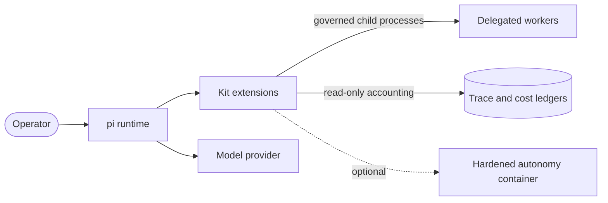

# Concepts

The vocabulary the rest of the documentation uses: what the kit is, the rules its extensions
follow, and how capability tiers, layers and profiles relate. Nothing here is a promise of
future work; see [Roadmap](roadmap.md) for that.

## What the kit is

Pi System is a **capability layer for the [pi coding agent](https://github.com/earendil-works/pi)**:
extensions, skills, prompt templates, themes, profiles and an installer. It adds what pi
deliberately leaves out of its core (a permission gate, delegation, durable memory, verification,
recovery, observability) and packages it so one command installs a coherent set.

Two properties shape everything else:

- **The harness matters as much as the model.** Reliability comes from decomposition, durable
  state, verification, bounded recovery and observability around the model, not from prompting
  alone. The kit is that surrounding harness.
- **Local first, portable.** The kit installs onto any pi installation with `pi install`. It does
  not depend on a particular model, provider, container or host, and it never sends anything
  anywhere on its own.

## Design rules

Every extension and profile follows these. `npm run verify` enforces the mechanical ones.

1. **Stable instruction is separate from learned recall.** Policy and skills are versioned files;
   memory is a cheaper, selectively retained layer.
2. **Progressive disclosure.** Skill names load at start, bodies on demand; memory indexes first,
   details on trigger.
3. **The trace is not the context.** An append-only trace records what happened; only selected
   summaries reach the model.
4. **A long task has an explicit objective** with a verifiable definition of done, restartable from
   the working tree and the goal file alone.
5. **The model does not certify "done".** Verification decides, cheapest checks first.
6. **Recovery is evidence-driven and bounded**, chosen by the kind of failure, never retry-until-broke.
7. **Isolated workers, not one giant context.** Delegated work runs in its own process under the
   same governance as its parent.
8. **Scale the machinery to the task.** A quick fix must not pay long-horizon overhead; that is what
   [profiles](profiles.md) and [effort](effort.md) are for.
9. **General capability lives in the kit; domain rules compose on top.** A domain extension (for
   example pentest scope and rules of engagement) composes a general one and never reimplements it.
   Per-engagement values live in the engagement configuration, not in the capability layer.
10. **Extensions are self-contained.** No extension imports another; cross-extension contracts go
    through small registries on `globalThis` (`Symbol.for("pi-kit.*")`), so any one extension can be
    removed without breaking the rest.

## Tiers

A tier is a level of capability. Each is useful alone; higher tiers are only worth trusting once the
lower ones are solid.

| Tier | Name | The agent can | Provided by |
|---|---|---|---|
| **T0** | Safe substrate | Not damage the repository or leak secrets; every action is recoverable; progress survives a crash. | guards, checkpoints, auto-commit |
| **T1** | Durable quick-task agent | Make fast, correct edits; remember project facts; keep context lean. | memory, handoff, context hygiene |
| **T2** | Verified agent | Refuse to declare victory on broken code; self-correct from verifier feedback. | verify-gate, verifier-board |
| **T3** | Long-horizon agent | Hold a goal and plan, persist state across context resets, isolate risky work, recover by evidence. | goal-core, task-graph, branch-lab, autonomous-loop |
| **T4** | Self-improving specialist | Record and score runs, mine failures, curate skills, route hard jobs to a stronger reviewer. | trace-ledger, skill-forge, self-improvement |

Each extension manifest declares a `tier`; `docs/EXTENSIONS.md` lists them.

## Layers

Extensions belong to one of six layers, which is what a manifest's `layer` field records.

1. **Execution substrate**: isolation, checkpoints, rollback, worktrees.
2. **Tool surface**: few, typed, observable tools; interception and re-validation of tool calls
   (the [tool firewall](autonomy-gate.md)).
3. **Context and memory**: identity, policy (`AGENTS.md`), procedural memory (skills), project
   memory, task summaries, the trace, retrieval, and the context sieve that decides what the model
   sees.
4. **Orchestration**: goals, task graphs, delegation, the autonomous loop, model routing.
5. **Verification**: cheap static gates, executable tests, process critics, independent reviewers.
6. **Observability and self-improvement**: structured traces, the status bar, cost accounting,
   skill mining.

## Profiles

A profile is a named set of extensions, skills and prompts, plus a firewall mode and policy. It
exists so the machinery scales to the task. The [profiles guide](profiles.md) lists what each one
loads and how to switch; [effort](effort.md) is a separate, per-task dial that changes how much the
agent delegates without changing what is installed.

## Where things run

The kit runs inside pi's process. Delegated workers are separate pi processes that the kit
launches under the same governance as their parent. The autonomy runner is a separate, optional
component that runs a whole session inside a hardened container.
