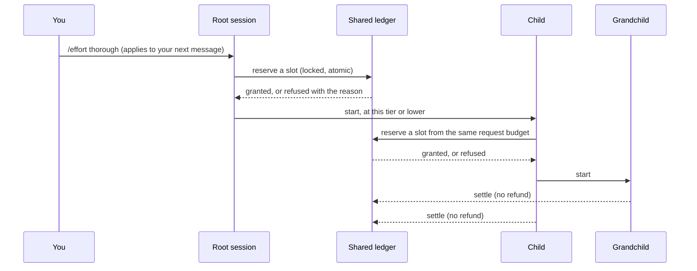

# Effort

Effort sets **how deep and how broad** the agent works on a task, and how much it may delegate to
sub-agents. It is one dial with five positions.

Effort is independent of three other things, and never changes them:

- the **model** and its **thinking level**;
- the **profile** (what is installed and loaded);
- **permissions**: what the firewall and guards allow. A higher effort never grants a permission,
  and a lower effort never removes one.

## The five tiers

| Tier | Id | Concurrent | Total | Scouts | What the agent is told |
|---|---|---:|---:|---:|---|
| **E1 Minimal** | `minimal` | 0 | 0 | 0 | Work directly. No discretionary delegation and no scouts. Inspect and verify only what correctness requires. |
| **E2 Focused** | `focused` | 1 | 1 | 1 | Investigate only what the task touches, state a brief approach, make the small change and run the targeted checks. Delegate rarely. |
| **E3 Standard** (default) | `standard` | 2 | 3 | 1 | Plan non-trivial work, inspect the relevant dependencies, delegate selectively, implement and validate, then review the affected behaviour. |
| **E4 Thorough** | `thorough` | 4 | 8 | 2 | Investigate risks and compare alternatives. Structure the plan, parallelise separable work, run broad relevant tests and have substantial changes reviewed independently. |
| **E5 Exhaustive** | `exhaustive` | 6 | 16 | 3 | Investigate systematically and work in phases with independent perspectives. Validate comprehensively, resolve material findings, document the evidence. A trivial edit is still done directly. |

The limits are **per user request**, not per session, and are defaults rather than quotas: the
agent is told never to invent work to use them up. The policy, the limits and the exact wording
live in one file, `packages/extensions/src/effort/policy/effort.json`, plus one markdown file per
tier next to it.

Every tier also receives the same shared paragraph, which states that effort controls execution
depth and breadth and not model reasoning or permissions; that the agent should apply it in
proportion to complexity, uncertainty and risk; that it should delegate only bounded work with a
clear deliverable; and that it must not claim checks it did not perform, and should recover in a
bounded way when blocked rather than repeat what failed.

## Choosing a tier

```
/effort                 a picker
/effort thorough        by name (also E4, or 4)
/effort status          the tier, limits and this request's use
/effort reset           forget the saved default
/effort help            the table above
```

A choice is saved as your default in `<agent dir>/pi-kit/effort.json` and applies **from your next
message**: the tier already governing the turn in progress is never changed under it. The status
bar shows the tier as a chip (`E3 Standard`, and `→ E4` while a change is waiting for the next
message); `/footer status` shows the limits and the current request's use.

The agent's prompt carries exactly one effort block. Changing tier replaces that block; it never
stacks a second one, so the cost of the setting does not grow over a long session.

### Adjusting the limits

`<agent dir>/pi-kit/effort.json` may lower or raise a tier's limits within the platform ceilings
(8 concurrent, 64 in total, 8 scouts):

```json
{
  "schemaVersion": 1,
  "default": "focused",
  "limits": { "thorough": { "maxTotal": 6 } }
}
```

Invalid entries are ignored with a warning and never stop pi from starting.

## How delegation is budgeted

Every way of starting a child (the `subagent` tool, workflows, the verification reviewer,
recovery) asks the same **shared ledger** for a slot before it launches anything. The ledger is a
small file under `<agent dir>/pi-kit/effort/ledgers/`, updated under a lock, so:

- the limits are **atomic**: two children asking at once cannot both take the last slot;
- they hold **at every depth**: a child's own children, and theirs, draw from the same request
  budget as the parent's, so delegation cannot multiply by nesting;
- a **failed or retried child still counts**: nothing is refunded, so a retry loop cannot spend
  unbounded children;
- a child can **never run at a higher tier than its parent**. A child's tier is the parent's
  tier, or lower if its agent definition or the `subagent` call asks for less.



At **E1** the model-launchable delegation tools are not even offered (their descriptions cost
around 850 tokens a turn and could only be refused); they return at the next message after a
higher tier is chosen.

Three kinds of launch are accounted separately from the discretionary budget above:

| Kind | Budget | Why it is separate |
|---|---|---|
| **Mandatory** verification (completion reviewer, validator) | up to 6 a request | Verification is a safety control, so a minimal effort setting must not switch it off. |
| **Recovery** | 2 invocations, 1 at a time, read-only scout roles only (see below), and only while the trusted recovery extension has recovery active | So a session at E1 can still get help when stuck. The model cannot open this budget itself, and it never adds to the discretionary one. |
| **User-directed** (`/workflow` and similar commands you run) | the platform ceilings only | You asked for it. |

If the policy or ledger cannot be read, delegation is **refused** rather than allowed without a
budget; mandatory verification is the one exception, and runs unbudgeted rather than not at all.
An unbudgeted verification child does not inherit a tier or a ledger, so it starts its own root
scope; that is harmless only because the reviewer and validator roles have no `subagent` tool.

**What "read-only scout" means.** Recovery accepts a role whose tool list is explicit and names no
`write`, `edit`, `subagent` or `notebook_edit` tool (`isReadOnlyRole`), and that is named `scout` or
says `scout: true`. `bash` is allowed by that test, so the built-in `scout` can run shell commands: it
is a role and a budget, not a sandbox. Every child runs under its parent's firewall and
protections whatever its role says. (The conductor applies a stricter test, counting `bash` as a
write tool, for its own specialists.)

## Autonomous runs

An autonomous run pins its tier from the run contract (`effort` in the run definition, default
E3). A pinned session ignores `/effort` for its own tier (the choice is only saved for later) and
passes the pin, and a cap, to its children through `PI_KIT_EFFORT` and `PI_KIT_EFFORT_CAP`. See
[Autonomous runs](autonomy.md).

## Sub-agent definitions

An agent file under `packages/kit/agents/` (or a project's `.pi/agents/`) may carry
`effort: <tier>` to ask for a lower tier for that role, and `scout: true` to count against the
scout limit (the built-in `scout` role always does). The `subagent` tool takes an optional
`effort` argument for the same purpose. Both are clamped to the parent's tier.

## What effort is not

Effort is a **cost and behaviour policy, not a security boundary.** The ledger is a file owned by
your user; a process running as you (or a compromised tool) could edit it or unset the
environment. The controls that stop an agent doing something it should not are the
[firewall and guards](security.md), which apply to every child whatever its tier. Effort keeps an
honest agent from over- or under-working; it does not contain a hostile one.
