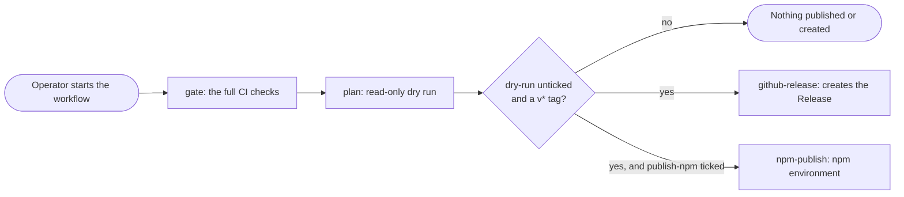

# Releasing

pi-system is delivered from its public git repository, `github.com/SATUNIX/pi-system`. pi
installs it straight from there, so **a pushed `vX.Y.Z` tag is the release**: there is no package
registry in between.

| Channel | What it is | How users get it |
|---|---|---|
| `next` | Every commit on `main` | Merging to `main` is enough |
| `latest` | The newest `vX.Y.Z` tag (the newest stable one once a stable release exists; betas until then) | Push a tag |
| `X.Y.Z` | One tag, pinned | Push a tag |

The delivery is one setting, `delivery` in `packages/core/distribution.json` (`git`). The
installer, `/profile` and `/update` read it.

Releasing is **manual and operator-run**. Nothing in this repository tags, publishes or creates a
release on its own, and the release workflow defaults to a dry run.

## Cutting a release

```sh
# 1. On main, with a clean tree: add a "## [0.2.4-beta.1]" section to CHANGELOG.md and commit it.
# 2. Run the full gate, bump every package.json and the lockfile, commit, tag (local only).
#    The gate is `npm ci --dry-run`, `npm run check:all` (about eight minutes), the lockfile check and a
#    strict MkDocs build (`python -m pip install -r requirements-docs.txt` first; the script says so
#    before it starts if MkDocs is missing):
npm run release -- 0.2.4-beta.1
# 3. Review the commit and tag, then push both:
git push origin main --follow-tags
```

`release.mjs` refuses to run on a dirty tree, without a CHANGELOG section, or when the version does
not move forward (prerelease-aware: `0.2.4-beta.0 < 0.2.4-beta.1 < 0.2.4`). It never pushes.
`npm run release -- 0.2.4-beta.1 --dry-run` runs every gate without changing anything.
`--bump-only` syncs the version fields and lockfile without gates, commit or tag, which is how a
release branch is prepared.

**The first release** is the version already in `package.json` (`0.2.4-beta.0`). With no `v*`
tags yet, `npm run release -- 0.2.4-beta.0` finds every version field already at that version and
only gates and tags it.

Users on `latest` see a new release the next time `/update` checks (at most a day later, or
straight away with `/update`). A tag is the release even if a later workflow fails: `/update`
reads tags. If a tag is wrong, delete it (`git push origin :refs/tags/vX.Y.Z` and
`git tag -d vX.Y.Z`), fix the problem and release again.

## The release workflow

`.github/workflows/release.yml` adds two **optional** steps on top of a tag. It runs only when an
operator starts it from the Actions tab (`workflow_dispatch`); it never runs on a push, a tag or a
pull request.

| Job | Runs | Permissions | Side effects |
|---|---|---|---|
| `gate` | always | `contents: read` | none: the full CI gate for the same commit |
| `plan` | always | `contents: read` | **none**: plans the version and dist-tag, checks the tarball, runs `npm publish --dry-run`, previews the release notes in the run summary |
| `github-release` | only with `dry-run` unticked, from a `v*` tag | `contents: write` | creates the GitHub Release with the CHANGELOG notes |
| `npm-publish` | only with `dry-run` unticked **and** `publish-npm` ticked, from a `v*` tag | `id-token: write`, the `npm` environment | publishes `@satunix/pi-system` to npm |

`dry-run` defaults to **ticked**. The two jobs with side effects are guarded by an explicit
`inputs.dry-run == false` comparison, so any other event type, or an empty input, also means "no
side effects". `tests/release-workflow-smoke.mjs` checks this structure and is run by `check:all`,
and it fails against a workflow that publishes on a dry run.



Recommended order for a release:

1. Merge the release commit to `main`; wait for CI.
2. `npm run release -- <version>` locally, push the tag (above).
3. Run the `release` workflow from the tag with the defaults (dry run) and read the `plan`
   summary: tarball contents, `npm publish --dry-run` output, release notes.
4. Run it again from the tag with **dry-run unticked** to create the GitHub Release. Leave
   `publish-npm` unticked unless npm publication has been set up (below).

## Repository settings (GitHub)

These are operator actions; the repository does not change its own settings.

- **Protect `main`**: require pull requests, the `ci` checks and the `security` checks; block
  force pushes.
- **Protect tags `v*`**: restrict who can create them.
- **Code scanning and secret scanning**: enable them; `security.yml` uploads SARIF and runs
  gitleaks.
- **Actions**: allow only the pinned actions in use; workflow tokens default to read-only.

## What a release contains

The whole repository at the tag. pi runs `npm install --omit=dev` in its copy; the kit has no
runtime dependencies, so nothing is fetched from the npm registry. Companion packages (`pi-lens`,
`pi-readseek`) are separate pi packages from npm, registered by the installer at the kit's
reviewed pins in `packages/core/sources.json`.

`npm run smoke:package` (part of `check:all`) packs the repository exactly as `npm publish`
would, unpacks it and proves the copy works alone, and `smoke:clean-install` installs that copy
for every profile and starts the real pi with it.

## npm publication (optional)

npm delivery is built and tested but **not enabled, and the package is not published**. Git
delivery is the supported path. To enable npm as well, an operator needs to:

1. Have an npm account with two-factor authentication and the `satunix` organisation (it owns
   the `@satunix` scope).
2. Add a GitHub environment named `npm`.
3. Publish the first version by hand (`npm login`, then `npm publish --access public`), because
   npm only lets you attach a trusted publisher to a package that exists.
4. On npmjs.com, package settings, Trusted Publisher, GitHub Actions: organisation `SATUNIX`,
   repository `pi-system`, workflow `release.yml`, environment `npm`. Then set publishing access
   to "Require two-factor authentication and disallow tokens".
5. Set `"delivery": "npm"` in `packages/core/distribution.json` **only if** npm should replace
   git as the default; git delivery keeps working without it.

The npm channels are dist-tags: `latest` for releases, `beta` for prereleases once a stable release
exists, and `release-X.Y` for maintenance releases (`packages/core/publish-plan.mjs`).

## Local checks

```sh
npm run check:all            # everything CI runs, including the delivery, update and install tests
npm run security:lockfile    # lockfile integrity
node packages/core/release-notes.mjs 0.2.4-beta.0   # preview the notes for a release
```
