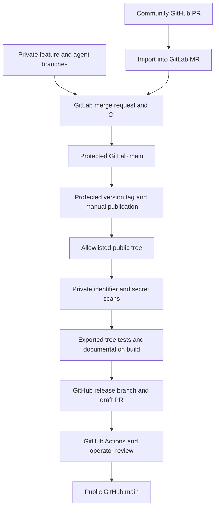

# Development and public releases

Private GitLab is the development source of truth. Its protected `main` accepts reviewed merge
requests from feature, fix, agent and experiment branches. GitHub is the public release
repository. Direct public changes must enter GitLab before the next export.

The publication pipeline exports files, never private Git objects, branches, commit messages or
agent identities. Its versioned manifest classifies every tracked file as public or private.
An unclassified path stops publication. Directory allowlists and automatic history mirroring
are not used. Private roles, review evidence, experiment records and GitLab CI stay private.

Every pipeline validates the private checkout and the actual public export. The export receives
secret scanning, private identifier scanning, the complete public `check:all` suite and a strict
documentation build. Narrow synthetic network fixtures are accepted only by exact path, matched
value and line fingerprint; changed content needs review. Retired source migration uses source
fingerprints instead of publishing private hostnames.

An operator prepares a version on GitLab `main`, creates a protected `vX.Y.Z` (or prerelease) tag,
and starts the manual publication job after the gates pass. The publisher verifies the tag
version and its ancestry, creates a clean commit on GitHub's existing public `main`, and pushes
`release/vX.Y.Z`. It creates a draft PR. It never force pushes, merges, tags GitHub, or publishes
npm. An existing release branch with a different tree stops the job; an identical rerun reuses
it. GitHub Actions independently validates the PR. The operator merges only after checks pass,
then tags that public commit and optionally uses the existing manual GitHub release workflow.
The public install and `latest` channel continue to use GitHub tags.

Publication uses a repository-scoped GitHub App installation token. The private App key is
stored as a protected GitLab file variable, scoped to the `public-release` environment on a
protected release runner. Protect the environment when the GitLab edition supports it.
Community Edition has no environment deployment approval gate: restrict project membership
and version-tag creation to trusted release operators. App permissions are Contents read/write, Pull
requests read/write and Metadata read; Workflows write is required when an export changes
`.github/workflows`. The token is short lived and revoked after the job. Feature, agent and
untrusted MR pipelines must not receive the key. Instance and repository protection setup is
an operator prerequisite documented privately in the publication runbook.

Community contributions use this path: review the GitHub PR, import or adapt it into a GitLab
branch, merge its GitLab MR, then include it in the next export. Public reviewers can track the
original PR from the release PR. Do not develop independently on both `main` branches.

The implementation is pinned by the private `smoke:public-export` tests (unknown files,
private data, symlinks and exported script classification). The publisher needs a configured
GitHub App and a protected runner to exercise its remote path; local tests do not prove those
remote settings.
