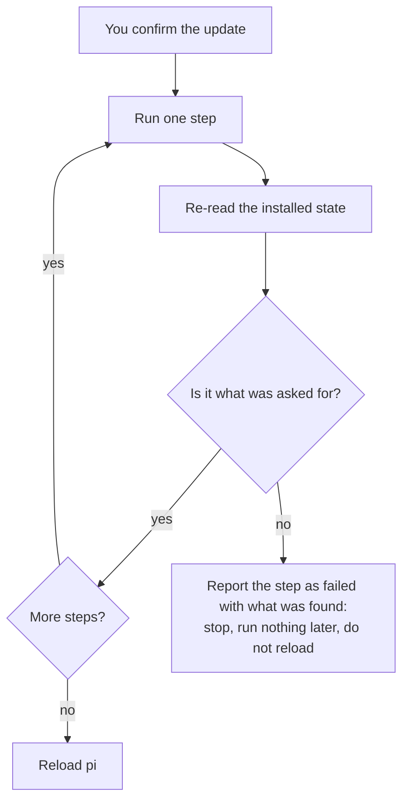

# Updates

A pi setup has three parts that update separately:

| Part | What it is | Where it comes from |
|---|---|---|
| **pi** | The agent binary, TUI and session model | `@earendil-works/pi-coding-agent` on npm |
| **pi-system** | This kit: extensions, skills, prompts, profiles, themes | Its public git repository, `github.com/SATUNIX/pi-system`, on a channel |
| **Linked packages** | Other pi packages in your settings, including the kit's companions (`pi-lens`, `pi-readseek`, ...) | npm |

A **profile** is not a part: it is a setting that chooses what loads from the kit (see
[Profiles](profiles.md)). Updates keep your profile and your hand edits.

## `/update`

The `kit-update` extension, loaded in every profile, checks all three parts.

- **In the background**: at most once a day at session start. It never delays startup and never
  prompts for git credentials. When something can be updated you get one notice, and the status
  bar shows `updates: /update`.
- **On demand**: `/update` checks now and lists what can be updated.

| Command | What it does |
|---|---|
| `/update` | Check now, then pick: everything, pi-system, pi, linked packages, or a channel switch |
| `/update status` | Installed and available versions for every part |
| `/update all` | Update pi-system and linked packages, re-apply your profile, reload; then update pi |
| `/update kit`, `/update pi`, `/update packages` | Update one part |
| `/update channel latest` / `next` / `X.Y.Z` | Follow the other channel, or pin a release |

Every update asks for confirmation first. A new pi version needs a restart of pi; everything
else reloads in place.

### Updates are verified

An update is only reported as done when the result is what was asked for. After each step
`/update` re-reads the installed state and checks it: the kit is registered at the expected
release or commit, a linked package is at the version it was moved to, pi reports the new version,
and the profile has been re-applied. A step that ran but left the old state behind is reported as
**failed**, with what it found, and the run stops there: nothing later runs and pi is not
reloaded. Without a terminal UI (for example under `pi -p`) the progress and the failure go to
standard error, prefixed `[update]`, so a script sees them.



If the repository cannot be reached, the message says so and names the checks to make; it never
reports "up to date" for a lookup that did not happen.

After pi-system updates, your recorded profile is re-applied, so extensions a new release adds to
your profile load, and companions move to the kit's newly reviewed pins.

## Channels

| Channel | Registered in pi as | Gets |
|---|---|---|
| `latest` | `git:github.com/SATUNIX/pi-system@v<newest release>` | The newest release tag. Betas count until the first stable release; after that, only stable releases |
| `next` | `git:github.com/SATUNIX/pi-system` (no tag) | Every commit on `main` |
| pinned | `git:github.com/SATUNIX/pi-system@v0.2.4-beta.0` | Exactly that release, never moved automatically |

`latest` and a pin look the same in pi's settings (a tag). The installer records which one you
chose in `~/.pi/agent/.pi-kit.json`, and `/update` follows that record.

Switch with `/update channel <name>`. The switch keeps your profile and is verified like any
other step. Moving from `next` back to `latest` can install an older commit than you have now;
that is expected. `latest` needs at least one release tag on the repository: before the first
release is tagged, `/update channel latest` fails with a message saying so.

## Settings

| Variable | Effect |
|---|---|
| `PI_KIT_UPDATE_CHECK=0` | No background check (`/update` still works) |
| `PI_KIT_UPDATE_CHECK_HOURS` | Hours between background checks (default 24) |
| `PI_SYSTEM_GIT_SOURCE` | Git source of the kit, for example `git:git@github.com:SATUNIX/pi-system` to use SSH. A value that still names a retired private source is ignored and reported |
| `PI_KIT_DELIVERY` | `git` or `npm`: override the kit's delivery on this machine |
| `PI_KIT_NPM_REGISTRY` | Registry to query for pi and linked packages (default `https://registry.npmjs.org`) |
| `PI_OFFLINE` | pi's offline mode: no background check |

## Without the extension

The same updates from a shell:

```sh
pi update --self                                                    # pi
pi install git:github.com/SATUNIX/pi-system@v0.2.4-beta.1          # the kit, to a new release (latest or a pin)
pi update git:github.com/SATUNIX/pi-system                         # the kit, on next
pi update --extensions                                              # every unpinned package
node ~/.pi/agent/git/github.com/SATUNIX/pi-system/packages/core/install.mjs --profile balanced --yes --settings-only
                                                                    # re-apply a profile (and companion pins)
```

To find the newest release tag: `git ls-remote --tags https://github.com/SATUNIX/pi-system.git`.

## Checkouts

A **checkout** registered in place for development: `/update kit` runs `git pull --ff-only`,
re-applies the profile and reloads. Uncommitted work blocks nothing: a fast-forward either
applies cleanly or fails without changing anything. It is reported as behind only when its
upstream branch has commits the checkout does not contain.

`/update channel latest` (or `next`) from a checkout registers the released kit instead of the
checkout. The installer keeps exactly one registered copy of the kit: any other copy (another
checkout, the npm package) would load every extension twice.

## Delivery

Where releases come from is set in `packages/core/distribution.json` (`"delivery": "git"`). npm
delivery (`@satunix/pi-system` dist-tags) is built but the package is not published; see
[Releasing](releasing.md#npm-publication-optional). When a kit release changes the delivery,
`/update kit` moves each install over, keeping its channel and profile.

## Coming from the private GitLab source

An install registered from the earlier private GitLab source runs that checkout's old code, which
cannot move itself. Install the public kit and run its installer ([Migration](migration.md), Route 1);
from then on `/update` follows the public repository. Where a retired registration or a local
checkout with a retired `origin` is seen by this release's `/update`, it reports it and never
contacts that host (`/update kit` moves a registration; a checkout is left for you to re-point).
