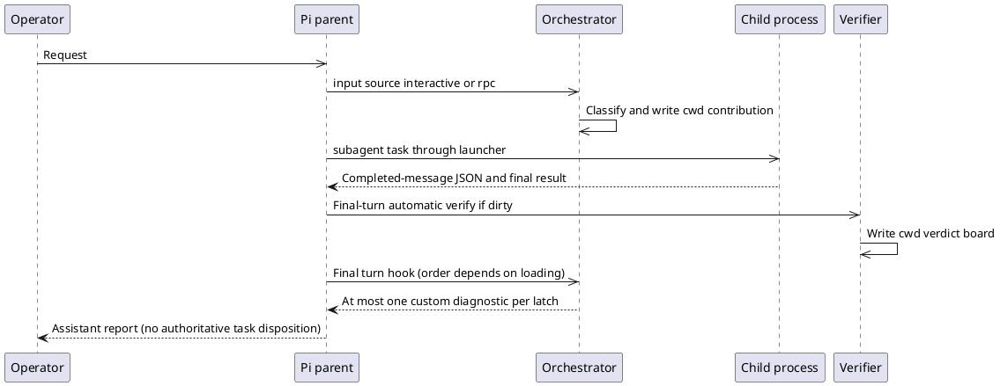
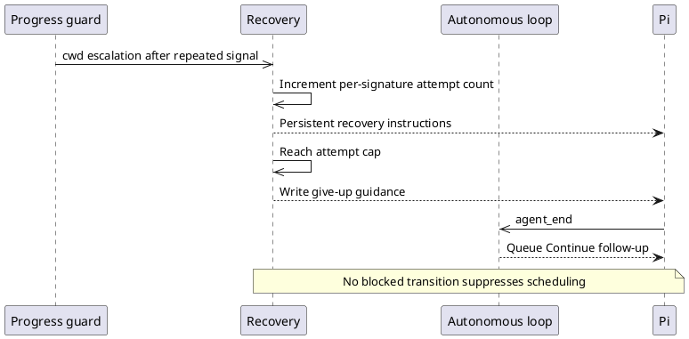

# Runtime inventory, boundaries and control flow

Baseline and raw digests: [runtime-inventory.json](runtime-inventory.json). Source commit `6460ef6392dc290038f5ad79835861f9e5e06134`; Windows/Node 24.14.0; installed and local test Pi 0.76.0; both kit versions 1.0.0. Local dependencies were installed from the committed lock with lifecycle scripts disabled. Offline cache initially lacked pi-tui; sandbox networking then refused connections; installation succeeded outside that sandbox. No dependency manifest changed.

## Resource selection and provenance

Inventory resolves all six actual profiles: quick, balanced, long-horizon, autonomous, self-improving and engagement. It includes the exact name-to-source mapping, optional external references and lite declaration. Root wildcard loading is a separate configuration, not synonymous with filtered profile installation. The current installer applies resource filtering; the historical finding that profiles are metadata-only is not carried forward unchanged.

Settings still reference the OffSec checkout's `dist/pi-kit-lite` plus `npm:@jmfederico/pi-web`. The installed artifact manifest explicitly lists pi-readseek. Of 39 source extension entry files compared, 12 have identical installed counterparts, three differ (orchestrator, verify-gate, todo), and 24 have no counterpart. Those numbers describe source-entry comparisons, not every installed resource or a process load receipt. Source vs lite omissions are often intentional. No new export was generated over the installed package, no settings were changed and no active session was reloaded.

| Runtime/surface | Established in this review | Remaining coverage |
| --- | --- | --- |
| Windows Pi 0.76.0 source | Locked dependency checks, actual runner dispatch method and footer method, synthetic extension scenarios | Full provider-free AgentSession streaming integration, process tree/cancel fixtures, real terminal rendering |
| Installed lite | On-disk hashes and old orchestrator hook approximation | Historical process-loaded bytes and incident event ordering |
| Six profiles and root package | Selected source/resource definitions; installer-filter regression passes | Isolated actual install/load receipts for each, duplicate external registrations |
| Linux | Source review of shell/cancel paths | Execute Linux integration/process/isolation matrix |
| Headless/JSON/RPC | Source paths and inert headless authorization; runtime input provenance | Durable approval routing and complete asynchronous session tests |
| TUI | Exact footer adapter method exercised synthetically | Keyboard, narrow terminals, screen reader/accessibility, other footer composition |
| Web | Configured external package identified | Package implementation, version pin, navigation/reconnect/control semantics |
| Newer Pi peers | Manifest permits versions above 0.76.0 | Unsupported by this evidence; pin/qualify before support claims |

Runtime `main.js:332` forwards `--tools`; `sdk.js:157-159` creates an allowed set; `agent-session.js:1798-1806,1843-1857` filters built-in **and extension** tools by it. Therefore do not claim restricted planner/reviewer roles automatically regain custom delegation tools. Extensions themselves still load hooks and can write state or launch internal processes. Roles lacking a tools list and separate unrestricted launchers need independent assessment.

## Trust/resource boundaries

| Boundary | Owner/state today | Risk and required separation |
| --- | --- | --- |
| Operator intent → request | Pi input source interactive/rpc/extension | Source tag distinguishes extension user messages; no kit task epoch authenticates lifecycle changes |
| Repository/role → child prompt | Role loader, appended prompt file | Project trust switch is model-controlled; parent-owned role digest/capability grant needed |
| Contribution JSON → system prompt | context-sieve reads cwd directory | Filesystem writers become instruction producers; no sender/epoch/expiry validation |
| Model tool → tool execution | Pi wrapper, ordered tool_call hooks | First block short-circuits later hooks; extension internal native execution is a separate route |
| Parent → child OS process | Three launchers; shared cwd/environment | Private context is not filesystem/credential/network isolation; no universal tree owner/budget |
| Task/verdict state → acceptance | Shared JSON read-modify-rename | No transactional claims, fencing, expected-check set or trusted revision attestation |
| Execution → monitoring | cwd ledger/audit under agent OS principal | Missing actor/call IDs, truncation and local rewrite defeat audit independence |
| UI → control | Commands and status strings | No common pause/cancel/approval state machine; footer API mismatch detaches rendering |

Read-only workers can report plain text through stdout, but there is no independently routable request-help/result acknowledgement protocol. A process exit, worker report, task success, verified artifact and mission success must remain separate facts.

## Current lifecycle and sequences

There is no single kit lifecycle table. Pi owns model/tool processing, task-graph stores pending/in_progress/done/blocked, orchestrator owns two local verification booleans, recovery owns per-signature counters, and autonomous-loop owns another counter. Shared files convey observations without atomic ownership. None of these jointly governs all model starts.

S03 reproduces orchestrator-before-verifier queuing a stale diagnostic even though the verifier then passes. Reversing those two handlers emits none. S14 shows three continued turns after recovery cap with a separate loop limit of three. S10 shows malformed loop limit bypassing its numeric cap and a queued continuation surviving `/loop stop` in the script scheduler. This is not proof all default configurations loop forever.

## Prompt provenance catalog

[prompt-execution-catalog.json](prompt-execution-catalog.json) indexes 50 prompt/control leads and 15 native execution leads with source lines. It is a searchable static inventory, not proof of runtime reachability for every profile or external package.

| Source | Priority/delivery | Trigger and scope | Expiry/reset and scheduling |
| --- | --- | --- | --- |
| Operator interactive/RPC input | User | Pi input; workspace classifier | Resets verification latch; no task epoch; normally schedules work |
| Agent role/AGENTS/skills/templates | Appended system or runtime resource expansion | Role spawn or input expansion | Role file per launch; actual prompt depends on runtime discovery; no kit role digest grant |
| Orchestrator contribution | System via sieve | Complexity or explicit workflow; cwd | Cleared on input/start/off; no agent identity; does not itself enqueue |
| Goal, memory, guidance contributions | System via sieve | Goal startup/input recall; cwd | File lifetime and flags; no common TTL; inherited/compacted where configured |
| Progress/recovery contributions | System via sieve | Read/repeat signal or escalation; cwd | Partial cleanup, per-signature local budget; recovery not cleared by verified success |
| Source orchestrator diagnostic | Custom message followUp | Final stop + required failed board | One correction latch; custom messages bypass input hook; may schedule next turn |
| Source standalone verify diagnostic | Custom message followUp | Dirty final turn + failed check, orchestrator absent/disabled | One latch reset by non-extension input; may schedule next turn |
| Installed old orchestrator | User steer | Every agent_end with blocked board | No task scope/latch; repeated scheduling in approximation |
| Autonomous-loop | User followUp, source extension | agent_end when armed | Local counter; invalid value removes bound; stop does not fence already queued message |
| Dual-review output | User followUp, source extension | Child close | No epoch/revision check, cancellation fence or expiry |
| Tool outputs/peer reports | Tool/data initially | Tool completion/child output | Content may be forwarded into prompts; no authenticated peer-message protocol |
| Compaction summary | Runtime history summary | Active goal/contribution at compaction | Sieve replaces summary with template + oldest transcript prefix; can preserve stale directives |

Pinned `AgentSession.sendUserMessage` calls prompt with source `extension`; custom messages enter a distinct path. Thus the current dual-review/loop calls do **not** automatically reset the source orchestrator latch through interactive input. The concern is unscoped scheduling and user-role content, not a proven source-tag reset bug. RPC input is not enough information to distinguish a human request from all possible external integrations.

Native execution inventory includes vendored/conductor/dual-review launchers, verification, branch-lab, skill-forge, checkpoint/auto-commit/dirty checks, footer git lookup and notification subprocesses. These routes must pass a common broker or have a documented narrow trusted-service exemption; a model tool-call hook alone does not mediate their effects.
